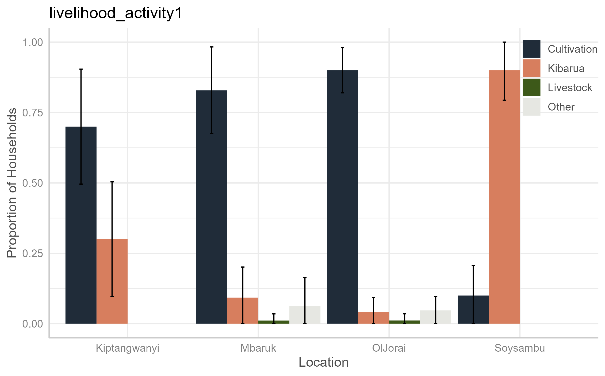

```{r setup, include=FALSE}
knitr::opts_chunk$set(echo = FALSE,
                      warning = FALSE,
                      message = FALSE)
```

```{r}
library(sea)
library(tidyverse)
library(xfun)
library(lubridate)
library(openxlsx)
library(scales)
library(googlesheets4)
library(stats)
library(stats4)
library(survey)
library(srvyr, warn.conflicts = FALSE)
library(sjPlot)
library(cowplot)
library(egg)

hhs_cleaned <- readRDS("hhs_cleaned.rds")
#Sustain EA colour pallette

# Set survey design
dclus2 <- hhs_cleaned %>%
  as_survey_design(c(dnum, snum), fpc = c(fpc1, fpc2))
```

\newpage

### Disclaimer

The views and opinions expressed in this report reflect those of the authors. Whilst every care has been taken in the writing of this report, the authors accept no responsibility for any resultant errors herein, any damages or loss whatsoever caused or suffered by any individual or organisation.

### Rights

The information in this report is copyrighted, therefore, copying or transmitting any part of this report without permission from the authors may be a violation. However, we encourage dissemination and use of this report with appropriate citation and acknowledgement.

### Suggested citation

Please cite this report as such :

Brehony, P., Tyrrell, P., Muiyuro, R., Wairimu, E. 2024. Social Assessment of Protected Area for Soysambu Conservancy. Sustain East Africa, Nairobi, Kenya.

### Acknowledgements

This Social Assessment of Protected Areas for Soysambu Conservancy is the result of a collaborative effort between Sustain East Africa, Soysambu Conservancy, and representatives from communities bordering the Conservancy. Thank you to the all those who helped to pull this together.

Particular thanks go to: Helen Jerotich, Community Education Officer (Soysambu Conservancy); Chief Joseph Mwangi and Assistant Chief Felicah Mugi of Mbaruk location; Chief Parit Sururu and Assistant Chief Henry Balozi of Kongasis, Oljorai location; and Chief Simon Mathare and Assistant Chief Benson Mungai of Kiptangwani location. 

We would also like to acknowledgement the MCA of Eburru Mbaruk Ward, Michael Gathanwa, and his ward administration for their insights and input in highlighting areas where Soysambu Conservancy can continue to support neighbouring communities.

We also thank the Nyumba Kumi village elders from the three locations for their input, as well as the dedicated enumerators involved in carrying out the household surveys: Benedicta Wanjiru, Emmanuel Kooli, and Paul Waweru.

\newpage

# Summary

## Context

The Social Assessment for Protected and Conserved Areas (SAPA) is a standardised, low-cost and relatively simple approach to assessing social impacts of protected or conserved areas. SAPA can help identify positive and negative social impacts of protected or conserved areas, understand the underlying causes of problems related to governance and identify actions that could improve the situation. The methodology can also be used to establish a baseline for social impacts and their overall contribution to human wellbeing against which changes can be tracked over time. It is a multi-stakeholder assessment methodology for use by site-level stakeholders. 

## Key Findings

### Positive social impacts

Based on the findings of the SAPA process, the main positive social impacts that contributed to household well-being in communities neighbouring or within Soysambu Conservancy were: 
1) Improving access to water
2) Building or maintaining infrastructure
3) Support for education
4) Support for health projects
5) Outreach services and training

Soysambu conservancy provides water to the community either through trucks or by building water tanks, ensuring access to clean and safe water for local residents. 

Soysambu conservancy's support in building or maintaining infrastructure including police posts, schools, and roads, were reported to enhance the overall quality of life for community members.

Soysambu conservancy’s initiative to offer sponsorship opportunities for students, enabling access to education and fostering academic achievement, was seen as a positive social impact by some households. Additionally, Soysambu's contributions to local schools, such as providing school meals for students, school uniforms, desks, and sports equipment, positively impact educational outcomes and student well-being. The Conservancy also provides free guided educational trips to community members, offering valuable learning experiences and fostering appreciation for conservation efforts.

> We appreciate Soysambu for giving land to construct Lady Anne Secondary School - Respondent from Mbaruk

Soysambu conservancy’s support for health projects, including the provision of equipment to clinics and cancer screening for women, contributed to improved healthcare access and outcomes within the community. Additionally, Soysambu Conservancy also provided anti-rabies vaccinations for dogs and donkeys, demonstrating a commitment to community health.

Soysambu conservancy also offered outreach services in the form of training in improved livestock production, health, and waste management, empowering residents with valuable knowledge and skills.

Soysambu actively participates in environmental conservation initiatives, such as tree planting, contributing to the preservation of natural resources and biodiversity. Furthermore, some households also felt that providing access to firewood also demonstrated a commitment to community support.

### Negative social impacts

Most negative social impacts across the six case studies fall under five main categories:
1) Ecosystem service benefits
2) PA-related employment
3) PA-supported development projects
4) Reduced human-wildlife conflict, and
5) Improved security

Short detail about each

<!-- quote -->
> Scholarships should be transparent and target vulnerable children


<!-- quote -->
> My child needs compensation. He was injured by a buffalo and was a security in conservancy

### Overall contribution to wellbeing

The survey results indicated that the majority of respondents perceived Soysambu's overall contribution to well-being as neutral, taking into account both positive and negative impacts. There were exceptions, particularly in Oljorai and Mbaruk locations, where a few respondents felt that Soysambu had increased their well-being. 

`r big_numbers("75%", "of those residing in Soysambu felt the conservancy increased their wellbeing")` 

\ 
 
On the other hand, approximately 
`r big_numbers("12%", "of respondents living in Oljorai agreed that Soysambu had reduced their overall well-being")`


### Governance

SAPA encompasses four key principles of effective governance:  participation in decision-making, transparency and accessibility to information, mitigation of negative impacts, and equitable benefit-sharing process.

#### Participation

In Mbaruk and Oljorai locations, the majority of people disagree that there is participation in Soysambu’s decision-making that impacts the community. However, in Soysambu itself, a large percentage of people feel that there is some level of participation, particularly in knowing their community representative for meetings with Soysambu and communicating with them. In Kiptangwani, there is a mix in opinions with most people feeling that there is no participation, some agreeing that there is participation, and quite a number do not know whether there is any participation.

#### Transparency and access to information


#### Rights

#### Benefit Sharing Process

#### Mitigation of Negative Impacts

### Recommendations going forward

Given that there are significant differences between locations, we recommend xyz

\newpage

<!-- inverse rust page -->
<div class="section-rust-inverse">

# Introduction

## Soysambu Conservancy

Soysambu Conservancy is located within the Rift Valley System. It covers 48,000 acres, encompassing the northern and western shores of Lake Elmenteita. Soysambu Conservancy is renowned for its remarkable biodiversity, including a population of 170 endangered Nubian Giraffes and over 450 bird species, notably hosting 28% of the world's Lesser Flamingo population. Indeed Lake Elmentaita is one of Kenya's Key Biodiversity Areas and RAMSAR sites (a wetland that is of international importance under the Ramsar Convention). Its rich wildlife habitat is home to buffalo, leopard, hippo, hyena, jackal, eland, zebra, impala, Thompson’s and Grant’s Gazelle, waterbuck, reedbuck, klipspringer, warthog, steinbok, colobus monkey, vervet monkey, and baboons.

Soysambu Conservancy was established as a Not-for-Profit Company in 2007 and works to conserve the Soysambu Estate as a traditional wildlife area, which supports the integrity of the greater Rift Valley ecosystem, while promoting sustainable coexistence of wildlife with livestock and at the same time being relevant to and part of modern-day Kenya. 

Soysambu Conservancy wanted to understand more about the social impact of the conservancy on communities living within and surround the conservancy. Furthermore, they wanted to use the opportunity of assessing the social impacts of the Conservancy to listen to what communities within and surrounding the conservancy had to say about the positive and negative impacts of the Conservancy. This could also serve as an opportunity to establish a baseline for Soysambu Conservancy's contribution to the well-being of communities, over time.


## Social Assessment of Protected Areas (SAPA) approach

The Social Assessment for Protected and Conserved Areas (SAPA), launched in 2014, responded to a need for a standardised, low-cost and relatively simple approach to assessing social impacts of protected or conserved areas [@franks_social_2018]. 

</div>
<!-- rust page -->
<div class ="section-rust">

SAPA is a multi-stakeholder assessment methodology for use by site-level stakeholders. The methodology is based on a standardised process that can be replicated across protected or conserved areas while remaining flexible enough for tailoring to local needs and contexts.

SAPA uses a set of standard assessment questions directly related to social impacts and governance quality. It also includes a process of developing site-specific questions that respond to specific needs of actors. 

SAPA can help identify positive and negative social impacts of protected or conserved areas, understand the underlying causes of problems related to governance and identify actions that could improve the situation. The inclusion of a governance and equity assessment in the second edition of SAPA strengthens the results and action planning processes. Governance is distinct from management and pays attention to who defines objectives and how. It also looks at allocation of responsibility and accountability for delivering on these objectives.

The methodology can also be used to establish a baseline for social impacts and their overall contribution to human wellbeing against which changes can be tracked over time. Therefore, the SAPA approach meets the requirements of Soysambu Conservancy as they seek to understand social impacts over time, and to listen to feed back from communities living within and surrounding the conservancy. 

## Objectives of the Social Assessment

Soysambu Conservancy aims to ensure that they provide value to Kenya, its people and the wider international community through sustainable conservation and enjoyment as a national treasure and heritage. 

The conservancy is currently expanding its engagement with communities living within and surrounding the conservancy. Conducting a SAPA will therefore help them better understand the views, needs, and opportunities of the surrounding communities. 

The primary objective of this assessment therefore was to integrate conservation initiatives with community development and foster a positive relationship between Soysambu and their neighbouring communities, principally by increasing positive impacts and reducing negative impacts to communities. 

</div>
<!-- inverse gunmetal page -->
<div class="section-gunmetal-inverse">

# Approach and Methods

## SAPA overview, process and outputs

The SAPA Assessment uses a mixed methods approach that combines qualitative data and quantitative data to gather information, assess results and generate ideas for action in response to the findings. 

Throughout the SAPA process, there is an emphasis on linking the steps to stakeholder engagement, either through discussions, or feedback, or actions to improve the situation. This ensures that stakeholders, including communities through their representatives, are effectively engaged throughout the assessment. 

This multi-stakeholder approach increases the accuracy and credibility of the findings, enhances transparency and ownership of the assessment process, builds support for action and accountability for implementation.

</div>
<div class="section-gunmetal">

The main phases of the SAPA include:

* Preparation  
  + Feasibility and planning 
  + Community mapping 
  + Review existing information
  + Stakeholder engagement 

* Scoping
  + First community meeting and stakeholder workshop
  
* Information Gathering 
  + Planning household survey
  + Develop household survey 
  + Train enumerators 
  + Conduct household survey 
  + Analyse household survey data 
  
* Assessing 
  + Second community meeting and stakeholder workshop 
  
* Taking Action 
  + Communicate results 
  + Plan actions 
  + Monitor progress 

For those interested, much greater detail can be found in the SAPA manual @franks_social_2018.

## Preparation

### Feasibility and planning 

Following discussing with Soysambu Conservancy management, it was agreed that Soysambu met the feasiblity requirements for a SAPA process. Soysambu began operating in 2007. It was Protected or Conserved Area that was established and operating with management and governance systems for at least two years. Furthermore, Soysambu Conservancy satisfies the second feasibility criterion as its managers and other key stakeholders can convene for face-to-face meetings at least once during the assessment process. Additionally, there is a clearly defined zone covering Soysambu and its neighboring communities. Finally, the managers of Soysambu were willing to implement specific action plans aimed at improving social impacts and governance within the conservancy. 

In order to plan the SAPA process, together with the Soysambu management, the Sustain East Africa team put together a work plan with dates for key steps in the SAPA process, and those responsible for organising the step, and where relevant, inviting stakeholders, such as community representatives to participate. 

### Community Mapping 

The aim of community mapping is to ensure that all stakeholders within or neighbouring the conservancy are considered during the SAPA process.

Soysambu Conservancy provided a detailed map delineating its boundaries and essential physical features such as roads, rivers, and Lake Elmenteita. This map also included the locations and boundaries of communities within and surrounding the conservancy.

Following a meeting and exploratory visit with Soysambu management and representatives from neighbouring communities in September 2023 it was decided that this SAPA would focus on key neighbouring villages within the Oljorai, Kiptangwani, and Mbaruk locations, as well as those living within Soysambu. 

Futhermore, at this stage of the process, some of the questions that would be specifically tailored to the Soysambu context were formulated. While many of these raised issues that were already aligned with standard assessment questions, some were articulated as additional queries in the household questionnaire. 

### Review existing information 

At this stage, Soysambu Conservancy provided reports and meeting minutes from previous community engagements and projects. These were carefully reviewed to gain a comprehensive understanding of pertinent background details that a site profile could be formed. 
In turn, this allowed us to ensure that we were able to ensure that the most appropriate positive and negative social impacts and measures of wellbeing were being covered in the assessments; that a sufficient number of households would be sampled; that the assessment would be suitable to the cultural context.

### Stakeholder Engagement 

Finally, each location was visited, and the assessment was discussed with the Administrative Chief from the location. This in turn led to introductions to the heads of village. At this stage, the survey were able to understand the local context, ensure that community representatives were willing to participate in group discussions, and to secure permission to carry out the household surveys.  

## Scoping

The scoping phase of SAPA is dedicated to defining the assessment's boundaries concerning space, time, and issues, prior to delving into detailed information gathering.

In terms of space, the villages and locations that had been visited and consulted were already set. 

In terms of time, the SAPA primarily addresses social impacts that have occurred in the past, rather than those anticipated in the future. For this assessment, a recall period of five years was selected. 

SAPA covers various social impact and governance issues. The standard aspects of assessment include:

* The impact of Soysambu and its development activities on people's well-being. 
* Identification of significant negative and positive impacts resulting from Soysambu and associated conservation and development initiatives. 
* Evaluation of the recognition and respect of local women's and men's rights by Soysambu. 
* Assessment of timely access to pertinent information by local women and men. 
* Examination of the effectiveness of measures to mitigate negative impacts on local women and men. 
* Evaluation of the equitable distribution of benefits related to Soysambu within and between local communities. 

However, even these aspects of the assessment might overlook important issues. To address this, as part of the scoping step, a community meeting and stakeholder workshop is conducted. Furthermore, the household survey and the second community meeting are also designed to identify other potential gaps that may exist.

### First community meeting and stakeholder workshop


In November 2023, the Sustain team conducted a half-day workshop with community stakeholders, including 19 participants representing location chiefs, village representatives, and enumerators recruited from the communities. 

The workshop aimed to familiarize participants with the SAPA methodology and upcoming household survey questions. It also gave representatives a chance to raise any outstanding issues that were not being asked about. 

This workshop plays a vital role in ensuring the SAPA's relevance to local needs, active participation of the key stakeholders, and fostering ownership of the process among key stakeholders.

## Information Gathering

The next step in the process is to gather information through a household survey. This is then followed once more by a discussion and feedback in a stakeholder workshop and community meeting. This balanced approach combines quantitative data from surveys with qualitative insights from community meetings and stakeholder workshops.

### Planning the household survey 

The household survey will be the key step to collecting quantitative data from across the key locations in a statistically representative manner. Based on timelines, budgets, and the number of villages to cover, we agreed to interview 180 households, randomly selected from the target area's villages.

Therefore, out of 44 villages identified as important, across the 3 selected locations, 18 villages were randomly chosen for the survey. Within each of these 18 villages, a minimum of 10 households were to be randomly selected.

The sampling plan was devised based on information from the most recent national census, information from Administrative Chiefs, accessibility of locations, estimated survey duration and enumerator requirements.

```{r}
add_lot_link(caption = 'Table of sample size by location')

data <- data.frame(
  "Location" = c("Mbaruk", "Oljorai", "Soysambu", "Kiptangwani"),
  "Respondents" = c(81, 70, 20, 10),
  "Percentage" = c("45%", "39%", "11%", "5%")
)

data <- data %>%
  rename("Location" = "Location",
         "No. of Respondents" = "Respondents",
         "% of total" = "Percentage")

sea_table(data) 

# for reference colours: black, white, grey, pale_green, dark_green, rust_orange, gunmetal, dark_purple
```  
  

### Developing household questionnaire

The SAPA facilitation team crafted a series of questions to be piloted, then tested with enumerators, before being deployed in the household survey. 

The survey incorporated Soysambu-specific social impacts, governance issues, informed by concerns raised during reconnaissance visits and reports from the Soysambu Conservancy team. Furthermore, custom governance statements were developed to address rights, participation, transparency, and impact mitigation or benefit sharing.

The survey was initially drafted in English, it was then translated into Swahili. A back-translation process to English ensured accuracy and that the intended meaning was correct. Adjustments based on feedback from the pilot survey, training process, and Soysambu Conservancy management were incorporated, and the final questionnaire was uploaded to the Open Data Kit (ODK) and KoboToolbox for enumerator use during the survey.

### Enumerator Training

In order to ensure that data collection is of the highest standards, the SAPA process relies on proficiently trained enumerators, capable of conducting efficient and accurate surveys. 

Therefore, 3 enumerators were recruited from within the survey locations, based on their proficiency in English and Swahili, their good standing in the community, and the fact that they had at least completed high school.

In November 2023, the SAPA facilitation team conducted a two day training sessions which included a detailed run through of all the questions, the information the survey was to capture, and why this was important. The enumerators were trained in the use of ODK and KoboToolbox. The training also included a review of survey and research ethics, and appropriate behaviour before and after the survey.

The enumerators conducted practice interviews, focused on comprehension and questionnaire adjustments. 

Following successful completion of the training, the enumerators were equipped with smartphones, battery banks, notebooks, and backpags. They were clearly instructed on the sampling approach with each enumerator allocated six villages and instructed to randomly sample 10 households from each village.

As a final step in the training, the enumerators conducted pilot interviews with acquaintances. The data from these were reviewed and analysed and the enumerators were given feedback on their performance. 


### Conduct Household Survey

As discussed above, the sample size include 18 randomly selected villages, where a total of 10 households were surveys. In total, 181 households were sampled, over three weeks from November 20th to December 6th, 2023. 

Sampling locations included Data collection locations included Kiwanja Ndege Mkulima, Leleshwa, Pema, Kapkures, Mbaruk, Muranga, Kiambogo, Ngatta, Mololine, Kelelwa, Soysambu Area, Oldubey, Kapedo, Jogoo, Echareria, Central Utut, Jolai 1,2, Sleeping Warrior Gate, Jolai Gate, and Kampi Turkana.

Each survey began with an explanation of the purpose of the survey, how data would be used, confidentiality measures, the participant’s rights, and sought their consent before proceeding. 

Following each survey, the respondent was given a small token of appreciation in the form of sugar. 

As the survey was being conducted, the facilitation team made random calls to 11% of all respondents to verify that the survey had taken place, to ask for any comments or feedback, and to ensure that the information provided was correct. 

No negative feedback or concerns regarding the data collection process were received. 

```{r, fig.cap='Map of Soysambu with sample sizes from each locations', fig.align='center', out.width = '90%'}
knitr::include_graphics('img/map sample sizes.png')
```

### Analyse Household Survey

The first step in data analysis was to ensure that there was anonymity. Therefore, in adherence to the Data Protection Act, 2019, identities and numbers collected from respondents was removed. This ensured that all data collected from respondents was handled anonymously, and that no individually identifiable information pertaining to race, health status, ethnic social origin, conscience, belief, genetic data, biometric data, property details, marital status, family details, sex, or sexual orientation were shared.

The next steps were to use design based inference in *R*, with the **survey** and **srvyr** packages to calculate population proportions, standard errors and 95% confidence intervals based on the sample data collected. 

The results from these are presented as tables, graphs, maps, and percentages in the following section.

## Assessing

### Second community meeting and stakeholder workshop

The final stages of the SAPA process involve conducting a second stakeholder workshop, where key findings from the household survey are shared with representatives of key stakeholders. Any questions raised during the workshop are addressed, and actionable ideas are presented.

This workshop serves firstly as a review and validation that the data collected are likely to reflect the realities on the ground, and secondly as a further information-gathering opportunity. The insights gathered as part of this discussion can help assist in mitigating negative social impacts, promoting equitable distribution of positive impacts, and enhancing governance within the protected area.

At the second workshop in Soysambu, the focus was on discussing additional ideas for ways in which Soysambu could provide positive social benefits to the community, that were not sufficiently captured in the survey responses. 

These ideas, detailed below, encompassed community activities, initiatives by Soysambu Conservancy management, and greater collaboration with local, regional, or national government entities.

## Taking Action


### Communicate results 

Following the conclusion of Soysambu Conservancy's SAPA, it is crucial that the findings are effectively communicated to all relevant stakeholders. This includes not only the conservancy management team but also local communities, government authorities, NGOs, and other interested parties. This has been partly achieved through the second workshop discussed above. However, beyond this, clear and transparent communication of the assessment results will help foster understanding, build trust, and encourage collective action towards addressing identified issues.

In communicating the results, it is essential to use accessible language and diverse communication channels to reach different stakeholders effectively. This may include community meetings, workshops, newsletters, social media platforms, and formal reports. As was the case for the second workshop discussed above, engaging in further dialogue sessions where stakeholders can ask questions and provide feedback on the assessment findings will improve understanding and ownership of the process.

### Plan actions and monitor progress 

Looking ahead, it is important that an action plan to address the identified issues is put in place. This should outline specific strategies, activities, timelines, responsibilities, and resources required to implement interventions.

As was brought up in the second stakeholder workshop, community representatives called for greater collaboration with local, regional, or national government entities. Therefore, it will be important to ensure that the conservancy management, local communities, government agencies, and potentially other relevant NGOs, are involved in the action planning process. This will ensure some ownership, prioritising, and commitment to the proposed interventions. 

Once an action plan is in place, it will be essential to establish mechanisms for monitoring and evaluating progress. By continuously monitoring progress, Soysambu Conservancy can adapt its strategies and interventions to meet evolving social needs and ensure the sustainable management of the protected area.

</div>

<div class="appendix-section-grey">

# Findings

## Characteristics of the respondents

```{r, fig.cap='Map of principal livelihood activities in surveyed households', fig.align='center', out.width = '90%'}
knitr::include_graphics('img/map livelihood activity.png')
```

<!-- ```{r, fig.cap='Principal livelihood activities in surveyed households', fig.align='center', out.width = '90%'} -->
<!--  -->
<!-- ``` -->

Residents surrounding Soysambu Conservancy engage in various economic activities, each with distinct needs. To the south, adjacent to Samburu, are pastoralist communities. Along the Pipeline-Elementaita road, there exists a satellite urban settlement area where minimal agriculture is practiced. The northern region comprises a mix of satellite urban communities and pastoralists, while the area along the Nakuru road towards Gilgil is predominantly occupied by smallholder farmers. Following this, the results are presented disaggregated by location.

### Age of respondents

```{r, fig.cap='Age categories of household heads', fig.align='center', out.width = '100%'}
by_location <- dclus2 %>% 
  mutate(age_cat = cut(age, c(18, 25, 35, 55, 100), include.lowest = TRUE,
                       labels = c("18-25", "25-35", "35-55", "55 +"))) %>% 
  group_by(locat, age_cat) %>% 
  summarise(proportion = survey_mean(vartype = "ci", na.rm=TRUE),
            total = survey_total(vartype = "ci", na.rm=TRUE),
            n= unweighted(n())) 

by_location$age_cat <- by_location$age_cat %>% coalesce(by_location$age_cat, "Didn't answer")
  

ggplot(by_location, aes(x=locat, y=n, group = age_cat, fill = age_cat)) +
  geom_bar(stat = "identity", position = position_dodge(preserve = "single"), width = 0.95) +
  #geom_errorbar(data=by_location, aes(ymax = ifelse(proportion_upp > 1, 1, proportion_upp), ymin = ifelse(proportion_low < 0, 0, proportion_low)), 
  #              position = position_dodge(preserve = "single", width = 0.95), width = 0.1) +
  guides(fill=guide_legend(title=NULL)) +
  sea::scale_fill_sea_discrete() +
  labs(x="Location", y = "Number of Households") +
  #scale_y_continuous(limits=c(0, 1)) +
  theme_sjplot() + 
  theme(legend.position=c(0.90,0.950))
```
 
### Gender of household heads

```{r, fig.cap='Gender of respondents', fig.align='center', out.width = '100%'}
by_location <- dclus2 %>% 
  group_by(locat, gender) %>% 
  summarise(
    proportion = survey_mean(vartype = "ci", na.rm = TRUE),
    total = survey_total(vartype = "ci", na.rm = TRUE),
    n = unweighted(n())
  ) 

ggplot(by_location, aes(x = locat, y = n, group = gender, fill = gender)) +
  geom_bar(stat = "identity", position = position_dodge(preserve = "single"), width = 0.95) +
  guides(fill = guide_legend(title = NULL)) +
  labs(x = "Location", y = "Number of Households") +
  sea::scale_fill_sea_discrete() +
  theme_sjplot() + 
  theme(legend.position = c(0.95, 0.95))
```

### Was the household head born in the area

```{r, fig.cap='Was the household head born in this community?', fig.align='center', out.width = '100%'}
by_location <- dclus2 %>% 
  group_by(locat, hh_head_born) %>% 
  summarise(proportion = survey_mean(vartype = "ci", na.rm=TRUE),
            total = survey_total(vartype = "ci", na.rm=TRUE),
            n= unweighted(n())) 

ggplot(by_location, aes(x=locat, y=proportion, group = hh_head_born, fill = hh_head_born)) +
  geom_bar(stat = "identity", position = position_dodge(preserve = "single"), width = 0.95) +
  geom_errorbar(data=by_location, aes(ymax = ifelse(proportion_upp > 1, 1, proportion_upp), ymin = ifelse(proportion_low < 0, 0, proportion_low)), 
                position = position_dodge(preserve = "single", width = 0.95), width = 0.1) +
  guides(fill=guide_legend(title=NULL)) +
  sea::scale_fill_sea_discrete() +
  labs(x="Location", y = "Proportion of Households") +
  scale_y_continuous(limits=c(0, 1)) +
  theme_sjplot() + 
  theme(legend.position=c(0.80,0.950))
```

```{r}
add_lot_link(caption = 'Characteristics of households')

mean_numb_child_location <- dclus2 %>%
  group_by(locat) %>%
  summarize(mean_numb_child = survey_mean(numb_child))

mean_age_by_location <- dclus2 %>% 
  filter(!is.na(age)) %>% 
   group_by(locat) %>% 
  summarise(mean_age = survey_mean(age)) 

combined_table <- left_join(mean_numb_child_location, mean_age_by_location, by = "locat") %>%                   select(-contains("_se")) %>%
                  rename(Location = locat) %>%
                  rename("Mean age of household head" = mean_age) %>% 
  rename("Mean no. of children in household" = mean_numb_child) %>%
                  mutate_if(is.numeric, round, digits = 1) 

sea_table(combined_table) 
```

## Wealth of households

Based on a number of variables that were recorded during the survey, a wealth index was constructed. This included whether the household owned assets such as a car, motorbike, television, radio, generator, smart phone, water tank, pit latrine, and whether they used mpesa, the construction material of their house, how often they skipped meals, how many livestock they had, and how large an area they cultivated. Based on a principal component analysis, households were categorised into 5 quintiles, and a map of these is shown below, followed by two key variables in understanding household level wealth, namely how often the household were forced to skip a meal, and the construction material of the walls of their house. 

```{r, fig.cap='Map showing the distribution of wealth quintiles', fig.align='center', out.width = '90%'}
knitr::include_graphics('img/map wealth quintiles.png')
```


```{r, fig.cap='hh head born', fig.align='center', out.width = '100%'}
dclus2 <- dclus2 %>% 
  mutate(   
    skip_meal = case_when(
      skip_meal == "Some days in every month" ~ "Every month",
      skip_meal == "Only a few days in the worst months" ~ "Few days in worst months",
      skip_meal == "Never" ~ "Never",
      skip_meal == "I do not want to answer" ~ NA))

skip_meal_by_location <- dclus2 %>% 
  group_by(locat, skip_meal) %>% 
  summarise(
    proportion = survey_mean(vartype = "ci", na.rm = TRUE),
    total = survey_total(vartype = "ci", na.rm = TRUE),
    n = unweighted(n())
  ) %>% 
  drop_na(skip_meal)

wall_by_location <- dclus2 %>% 
  group_by(locat, wall) %>% 
  summarise(
    proportion = survey_mean(vartype = "ci", na.rm = TRUE),
    total = survey_total(vartype = "ci", na.rm = TRUE),
    n = unweighted(n())
  ) %>% 
  drop_na(wall)
```

## Positive Social Impacts

Soysambu conservancy’s initiative to offer sponsorship opportunities for students, enabling access to education and fostering academic achievement, was seen as a positive social impact by some households. Additionally, Soysambu's contributions to local schools, such as providing school meals for students, school uniforms, desks, and sports equipment, positively impact educational outcomes and student well-being. The Conservancy also provides free guided educational trips to community members, offering valuable learning experiences and fostering appreciation for conservation efforts.

Soysambu conservancy’s support for health projects, including the provision of equipment to clinics and cancer screening for women, contributed to improved healthcare access and outcomes within the community. Additionally, Soysambu Conservancy also provided anti-rabies vaccinations for dogs and donkeys, demonstrating a commitment to community health.

Soysambu conservancy provides water to the community either through trucks or by building water tanks, ensuring access to clean and safe water for local residents. 

Soysambu conservancy's support in building or maintaining infrastructure including police posts, schools, and roads, were reported to enhance the overall quality of life for community members.

Soysambu conservancy also offered outreach services in the form of training in improved livestock production, health, and waste management, empowering residents with valuable knowledge and skills.

Soysambu actively participates in environmental conservation initiatives, such as tree planting, contributing to the preservation of natural resources and biodiversity. Moreover, Soysambu offers support to bush-clearing workers by providing firewood for free, demonstrating a commitment to employee welfare and community support.

</div>
<!-- gunmetal page -->
<div class="section-gunmetal">

```{r, fig.cap='Overall positive impacts across all communities', fig.align='center', out.width = '100%'}
knitr::include_graphics('img/positive impacts overall.png')
```

## Positive Impacts by Location

The findings of the household survey reveal diverse perspectives across the four locations. When the survey respondents were asked about how important projects previously implemented by Soysambu were to their households the majority of respondents from Kiptangwani location assigned a rating of zero, indicating little importance. A significant portion expressed low importance, while only a few acknowledged medium to high importance, particularly concerning water provision and infrastructure development.

In Mbaruk location, respondents indicated that the previously mentioned projects had zero impact on their households, with very few attributing medium to high importance to them. 
In the Oljorai location, the influence of Soysambu Conservancy on the community appears notably positive. A majority of respondents affirmed the high importance of the projects to their households, with a significant number rating them as of medium importance. Fewer respondents indicated zero importance, while a minimal number expressed low importance.

The findings revealed mixed perceptions among residents within Soysambu regarding the significance of various projects. While a considerable number regarded most projects as of high importance, some perceived certain initiatives e.g sponsorship opportunities for students and community education programs, as having zero importance to their households. Consequently, the number of respondents expressing medium importance to the projects was minimal.

```{r, fig.cap='Positive impacts broken down into separate locations', fig.align='center', out.width = '120%'}
knitr::include_graphics('img/positive impacts by location.png')
```

### Feelings of security

This was not across the board, but there were clear results that communities living on Soysambu conservancy felt much more secure than those living outside. Feeling secure is a crucial contributor to wellbeing. 

```{r, fig.cap='How secure do you feel from the risk of theft of your property?', fig.align='center', out.width = '90%'}
by_location <- dclus2 %>% 
  group_by(locat, secure_feelings) %>% 
  summarise(
    proportion = survey_mean(vartype = "ci", na.rm = TRUE),
    total = survey_total(vartype = "ci", na.rm = TRUE),
    n = unweighted(n())
  ) %>% 
  filter(!secure_feelings == "I do not want to answer") %>%
  mutate(secure_feelings = fct_relevel(secure_feelings, "Very secure", "Secure", "Insecure", "Very Insecure"))

ggplot(by_location, aes(x = locat, y = proportion, group = secure_feelings, fill = secure_feelings)) +
  geom_bar(stat = "identity", position = position_dodge(preserve = "single"), width = 0.95) +
  geom_errorbar(data=by_location, aes(ymax = ifelse(proportion_upp > 1, 1, proportion_upp), ymin = ifelse(proportion_low < 0, 0, proportion_low)), 
                position = position_dodge(preserve = "single", width = 0.95), width = 0.1) +
  sea::scale_fill_sea_discrete() +  
  guides(fill = guide_legend(title = NULL)) +
  labs(x = "Location", y = "Proportion of Households") +
  scale_y_continuous(limits=c(0, 1)) +
  theme_sjplot() + 
  theme(legend.position = c(0.9, 0.85))
```


## Negative Social Impacts

Although Soysambu Conservancy have made considerable efforts to improve relationships with communities within and neighbouring the conservancy, there are still a number of impacts that are having negative impacts on household well-being.

The findings from discussions with community representatives and the household surveys indicate that transmission of disease from wildlife and livestock in Soysambu to local livestock poses a significant concern for community members. Human-wildlife conflict also dominates in the area with wildlife originating from Soysambu exacerbating tensions and challenges for residents. Examples include the damage to crops, livestock and other property; injury of people; and lack of compensation for damage and injury by wildlife from Kenya Wildlife Service (KWS) Moreover, restricted access to certain public utilities, such as roads, creates barriers to mobility and community well-being.

Respondents also said that Soysambu-related benefits are unfairly shared, for example, there was main concern on limited employment opportunities and a lack of prioritisation in employment within Soysambu. This together with the exclusion of the local community from involvement in development projects perpetuates feelings of exclusion. 

There is also a perceived lack of appreciation from Soysambu Conservancy when they receive assistance from the community, such as when the community assists in putting out fires during dry seasons. Limited access to grazing areas and restrictions on tree cutting within Soysambu Conservancy compound the challenges faced by local residents.


```{r, fig.cap='Overall negative impacts across all communities', fig.align='center', out.width = '120%'}
knitr::include_graphics('img/negative impacts overall.png')
```

## Negative Impacts by Location

The assessment findings suggest that respondents in Oljorai location considered all of the highlighted negative impacts as of high importance, implying a detrimental effect on their household well-being.  Fewer respondents felt that the impacts were of medium importance while a number of them fel that some impacts were of zero importance for example conflict with wildlife, little grazing access to Soysambu and community not being prioritised in employment by Soysambu. 

Opinions among respondents in Kiptangwani location were varied when it came to negative impacts. A significant majority of respondents highlighted that all negative impacts were of high importance and thus had a lot of impact on their household wellbeing, except for the restriction of access to public utilities, where most respondents expressed a perception of zero importance. Some respondents cited the negative impacts as having low importance, while others had no opinion at all. 


```{r, fig.cap='Negative impacts broken down into separate locations', fig.align='center', out.width = '120%'}
knitr::include_graphics('img/negative impacts by location.png')
```

## Damage by wildlife

These are not caused by wildlife from Soysambu, although people often attribute this to be the case. 

### Conflict
Based on the results of the household survey, the majority of conflict with wildlife comes from baboons and vervet monkeys, as well as a few others, including porcupines and buffalo. For households who have livestock, hyaenas (not defined which species) were the most frequently cited. Furthermore, across all areas, thankfully less than 1% (0.9%) of households reported that a member of their household was injured or killed by wildlife in the last year. 

#### Households reporting that livestock were damaged by wild animals in the last year

`r wrap_columns_elements(c(big_numbers("10%", "Kiptangwanyi"), big_numbers("25%", "Mbaruk"), big_numbers("50%", "Oljorai"), big_numbers("0%", "Soysambu")))`

#### Households reporting that crops were damaged by wild animals in the last year

`r wrap_columns_elements(c(big_numbers("80%", "Kiptangwanyi"), big_numbers("24%", "Mbaruk"), big_numbers("17%", "Oljorai"), big_numbers("4%", "Soysambu")))`

## Overall contribution to wellbeing

In terms of wellbeing, the survey looked at this from a number of perspectives. Firstly, the respondents were asked about their own overall self-assessed well-being. This was achieved by asking the household head *How's life* and explaining that 1 means everything is very bad and 10 means everything is very good. 


```{r, fig.cap='Responses when asked: How is your life at the moment?', fig.align='center', out.width = '100%'}
by_location <- dclus2 %>% 
  mutate(note_life_cat = cut(note_life, c(1, 3, 5, 8, 10), include.lowest = TRUE, labels = c("Very Bad", "Bad", "Good", "Very Good")
  )) %>% 
  group_by(locat, note_life_cat) %>% 
  summarise(
    proportion = survey_mean(vartype = "ci", na.rm = TRUE),
    total = survey_total(vartype = "ci", na.rm = TRUE),
    n = unweighted(n())
  ) %>% 
  drop_na(note_life_cat)

ggplot(by_location, aes(x = locat, y = proportion, group = note_life_cat, fill = note_life_cat)) +
  geom_bar(stat = "identity", position = position_dodge(preserve = "single"), width = 0.95) +
  geom_errorbar(data=by_location, aes(ymax = ifelse(proportion_upp > 1, 1, proportion_upp), ymin = ifelse(proportion_low < 0, 0, proportion_low)), 
                position = position_dodge(preserve = "single", width = 0.95), width = 0.1) +
  guides(fill = guide_legend(title = NULL)) +
  sea::scale_fill_sea_discrete() +
  labs(x = "Location", y = "Proportion of Households") +
  scale_y_continuous(limits=c(0, 1)) +
  theme_sjplot() + 
  theme(legend.position = c(0.9, 0.85))
```


```{r, fig.cap='How has the general wellbeing of your household changed over the last 5 years?', fig.align='center', out.width = '100%'}
by_location <- dclus2 %>% 
  group_by(locat, change_wellbeing) %>% 
  summarise(
    proportion = survey_mean(vartype = "ci", na.rm = TRUE),
    total = survey_total(vartype = "ci", na.rm = TRUE),
    n = unweighted(n())
  ) %>% 
  filter(!change_wellbeing == "I do not want to answer") 

ggplot(by_location, aes(x = locat, y = proportion, group = change_wellbeing, fill = change_wellbeing)) +
  geom_bar(stat = "identity", position = position_dodge(preserve = "single"), width = 0.95) +
  geom_errorbar(data=by_location, aes(ymax = ifelse(proportion_upp > 1, 1, proportion_upp), ymin = ifelse(proportion_low < 0, 0, proportion_low)), 
                position = position_dodge(preserve = "single", width = 0.95), width = 0.1) +
  guides(fill = guide_legend(title = NULL)) +
  sea::scale_fill_sea_discrete() +
  labs(x = "Location", y = "Proportion of Households") +
  scale_y_continuous(limits=c(0, 1)) +
  theme_sjplot() + 
  theme(legend.position = c(0.73, 0.9))
```

Then, once the respondent was asked about the positive and negative impacts of Soysambu conservancy, they were asked if they could take into account all of these impacts discussed, and summarise the overall impact of Soysambu on the well-being of their household. 

```{r, fig.cap='The impact of Soysambu Conservancy on the well-being of their household', fig.align='center', out.width = '120%'}
by_location <- dclus2 %>% 
  group_by(locat, overall_impact) %>% 
  summarise(
    proportion = survey_mean(vartype = "ci", na.rm = TRUE),
    total = survey_total(vartype = "ci", na.rm = TRUE),
    n = unweighted(n())
  ) %>% 
  filter(!overall_impact == "I do not want to answer") %>% 
  mutate(overall_impact = fct_relevel(overall_impact, "Increased our wellbeing", "Neutral", "Reduced our wellbeing"))


ggplot(by_location, aes(x = locat, y = proportion, group = overall_impact, fill = overall_impact)) +
  geom_bar(stat = "identity", position = position_dodge(preserve = "single"), width = 0.95) +
  geom_errorbar(data=by_location, aes(ymax = ifelse(proportion_upp > 1, 1, proportion_upp), ymin = ifelse(proportion_low < 0, 0, proportion_low)), 
                position = position_dodge(preserve = "single", width = 0.95), width = 0.1) +
  guides(fill = guide_legend(title = NULL)) +
  sea::scale_fill_sea_discrete() +
  labs(x = "Location", y = "Proportion of Households") +
  scale_y_continuous(limits=c(0, 1)) +
  theme_sjplot() + 
  theme(legend.position = c(0.72, 0.93))

```
  
Finally, in order to understand how the impact of Soysambu Conservancy on household wellbeing is changing over time, the respondents were asked how has the contribution of Soysambu to your household's well-being changed over the past 5 years?

```{r, fig.cap='How has the contribution of Soysambu to your households well-being changed over the past 5 years?', fig.align='center', out.width = '100%'}
by_location <- dclus2 %>% 
  group_by(locat, contribute_wellbeing) %>% 
  summarise(
    proportion = survey_mean(vartype = "ci", na.rm = TRUE),
    total = survey_total(vartype = "ci", na.rm = TRUE),
    n = unweighted(n())
  ) %>% 
  filter(!contribute_wellbeing == "I do not want to answer") %>% 
  mutate(contribute_wellbeing = fct_relevel(contribute_wellbeing, "Increased our wellbeing", "Neutral", "Reduced our wellbeing"))


ggplot(by_location, aes(x = locat, y = proportion, group = contribute_wellbeing, fill = contribute_wellbeing)) +
  geom_bar(stat = "identity", position = position_dodge(preserve = "single"), width = 0.95) +
  geom_errorbar(data=by_location, aes(ymax = ifelse(proportion_upp > 1, 1, proportion_upp), ymin = ifelse(proportion_low < 0, 0, proportion_low)), 
                position = position_dodge(preserve = "single", width = 0.95), width = 0.1) +
  guides(fill = guide_legend(title = NULL)) +
  sea::scale_fill_sea_discrete() +
  labs(x = "Location", y = "Proportion of Households") +
  scale_y_continuous(limits=c(0, 1)) +
  theme_sjplot() + 
  theme(legend.position = c(0.85, 0.85))
```

The survey results indicated that the majority of respondents perceived Soysambu's overall contribution to well-being as neutral, taking into account both positive and negative impacts. There were exceptions, particularly in Oljorai and Mbaruk locations, where a few respondents felt that Soysambu had increased their well-being. 

`r big_numbers("75%", "of those residing in Soysambu felt the conservancy increased their wellbeing")` 

\ 
 
On the other hand, approximately 
`r big_numbers("12%", "of respondents living in Oljorai agreed that Soysambu had reduced their overall well-being")`


## Governance

### Participation in decision-making

```{r, fig.cap='Map of survey locations', fig.align='center', out.width = '120%'}
knitr::include_graphics('img/agree disagree governance theme participation.png')
```

<aside>
#### Level of influence

One key positive result that did emerge from the survey was that most household heads felt that they had medium or high levels of influence on decision making in their communities. 

The percentage of households that said they had medium or high levels of influence in their communities: 

`r wrap_columns_elements(c(big_numbers("100%", "Kiptangwanyi"), big_numbers("98%", "Mbaruk"), big_numbers("96%", "Oljorai"), big_numbers("100%", "Soysambu")))`
</aside>

### Transparency and access to information 

```{r, fig.cap='Agree/Disagree on statements about transparency and access to information', fig.align='center', out.width = '120%'}
knitr::include_graphics('img/agree disagree governance theme transparency.png')
```


### Mitigation of negative impacts 

```{r, fig.cap='Agree/Disagree on statements about mitigation of negative impacts', fig.align='center', out.width = '120%'}
knitr::include_graphics('img/agree disagree governance theme negative impact.png')
```


### Equitable benefit-sharing processes

```{r, fig.cap='Agree/Disagree on statements about equitable benefit-sharing processes', fig.align='center', out.width = '120%'}
knitr::include_graphics('img/agree disagree governance theme benefit sharing.png')
```

### Rights

```{r, fig.cap='Agree/Disagree on statements about rights', fig.align='center', out.width = '120%'}
knitr::include_graphics('img/agree disagree governance theme rights.png')
```


</div>
</div>
</div>

<!-- inverse purple page -->
<div class="section-purple-inverse">

# From assessment to action

## Recommendations
Ex magna consectetur consectetur est pariatur id. Excepteur proident laborum commodo voluptate officia cupidatat commodo ad laborum nulla. Qui ea proident amet fugiat officia consequat fugiat esse sit fugiat in dolor ipsum laborum. Est irure ipsum nisi nostrud commodo duis laborum cupidatat esse ex nostrud consequat officia ad. Proident et ex aliqua in esse sint do reprehenderit voluptate enim cillum duis deserunt irure enim. In laborum sit ipsum aliquip elit do elit nulla nisi laboris voluptate.

```{r, fig.align='center', out.width = '60%'}
knitr::include_graphics('img/flamingos.png')
```
</div>

<!-- purple page -->
<div class="section-purple">

## Some more title

Ex magna consectetur consectetur est pariatur id. Excepteur proident laborum commodo voluptate officia cupidatat commodo ad laborum nulla. Qui ea proident amet fugiat officia consequat fugiat esse sit fugiat in dolor ipsum laborum. Est irure ipsum nisi nostrud commodo duis laborum cupidatat esse ex nostrud consequat officia ad. Proident et ex aliqua in esse sint do reprehenderit voluptate enim cillum duis deserunt irure enim. In laborum sit ipsum aliquip elit do elit nulla nisi laboris voluptate.


</div>

<!-- putting bibliography before appendix -->
<div id="refs">
## Bibliography
</div>

<!-- grey section - for appendix only -->
<div class="appendix-section-grey">

# Appendix

## Appendix 1 - Sample frame

```{r}
add_lot_link(caption = 'Sampling of households from locations and villages')

# Create a data frame with the provided data
data <- data.frame(
  Location = c("Gilgil", "Gilgil", "Gilgil", "Kiptangwanyi", "Kiptangwanyi", "Kiptangwanyi", "Kiptangwanyi", "Kiptangwanyi", "Kiptangwanyi", "Kiptangwanyi", "Mbaruk", "Mbaruk", "Mbaruk", "Mbaruk", "Mbaruk", "Mbaruk", "Mbaruk", "Mbaruk", "Mbaruk", "Mbaruk", "Mbaruk", "Mbaruk", "Oljorai", "Oljorai", "Oljorai", "Oljorai", "Oljorai", "Oljorai", "Oljorai", "Oljorai", "Oljorai", "Oljorai", "Oljorai", "Oljorai", "Oljorai", "Oljorai", "Oljorai", "Oljorai", "Oljorai", "Soysambu", "Soysambu", "Soysambu", "Soysambu", "Soysambu"),
  Village = c("Kikopey", "Karura", "Kasarani", "Jogoo", "Mwariki C", "Elmentaita", "Bombo", "Dam", "Old   game", "Miti   Mingi", "Muranga", "Mbaruk Marura", "Pema", "Kiwanja Ndege Mkulima", "Kiambogo", "Kahuho", "Mololine", "Kasambara", "Kiwanja Ndege", "Leleshwa", "Echareria", "Mbaruk", "Oldubey", "Kelelwa", "Central Utut", "Kapkures", "Elementaita Munyaka", "Lokichogio", "Kapedo", "Central hall", "Kongasis", "Block   D", "Gema", "Kampi   shule", "Kongasis   A", "Kongasis   B", "Kongasis   Centre", "Ngatta", "Kampi   Turkana", "Head office", "Soysambu area", "Melia Nyeupe/borehole/nginegii", "Jolai 1, 2, sleeping warrior, jolai gate", "Congreve area"),
  `HHS` = c("", "", "", "600", "", "200", "250", "150", "", "", "90", "100", "200", "5000", "70", "200", "80", "100", "200", "80", "300", "500", "260", "282", "178", "274", "600", "400", "189", "700", "", "500", "400", "400", "800", "1300", "1200", "250", "117", "92", "183", "28", "50", "11"),
  Selected = c("", "", "", "yes", "", "", "", "", "", "", "yes", "", "yes", "yes", "yes", "", "yes", "", "", "yes", "yes", "yes", "yes", "yes", "yes", "yes", "", "", "yes", "", "", "", "", "", "", "", "", "yes", "yes", "", "yes", "", "yes", "")
)


data <- data %>%
  rename("Location" = "Location",
         "Village" = "Village", 
         "Estimated No. of HHs" = "HHS",
         "Selected" = "Selected")

sea_table(data) 
```

\newpage

## Appendix 2 - Additional data
```{r, fig.cap='Map of second most important household livelihood', fig.align='center', out.width = '90%'}
knitr::include_graphics('img/map livelihood activity 2.png')
```

```{r, fig.cap='Livestock as tropical livestock units, per household', fig.align='center', out.width = '60%'}
by_location <- dclus2 %>% 
  mutate(total_tlu_cat = cut(total_tlu, c(0, 0.01, 1, 5, 10, Inf), include.lowest = TRUE,
                                  labels = c("None", "Less than 1", "1 - 5", "5 - 10", "More than 10"))) %>% 
  group_by(locat, total_tlu_cat) %>% 
  summarise(
    proportion = survey_mean(vartype = "ci", na.rm = TRUE),
    total = survey_total(vartype = "ci", na.rm = TRUE),
    n = unweighted(n())
  ) %>% 
  filter(! total_tlu_cat == "NA") %>% 
  filter(! total_tlu_cat == "None")

ggplot(by_location, aes(x = locat, y = proportion, group = total_tlu_cat, fill = total_tlu_cat)) +
  geom_bar(stat = "identity", position = position_dodge(preserve = "single"), width = 0.95) +
  geom_errorbar(data=by_location, aes(ymax = ifelse(proportion_upp > 1, 1, proportion_upp), ymin = ifelse(proportion_low < 0, 0, proportion_low)), 
                position = position_dodge(preserve = "single", width = 0.95), width = 0.1) +
    sea::scale_fill_sea_discrete() +
  guides(fill = guide_legend(title = NULL)) +
  labs(x = "Location", y = "Proportion of Households") +
  scale_y_continuous(limits=c(0, 1)) +
  theme_sjplot() + 
  theme(legend.position = c(0.9, 0.85))
```


```{r, fig.cap='Did the household cultivate crops in the last year', fig.align='center', out.width = '60%'}
knitr::include_graphics('img/cultivated crops in this location in the last year.png')
```

```{r, fig.cap='No. of acres cultivated by the household in their location, in the last year', fig.align='center', out.width = '60%'}
by_location <- dclus2 %>% 
  mutate(crop_acre_cat = cut(crop_acre, c(0, 0.01, 1, 5, 10, Inf), include.lowest = TRUE,
                       labels = c("None", "Less than 1 acre", "1 - 5 acres", "5 - 10 acres", "more than 10 acres"))) %>% 
  group_by(locat, crop_acre_cat) %>% 
  summarise(
    proportion = survey_mean(vartype = "ci", na.rm = TRUE),
    total = survey_total(vartype = "ci", na.rm = TRUE),
    n = unweighted(n())
  )
ggplot(by_location, aes(x = locat, y = proportion, group = crop_acre_cat, fill = crop_acre_cat)) +
  geom_bar(stat = "identity", position = position_dodge(preserve = "single"), width = 0.95) +
  geom_errorbar(data=by_location, aes(ymax = ifelse(proportion_upp > 1, 1, proportion_upp), ymin = ifelse(proportion_low < 0, 0, proportion_low)), 
                position = position_dodge(preserve = "single", width = 0.95), width = 0.1) +
    sea::scale_fill_sea_discrete() +
  guides(fill = guide_legend(title = NULL)) +
  labs(x = "Location", y = "Proportion of Households") +
  scale_y_continuous(limits=c(0, 1)) +
  theme_sjplot() + 
  theme(legend.position = c(0.88, 0.85))
```


```{r, fig.cap='Livestock damaged by wildlife in the last year', fig.align='center', out.width = '60%'}
by_location <- dclus2 %>% 
  group_by(locat, wild_conf_yn) %>% 
  summarise(
    proportion = survey_mean(vartype = "ci", na.rm = TRUE),
    total = survey_total(vartype = "ci", na.rm = TRUE),
    n = unweighted(n())
  ) %>% 
  drop_na(wild_conf_yn)

ggplot(by_location, aes(x = locat, y = proportion, group = wild_conf_yn, fill = wild_conf_yn)) +
  geom_bar(stat = "identity", position = position_dodge(preserve = "single"), width = 0.95) +
  geom_errorbar(data=by_location, aes(ymax = ifelse(proportion_upp > 1, 1, proportion_upp), ymin = ifelse(proportion_low < 0, 0, proportion_low)), 
                position = position_dodge(preserve = "single", width = 0.95), width = 0.1) +
  sea::scale_fill_sea_discrete() +
  guides(fill = guide_legend(title = NULL)) +
  labs(x = "Location", y = "Proportion of Households") +
  scale_y_continuous(limits=c(0, 1)) +
  theme_sjplot() + 
  theme(legend.position = c(0.9, 0.85))
```


```{r, fig.cap='Cultivated  crops damaged by wildlife in the last year', fig.align='center', out.width = '60%'}
by_location <- dclus2 %>% 
  group_by(locat, crops_damg_yn) %>% 
  summarise(
    proportion = survey_mean(vartype = "ci", na.rm = TRUE),
    total = survey_total(vartype = "ci", na.rm = TRUE),
    n = unweighted(n())
  ) %>% 
  drop_na(crops_damg_yn)

ggplot(by_location, aes(x = locat, y = proportion, group = crops_damg_yn, fill = crops_damg_yn)) +
    geom_bar(stat = "identity", position = position_dodge(preserve = "single"), width = 0.95) +
    geom_errorbar(data=by_location, aes(ymax = ifelse(proportion_upp > 1, 1, proportion_upp), ymin = ifelse(proportion_low < 0, 0, proportion_low)), 
                  position = position_dodge(preserve = "single", width = 0.95), width = 0.1) +
  sea::scale_fill_sea_discrete() +
    guides(fill = guide_legend(title = NULL)) +
    labs(x = "Location", y = "Proportion of Households") +
    scale_y_continuous(limits=c(0, 1)) +
    theme_sjplot() + 
    theme(legend.position = c(0.88, 0.85))
```


</div>

