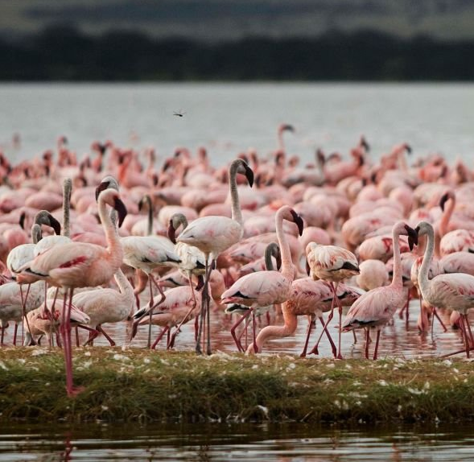
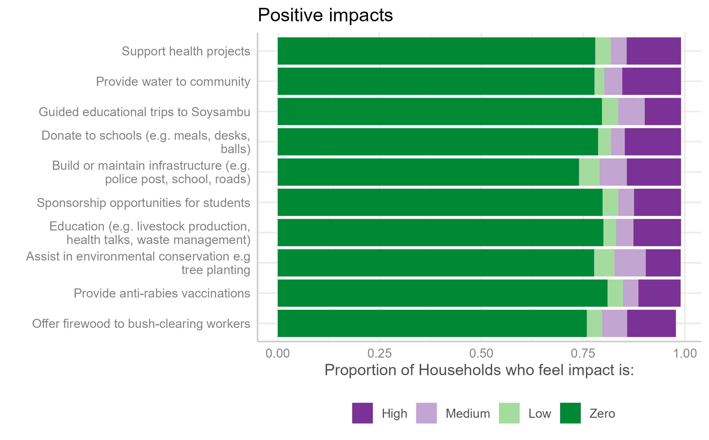
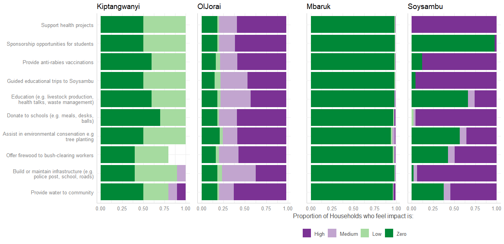
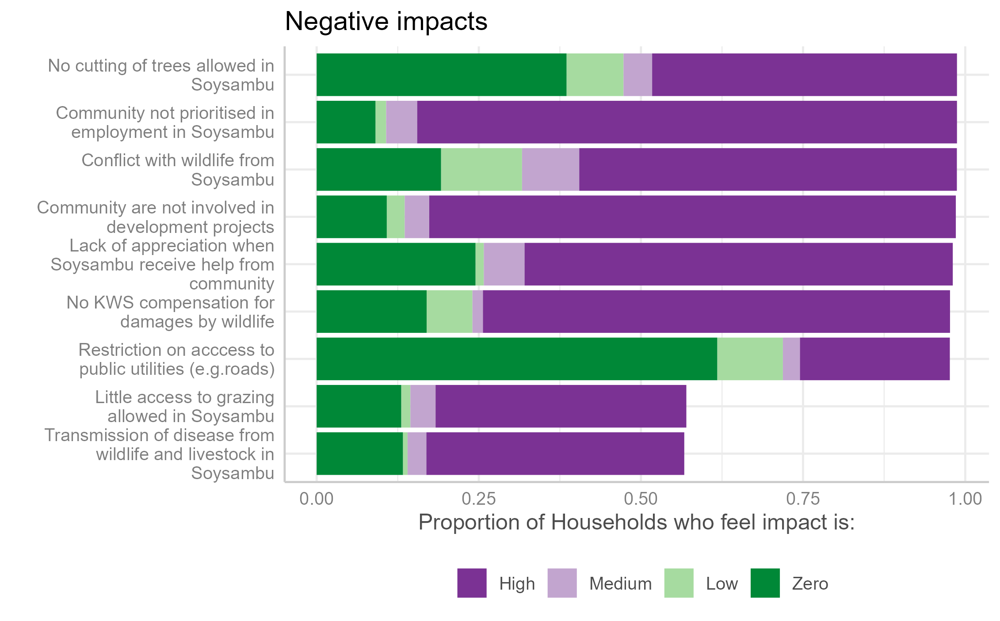
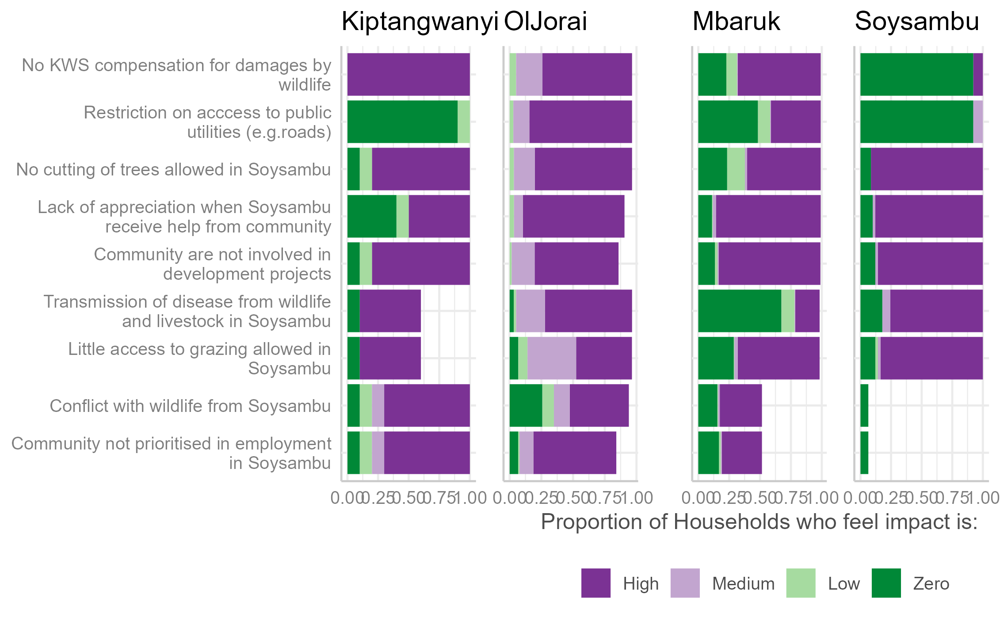

```{r setup, include=FALSE}
knitr::opts_chunk$set(echo = FALSE,
                      warning = FALSE,
                      message = FALSE)
```

```{r}
library(sea)
library(tidyverse)
library(xfun)
library(lubridate)
library(openxlsx)
library(scales)
library(googlesheets4)
library(stats)
library(stats4)
library(survey)
library(srvyr, warn.conflicts = FALSE)
library(sjPlot)
library(cowplot)
library(egg)

hhs_cleaned <- readRDS("hhs_cleaned.rds")
#Sustain EA colour pallette

# Set survey design
dclus2 <- hhs_cleaned %>%
  as_survey_design(c(dnum, snum), fpc = c(fpc1, fpc2))
```

<!-- remove if useless -->
\newpage

# Summary

## Context

The Social Assessment for Protected and Conserved Areas (SAPA) is a standardised, low-cost and relatively simple approach to assessing social impacts of protected or conserved areas. SAPA can help identify positive and negative social impacts of protected or conserved areas, understand the underlying causes of problems related to governance and identify actions that could improve the situation. The methodology can also be used to establish a baseline for social impacts and their overall contribution to human wellbeing against which changes can be tracked over time. It is a multi-stakeholder assessment methodology for use by site-level stakeholders. 

## Key Findings

### Positive social impacts

Based on the findings of the SAPA process, the main positive social impacts that contributed to household well-being in communities neighbouring or within Soysambu Conservancy were: 
1) Improving access to water
2) Building or maintaining infrastructure
3) Support for education
4) Support for health projects
5) Outreach services and training

Soysambu conservancy provides water to the community either through trucks or by building water tanks, ensuring access to clean and safe water for local residents. 

<!-- quote -->
> Soysambu are amazing for proving access to water

Soysambu conservancy's support in building or maintaining infrastructure including police posts, schools, and roads, were reported to enhance the overall quality of life for community members.

Soysambu conservancy’s initiative to offer sponsorship opportunities for students, enabling access to education and fostering academic achievement, was seen as a positive social impact by some households. Additionally, Soysambu's contributions to local schools, such as providing school meals for students, school uniforms, desks, and sports equipment, positively impact educational outcomes and student well-being. The Conservancy also provides free guided educational trips to community members, offering valuable learning experiences and fostering appreciation for conservation efforts.

Soysambu conservancy’s support for health projects, including the provision of equipment to clinics and cancer screening for women, contributed to improved healthcare access and outcomes within the community. Additionally, Soysambu Conservancy also provided anti-rabies vaccinations for dogs and donkeys, demonstrating a commitment to community health.

Soysambu conservancy also offered outreach services in the form of training in improved livestock production, health, and waste management, empowering residents with valuable knowledge and skills.

Soysambu actively participates in environmental conservation initiatives, such as tree planting, contributing to the preservation of natural resources and biodiversity. Furthermore, some households also felt that providing access to firewood also demonstrated a commitment to community support.

### Negative social impacts

Most negative social impacts across the six case studies fall under five main categories:
1) Ecosystem service benefits
2) PA-related employment
3) PA-supported development projects
4) Reduced human-wildlife conflict, and
5) Improved security

Short detail about each

<!-- quote -->
> Scholarships should be transparent and target vulnerable children


<!-- quote -->
> My child needs compensation. He was injured by a buffalo and was a security in conservancy

### Overall contribution to wellbeing

The survey results indicated that the majority of respondents perceived Soysambu's overall contribution to well-being as neutral, taking into account both positive and negative impacts. There were exceptions, particularly in Oljorai and Mbaruk locations, where a few respondents felt that Soysambu had increased their well-being. 

Interestingly, over `r big_numbers("75%")` of respondents residing within Soysambu felt that the conservancy had increased their well-being. On the other hand, approximately `r big_numbers("12%")` of respondents living in Oljorai agreed that Soysambu had reduced their overall well-being.

### Governance

SAPA encompasses four key principles of effective governance:  participation in decision-making, transparency and accessibility to information, mitigation of negative impacts, and equitable benefit-sharing process.

#### Participation

In Mbaruk and Oljorai locations, the majority of people disagree that there is participation in Soysambu’s decision-making that impacts the community. However, in Soysambu itself, a large percentage of people feel that there is some level of participation, particularly in knowing their community representative for meetings with Soysambu and communicating with them. In Kiptangwani, there is a mix in opinions with most people feeling that there is no participation, some agreeing that there is participation, and quite a number do not know whether there is any participation.

#### Transparency and access to information

`r big_numbers("75%", "Did one thing")`

#### Rights

#### Benefit Sharing Process

#### Mitigation of Negative Impacts

### Recommendations going forward

Given that there are significant differences between locations, we recommend xyz


### Disclaimer

The views and opinions expressed in this report reflect those of the authors. Whilst every care has been taken in the writing of this report, the authors accept no responsibility for any resultant errors herein, any damages or loss whatsoever caused or suffered by any individual or organisation.

### Rights

The information in this report is copyrighted, therefore, copying or transmitting any part of this report without permission from the authors may be a violation. However, we encourage dissemination and use of this report with appropriate citation and acknowledgement.

### Suggested citation

Please cite this report as such :

Brehony, P., Tyrrell, P., Muiyuro, R., Wairimu, E. 2024. Social Assessment of Protected Area for Soysambu Conservancy. Sustain East Africa, Nairobi, Kenya.

### Acknowledgements

This Social Assessment of Protected Areas for Soysambu Conservancy is the result of a collaborative effort between Sustain East Africa, Soysambu Conservancy, and representatives from communities bordering the Conservancy. Thank you to the all those who helped to pull this together.

Particular thanks go to: Helen Jerotich, Community Education Officer (Soysambu Conservancy); Chief Joseph Mwangi and Assistant Chief Felicah Mugi of Mbaruk location; Chief Parit Sururu and Assistant Chief Henry Balozi of Kongasis, Oljorai location; and Chief Simon Mathare and Assistant Chief Benson Mungai of Kiptangwani location. 

We would also like to acknowledgement the MCA of Eburru Mbaruk Ward, Michael Gathanwa, and his ward administration for their insights and input in highlighting areas where Soysambu Conservancy can continue to support neighbouring communities.

We also thank the Nyumba Kumi village elders from the three locations for their input, as well as the dedicated enumerators involved in carrying out the household surveys: Benedicta Wanjiru, Emmanuel Kooli, and Paul Waweru.

<!-- inverse rust page -->
<div class="section-rust-inverse">

# Introduction

## Soysambu Conservancy

Soysambu Conservancy is located within the Rift Valley System. It covers 48,000 acres, encompassing the northern and western shores of Lake Elmenteita. Soysambu Conservancy is renowned for its remarkable biodiversity, including a population of 170 endangered Nubian Giraffes and over 450 bird species, notably hosting 28% of the world's Lesser Flamingo population. Indeed Lake Elmentaita is one of Kenya's Key Biodiversity Areas and RAMSAR sites^[a wetland that is of international importance under the Ramsar Convention, also known as the "Convention on Wetlands"]. Its rich wildlife habitat is home to buffalo, leopard, hippo, hyena, jackal, eland, zebra, impala, Thompson’s and Grant’s Gazelle, waterbuck, reedbuck, klipspringer, warthog, steinbok, colobus monkey, vervet monkey, and baboons.

Soysambu Conservancy was established as a Not-for-Profit Company on April 13th, 2007 and works to conserve the Soysambu Estate as a traditional wildlife area, which supports the integrity of the greater Rift Valley ecosystem, while promoting sustainable coexistence of wildlife with livestock and at the same time being relevant to and part of modern-day Kenya. 

Soysambu Conservancy wanted to understand more about the social impact of the conservancy on communities living within and surround the conservancy. Furthermore, they wanted to use the opportunity of assessing the social impacts of the Conservancy to listen to what communities within and surrounding the conservancy had to say about the positive and negative impacts of the Conservancy. This could also serve as an opportunity to establish a baseline for Soysambu Conservancy's contribution to the well-being of communities, over time.


## The Social Assessment of Protected Areas (SAPA) approach

The Social Assessment for Protected and Conserved Areas (SAPA), launched in 2014, responded to a need for a standardised, low-cost and relatively simple approach to assessing social impacts of protected or conserved areas. 

SAPA is a multi-stakeholder assessment methodology for use by site-level stakeholders. The methodology is based on a standardised process that can be replicated across protected or conserved areas while remaining flexible enough for tailoring to local needs and contexts. SAPA uses a set of standard assessment questions directly related to social impacts and governance quality. It also includes a process of developing site-specific questions that respond to specific needs of actors. 

SAPA can help identify positive and negative social impacts of protected or conserved areas, understand the underlying causes of problems related to governance and identify actions that could improve the situation. The inclusion of a governance and equity assessment in the second edition of SAPA strengthens the results and action planning processes. Governance is distinct from management and pays attention to who defines objectives and how. It also looks at allocation of responsibility and accountability for delivering on these objectives.

The methodology can also be used to establish a baseline for social impacts and their overall contribution to human wellbeing against which changes can be tracked over time. Therefore, the SAPA approach meets the requirements of Soysambu Conservancy as they seek to understand social impacts over time, and to listen to feed back from communities living within and surrounding the conservancy. 

## Objectives of the Social Assessment

Soysambu Conservancy aims to ensure that they provide value to Kenya, its people and the wider international community through sustainable conservation and enjoyment as a national treasure and heritage. 

The conservancy is currently expanding its engagement with communities living within and surrounding the conservancy. Conducting a SAPA will therefore help them better understand the views, needs, and opportunities of the surrounding communities. 

The primary objective of this assessment therefore was to integrate conservation initiatives with community development and foster a positive relationship between Soysambu and their neighbouring communities, principally by increasing positive impacts and reducing negative impacts to communities. 

</div>

<!-- rust page -->
<div class ="section-rust">

<!-- columns layout -->
<!-- article instead of a div if you have titles to should go in the TOC -->

# Approach and Methods

<div class ="wrap-columns">
<div class ="column-50">

## SAPA overview, process and outputs

The SAPA Assessment uses a mixed methods approach that combines qualitative data and quantitative data to gather information, assess results and generate ideas for action in response to the findings. 

Throughout the SAPA process, there is an emphasis on linking the steps to stakeholder engagement, either through discussions, or feedback, or actions to improve the situation. This ensures that stakeholders, including communities through their representatives, are effectively engaged throughout the assessment. 

This multi-stakeholder approach increases the accuracy and credibility of the findings, enhances transparency and ownership of the assessment process, builds support for action and accountability for implementation.

The main phases of the SAPA include:

Preparing
  Planning
  Community mapping
  Stakeholder analysis
  Training
  
Scoping
  First community meeting and stakeholder workshop
  
Information Gathering
  Planning
  Develop household survey
  Train enumerators
  Conduct household survey
  Analyse household survey data
  
Assessing
  Second community meeting and stakeholder workshop
  
Taking Action
  Communicate results
  Plan actions
  Monitor progress

For those interested, much greater detail can be found in the SAPA manual @franks_social_2018.

## Preparation

Preparation

## Scoping

Scoping

## Information Gathering

### Existing reports

Existing reports

### Developing household questionnaire

Developing household questionnaire

### Enumerator Training

Enumerator Training

### Household Survey

Household Survey

</div>
<div class ="column-50">

Aute aliqua consequat fugiat reprehenderit nostrud. Nisi nostrud ex laboris non. Minim dolore esse consequat magna cillum sunt labore dolor Lorem minim.Cupidatat occaecat elit proident ad anim est cupidatat excepteur aute cillum ipsum minim mollit enim. Proident do incididunt occaecat magna esse ipsum elit dolore sint culpa dolore sint qui. Ex do in excepteur irure incididunt ea sint aliqua culpa Lorem et ipsum proident. Adipisicing ea adipisicing amet proident laborum Lorem magna commodo deserunt officia veniam laboris.
Nostrud laboris ullamco ut non eu elit amet. Mollit qui et cillum. Ex Lorem ea officia id est sint. Nulla consectetur ad ea consequat anim exercitation est consequat voluptate tempor dolor irure pariatur elit sit. Proident qui ad cupidatat. Do amet duis labore et.

</div>
</div>

<!-- quote -->
> Soysambu are amazing or not


```{r, fig.cap='Flamingos', fig.align='center', out.width = '90%'}

```

Ex magna consectetur consectetur est pariatur id. Excepteur proident laborum commodo voluptate officia cupidatat commodo ad laborum nulla. Qui ea proident amet fugiat officia consequat fugiat esse sit fugiat in dolor ipsum laborum. Est irure ipsum nisi nostrud commodo duis laborum cupidatat esse ex nostrud consequat officia ad. Proident et ex aliqua in esse sint do reprehenderit voluptate enim cillum duis deserunt irure enim. In laborum sit ipsum aliquip elit do elit nulla nisi laboris voluptate.


```{r}
add_lot_link(caption = 'Number of households sampled')

mtcars %>%
  head(7) %>%
  sea::sea_table(
    dark_color = sea_colors("rust_orange"),
    pale_color = sea_colors("grey"),
    third_color = "white"
  ) |>
  flextable::autofit()
```

\newpage

`r wrap_columns_elements(c(big_numbers("36%", "Did one thing"), big_numbers("45%", "Did one thing"), big_numbers("86%", "Did one thing")))`

`r wrap_columns_elements(c(big_numbers("5%", "Did one thing"), big_numbers("36%"), big_numbers("77%", "Did one thing")))`

`r wrap_columns_elements(c(big_numbers(fontawesome::fa("car"), "A nice car"), big_numbers(fontawesome::fa("plane"), "A nice plane"), big_numbers("36%", "Did one thing")))`

<!-- `r wrap_double_page("img/map sample sizes.png", caption = "Figure 2. Map of surveyed areas and sample sizes.")` -->


```{r, fig.cap='Figure 2. Map of survey locations', fig.align='center', out.width = '90%'}

library(mapview)
library(sf)
library(dplyr)
library(readxl)
library(readr)
library(leaflet)
library(tidyr)

hhs_locations_village <- readRDS("hhs_cleaned.rds") %>%
  select("locat", "locatn_lat", "locatn_long", "enum", "village", "livelihood_activity1", "livelihood_activity2") %>%
  rename("y" = "locatn_lat", "x" = "locatn_long")

hhs_location1 <- hhs_locations_village %>%
  group_by(locat) %>%
  summarize(num_samples = n())
hhs_location2 <- hhs_locations_village %>%
  group_by(locat) %>%
  summarize(mean_latitude = mean(y),
            mean_longitude = mean(x))
hhs_location <- merge(hhs_location1, hhs_location2, by = 'locat')

my_palette <- c("#202C39", "#d77e5e", "#3d5919", "#381D2A"
                #"#e6e7e2","#a4b792",  "#000000","#202C39", "#d77e5e"
                )

distinct_colors <- my_palette[1:length(unique(hhs_location$locat))]

map <- leaflet(data = hhs_location) %>%
  addTiles()
map <- map %>%
  addCircleMarkers(
    lat = ~mean_latitude,
    lng = ~mean_longitude,
    radius = ~sqrt(num_samples) * 5,
    color = ~distinct_colors,
    fillOpacity = 0.7
  ) %>%
  addLegend("bottomright",
            colors = distinct_colors,
            labels = unique(hhs_location$locat),
            opacity = 1)
```
<!-- `r wrap_double_page(map)` -->


```{r, fig.cap='Figure 3. Gender of respondents', fig.align='center', out.width = '90%'}
library(ggplot2)

# # map of the world
# world <- rnaturalearth::ne_countries(scale = "small", returnclass = "sf")
# 
# p <- ggplot(world) +
#   geom_sf(aes(fill = income_grp),
#           color = "lightgrey") +
#   sea::scale_fill_sea_discrete(reverse = TRUE) +
#   guides(fill = "none") +
#   theme_void()


gender_respond <- dclus2 %>% 
  group_by(locat, gender) %>% 
  summarise(
    proportion = survey_mean(vartype = "ci", na.rm = TRUE),
    total = survey_total(vartype = "ci", na.rm = TRUE),
    n = unweighted(n())
  ) 

a <- ggplot(gender_respond, aes(x = locat, y = n, group = gender, fill = gender)) +
  geom_bar(stat = "identity", position = position_dodge(preserve = "single"), width = 0.95) +
  sea::scale_fill_sea_discrete(reverse = TRUE) +
  guides(fill = guide_legend(title = NULL)) +
  labs(x = "Location", y = "Number of Households") +
  theme_sjplot() + 
  #guides(fill = "none") +
  #theme_void() +
  theme(legend.position = c(0.9, 0.9))
a
```

</div>

<!-- inverse gunmetal page -->
<div class="section-gunmetal-inverse">

# Findings

## Positive Social Impacts


Soysambu conservancy’s initiative to offer sponsorship opportunities for students, enabling access to education and fostering academic achievement, was seen as a positive social impact by some households. Additionally, Soysambu's contributions to local schools, such as providing school meals for students, school uniforms, desks, and sports equipment, positively impact educational outcomes and student well-being. The Conservancy also provides free guided educational trips to community members, offering valuable learning experiences and fostering appreciation for conservation efforts.

Soysambu conservancy’s support for health projects, including the provision of equipment to clinics and cancer screening for women, contributed to improved healthcare access and outcomes within the community. Additionally, Soysambu Conservancy also provided anti-rabies vaccinations for dogs and donkeys, demonstrating a commitment to community health.

Soysambu conservancy provides water to the community either through trucks or by building water tanks, ensuring access to clean and safe water for local residents. 

Soysambu conservancy's support in building or maintaining infrastructure including police posts, schools, and roads, were reported to enhance the overall quality of life for community members.

Soysambu conservancy also offered outreach services in the form of training in improved livestock production, health, and waste management, empowering residents with valuable knowledge and skills.

Soysambu actively participates in environmental conservation initiatives, such as tree planting, contributing to the preservation of natural resources and biodiversity. Moreover, Soysambu offers support to bush-clearing workers by providing firewood for free, demonstrating a commitment to employee welfare and community support.

```{r, fig.cap='Overall positive impacts across all communities', fig.align='center', out.width = '90%'}

```

## Positive Impacts per Location

The findings of the household survey reveal diverse perspectives across the four locations. When the survey respondents were asked about how important projects previously implemented by Soysambu were to their households the majority of respondents from Kiptangwani location assigned a rating of zero, indicating little importance. A significant portion expressed low importance, while only a few acknowledged medium to high importance, particularly concerning water provision and infrastructure development.

In Mbaruk location, respondents indicated that the previously mentioned projects had zero impact on their households, with very few attributing medium to high importance to them. 
In the Oljorai location, the influence of Soysambu Conservancy on the community appears notably positive. A majority of respondents affirmed the high importance of the projects to their households, with a significant number rating them as of medium importance. Fewer respondents indicated zero importance, while a minimal number expressed low importance.

The findings revealed mixed perceptions among residents within Soysambu regarding the significance of various projects. While a considerable number regarded most projects as of high importance, some perceived certain initiatives e.g sponsorship opportunities for students and community education programs, as having zero importance to their households. Consequently, the number of respondents expressing medium importance to the projects was minimal.

```{r, fig.cap='Positive impacts broken down into separate locations', fig.align='center', out.width = '90%'}

```

## Negative Social Impacts

Although Soysambu Conservancy have made considerable efforts to improve relationships with communities within and neighbouring the conservancy, there are still a number of impacts that are having negative impacts on household well-being.

The findings from discussions with community representatives and the household surveys indicate that transmission of disease from wildlife and livestock in Soysambu to local livestock poses a significant concern for community members. Human-wildlife conflict also dominates in the area with wildlife originating from Soysambu exacerbating tensions and challenges for residents. Examples include the damage to crops, livestock and other property; injury of people; and lack of compensation for damage and injury by wildlife from Kenya Wildlife Service (KWS) Moreover, restricted access to certain public utilities, such as roads, creates barriers to mobility and community well-being.

Respondents also said that Soysambu-related benefits are unfairly shared, for example, there was main concern on limited employment opportunities and a lack of prioritisation in employment within Soysambu. This together with the exclusion of the local community from involvement in development projects perpetuates feelings of exclusion. 

There is also a perceived lack of appreciation from Soysambu Conservancy when they receive assistance from the community, such as when the community assists in putting out fires during dry seasons. Limited access to grazing areas and restrictions on tree cutting within Soysambu Conservancy compound the challenges faced by local residents.


```{r, fig.cap='Overall negative impacts across all communities', fig.align='center', out.width = '90%'}

```

## Negative Impacts per Location

The assessment findings suggest that respondents in Oljorai location considered all of the highlighted negative impacts as of high importance, implying a detrimental effect on their household well-being.  Fewer respondents felt that the impacts were of medium importance while a number of them fel that some impacts were of zero importance for example conflict with wildlife, little grazing access to Soysambu and community not being prioritised in employment by Soysambu. 

Opinions among respondents in Kiptangwani location were varied when it came to negative impacts. A significant majority of respondents highlighted that all negative impacts were of high importance and thus had a lot of impact on their household wellbeing, except for the restriction of access to public utilities, where most respondents expressed a perception of zero importance. Some respondents cited the negative impacts as having low importance, while others had no opinion at all. 


```{r, fig.cap='Negative impacts broken down into separate locations', fig.align='center', out.width = '90%'}

```

## Some more title

Nulla consequat deserunt anim labore dolor nulla anim et. Id officia nostrud officia pariatur eiusmod velit id elit sit ut duis pariatur duis. Officia et veniam cupidatat sint velit nisi ut. Duis enim est labore ea laborum officia ad occaecat ex non tempor commodo ea tempor elit.

`r wrap_columns_elements(c(big_numbers("36%", "Did one thing"), big_numbers("36%", "Did one thing"), big_numbers("36%", "Did one thing")))`

Eu reprehenderit amet duis irure aute proident Lorem laborum do eu. Cillum eiusmod irure sint id dolor do amet. Ad sunt sunt voluptate anim qui aliqua voluptate.

</div>

<!-- gunmetal page -->
<div class="section-gunmetal">


```{r, fig.cap='Figure 4. Proportion of Households born in their area', fig.align='center', out.width = '90%'}

born <- dclus2 %>% 
  group_by(locat, hh_head_born) %>% 
  summarise(proportion = survey_mean(vartype = "ci", na.rm=TRUE),
            total = survey_total(vartype = "ci", na.rm=TRUE),
            n= unweighted(n())) 

a <- ggplot(born, aes(x=locat, y=proportion, group = hh_head_born, fill = hh_head_born)) +
  geom_bar(stat = "identity", position = position_dodge(preserve = "single"), width = 0.95) +
  geom_errorbar(data=born, aes(ymax = ifelse(proportion_upp > 1, 1, proportion_upp), ymin = ifelse(proportion_low < 0, 0, proportion_low)), 
                position = position_dodge(preserve = "single", width = 0.95), width = 0.1) +
  sea::scale_fill_sea_discrete(reverse = TRUE) +
  guides(fill=guide_legend(title=NULL)) +
  labs(x="Location", y = "Proportion of Households") +
  scale_y_continuous(limits=c(0, 1)) +
  theme_sjplot() + 
  theme(legend.position=c(0.80,0.950))
a

```

<!-- columns layout -->
<div class="wrap-columns">
<div class="column-60">

Ex magna consectetur consectetur est pariatur id. Excepteur proident laborum commodo voluptate officia cupidatat commodo ad laborum nulla. Qui ea proident amet fugiat officia consequat fugiat esse sit fugiat in dolor ipsum laborum. Est irure ipsum nisi nostrud commodo duis laborum cupidatat esse ex nostrud consequat officia ad. Proident et ex aliqua in esse sint do reprehenderit voluptate enim cillum duis deserunt irure enim. In laborum sit ipsum aliquip elit do elit nulla nisi laboris voluptate.

## Title inside column

Ex magna consectetur consectetur est pariatur id. Excepteur proident laborum commodo voluptate officia cupidatat commodo ad laborum nulla. Qui ea proident amet fugiat officia consequat fugiat esse sit fugiat in dolor ipsum laborum. 

</div>
<div class="column-40">

Aute aliqua consequat fugiat reprehenderit nostrud. Nisi nostrud ex laboris non. Minim dolore esse consequat magna cillum sunt labore dolor Lorem minim.Cupidatat occaecat elit proident ad anim est cupidatat excepteur aute cillum ipsum minim mollit enim. Proident do incididunt occaecat magna esse ipsum elit dolore sint culpa dolore sint qui. Ex do in excepteur irure incididunt ea sint aliqua culpa Lorem et ipsum proident. Adipisicing ea adipisicing amet proident laborum Lorem magna commodo deserunt officia veniam laboris.
Nostrud laboris ullamco ut non eu elit amet. Mollit qui et cillum. Ex Lorem ea officia id est sint. Nulla consectetur ad ea consequat anim exercitation est consequat voluptate tempor dolor irure pariatur elit sit. Proident qui ad cupidatat. Do amet duis labore et.

</div>
</div>

<!-- <aside> tags have inverse background -->
<aside>

### Aside title

Proident do incididunt occaecat magna esse ipsum elit dolore sint culpa dolore sint qui. Ex do in excepteur irure incididunt ea sint aliqua culpa Lorem et ipsum proident. Adipisicing ea adipisicing amet proident laborum Lorem magna commodo deserunt officia veniam laboris.

</aside>

</div>

<!-- inverse purple page -->
<div class="section-purple-inverse">

# Conclusion

## Level 2

Nulla consequat deserunt anim labore dolor nulla anim et. Id officia nostrud officia pariatur eiusmod velit id elit sit ut duis pariatur duis. Officia et veniam cupidatat sint velit nisi ut. Duis enim est labore ea laborum officia ad occaecat ex non tempor commodo ea tempor elit. Eu reprehenderit amet duis irure aute proident Lorem laborum do eu. Cillum eiusmod irure sint id dolor do amet. Ad sunt sunt voluptate anim qui aliqua voluptate.

### Some more title level 3

Nulla consequat deserunt anim labore dolor nulla anim et. Id officia nostrud officia pariatur eiusmod velit id elit sit ut duis pariatur duis. Officia et veniam cupidatat sint velit nisi ut. Duis enim est labore ea laborum officia ad occaecat ex non tempor commodo ea tempor elit. Eu reprehenderit amet duis irure aute proident Lorem laborum do eu. Cillum eiusmod irure sint id dolor do amet. Ad sunt sunt voluptate anim qui aliqua voluptate.

</div>

<!-- purple page -->
<div class="section-purple">

Ex magna consectetur consectetur est pariatur id. Excepteur proident laborum commodo voluptate officia cupidatat commodo ad laborum nulla. Qui ea proident amet fugiat officia consequat fugiat esse sit fugiat in dolor ipsum laborum. Est irure ipsum nisi nostrud commodo duis laborum cupidatat esse ex nostrud consequat officia ad. Proident et ex aliqua in esse sint do reprehenderit voluptate enim cillum duis deserunt irure enim. In laborum sit ipsum aliquip elit do elit nulla nisi laboris voluptate.

## Some more title

Ex magna consectetur consectetur est pariatur id. Excepteur proident laborum commodo voluptate officia cupidatat commodo ad laborum nulla. Qui ea proident amet fugiat officia consequat fugiat esse sit fugiat in dolor ipsum laborum. Est irure ipsum nisi nostrud commodo duis laborum cupidatat esse ex nostrud consequat officia ad. Proident et ex aliqua in esse sint do reprehenderit voluptate enim cillum duis deserunt irure enim. In laborum sit ipsum aliquip elit do elit nulla nisi laboris voluptate.

> Deserunt consectetur veniam irure pariatur occaecat eu elit officia minim. Eiusmod irure consectetur sunt mollit in ad ea veniam ut.

Aute aliqua consequat fugiat reprehenderit nostrud. Nisi nostrud ex laboris non. Minim dolore esse consequat magna cillum sunt labore dolor Lorem minim.Cupidatat occaecat elit proident ad anim est cupidatat excepteur aute cillum ipsum minim mollit enim. Proident do incididunt occaecat magna esse ipsum elit dolore sint culpa dolore sint qui. Ex do in excepteur irure incididunt ea sint aliqua culpa Lorem et ipsum proident. Adipisicing ea adipisicing amet proident laborum Lorem magna commodo deserunt officia veniam laboris.
Nostrud laboris ullamco ut non eu elit amet. Mollit qui et cillum. Ex Lorem ea officia id est sint. Nulla consectetur ad ea consequat anim exercitation est consequat voluptate tempor dolor irure pariatur elit sit. Proident qui ad cupidatat. Do amet duis labore et.

Duis esse amet enim officia Lorem anim culpa consequat consectetur. Consequat duis Lorem laboris ullamco tempor enim cupidatat ea laborum proident. Quis ullamco mollit ipsum ullamco ea culpa. Veniam ad duis duis aliquip amet aute laboris id eu labore sint ad exercitation pariatur.

Aute aliqua consequat fugiat reprehenderit nostrud. Nisi nostrud ex laboris non. Minim dolore esse consequat magna cillum sunt labore dolor Lorem minim.Cupidatat occaecat elit proident ad anim est cupidatat excepteur aute cillum ipsum minim mollit enim. Proident do incididunt occaecat magna esse ipsum elit dolore sint culpa dolore sint qui. Ex do in excepteur irure incididunt ea sint aliqua culpa Lorem et ipsum proident. Adipisicing ea adipisicing amet proident laborum Lorem magna commodo deserunt officia veniam laboris.
Nostrud laboris ullamco ut non eu elit amet. Mollit qui et cillum. Ex Lorem ea officia id est sint. Nulla consectetur ad ea consequat anim exercitation est consequat voluptate tempor dolor irure pariatur elit sit. Proident qui ad cupidatat. Do amet duis labore et.

Duis esse amet enim officia Lorem anim culpa consequat consectetur. Consequat duis Lorem laboris ullamco tempor enim cupidatat ea laborum proident. Quis ullamco mollit ipsum ullamco ea culpa. Veniam ad duis duis aliquip amet aute laboris id eu labore sint ad exercitation pariatur.

Aute aliqua consequat fugiat reprehenderit nostrud. Nisi nostrud ex laboris non. Minim dolore esse consequat magna cillum sunt labore dolor Lorem minim.Cupidatat occaecat elit proident ad anim est cupidatat excepteur aute cillum ipsum minim mollit enim. Proident do incididunt occaecat magna esse ipsum elit dolore sint culpa dolore sint qui. Ex do in excepteur irure incididunt ea sint aliqua culpa Lorem et ipsum proident. Adipisicing ea adipisicing amet proident laborum Lorem magna commodo deserunt officia veniam laboris.
Nostrud laboris ullamco ut non eu elit amet. Mollit qui et cillum. Ex Lorem ea officia id est sint. Nulla consectetur ad ea consequat anim exercitation est consequat voluptate tempor dolor irure pariatur elit sit. Proident qui ad cupidatat. Do amet duis labore et.

Duis esse amet enim officia Lorem anim culpa consequat consectetur. Consequat duis Lorem laboris ullamco tempor enim cupidatat ea laborum proident. Quis ullamco mollit ipsum ullamco ea culpa. Veniam ad duis duis aliquip amet aute laboris id eu labore sint ad exercitation pariatur.

</div>

<!-- putting bibliography before appendix -->
<div id="refs">
## Bibliography
</div>

<!-- grey section - for appendix only -->
<div class="appendix-section-grey">

# Appendix

## Appendix 1

Ex magna consectetur consectetur est pariatur id. Excepteur proident laborum commodo voluptate officia cupidatat commodo ad laborum nulla. Qui ea proident amet fugiat officia consequat fugiat esse sit fugiat in dolor ipsum laborum. Est irure ipsum nisi nostrud commodo duis laborum cupidatat esse ex nostrud consequat officia ad. Proident et ex aliqua in esse sint do reprehenderit voluptate enim cillum duis deserunt irure enim. In laborum sit ipsum aliquip elit do elit nulla nisi laboris voluptate.

\newpage

## Appendix 2

```{r}
mtcars %>%
  head(20) %>%
  sea::sea_table(
    dark_color = "darkgrey",
    pale_color = sea_colors("grey"),
    third_color = "white"
  ) |>
  flextable::autofit()
```


</div>

