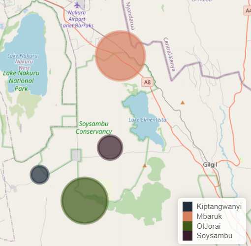
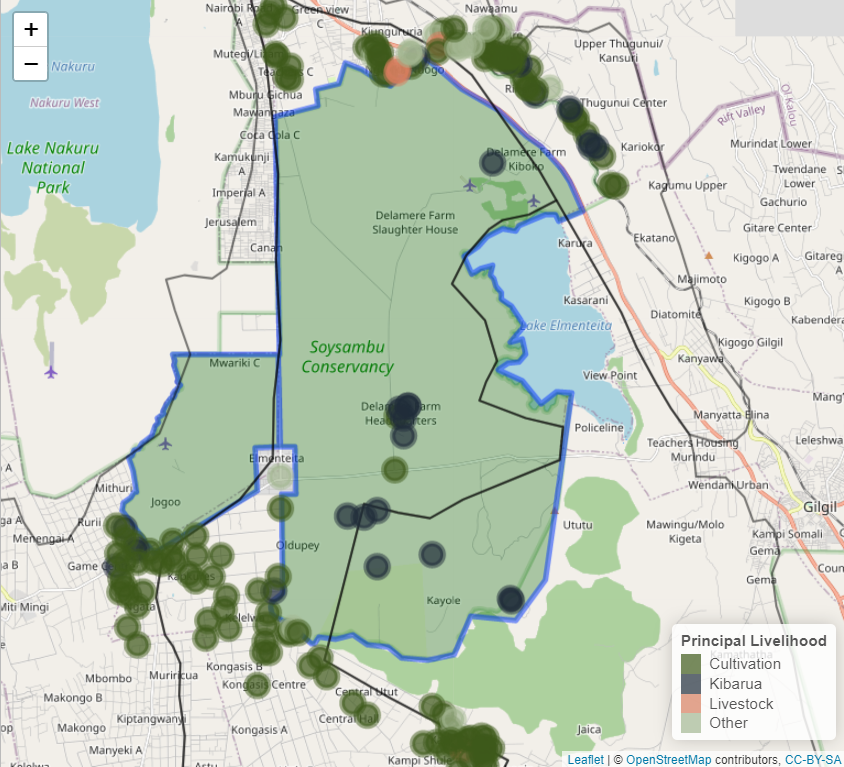
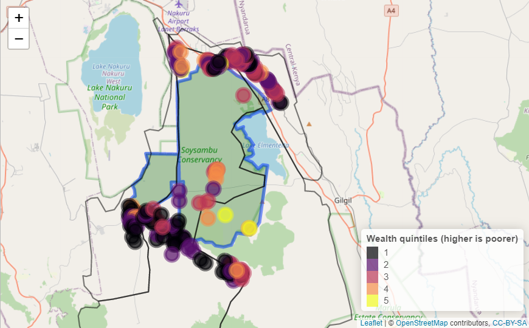
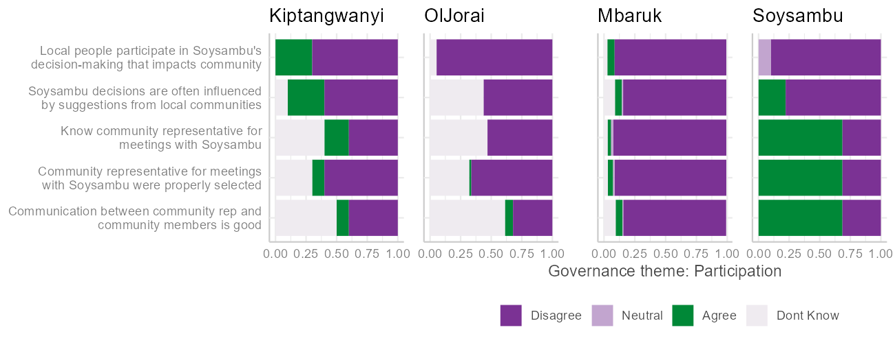
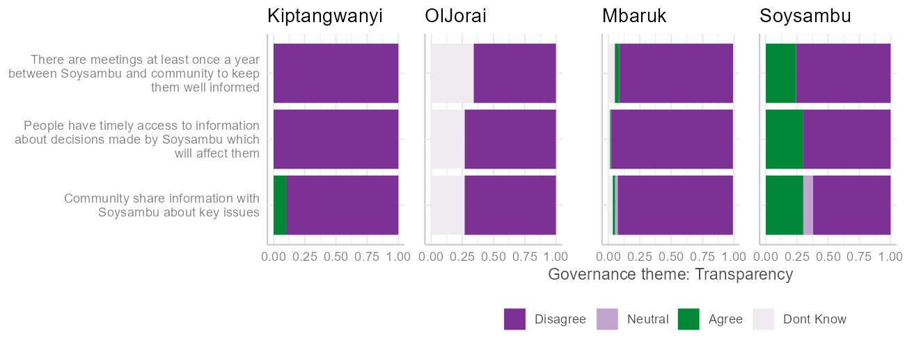
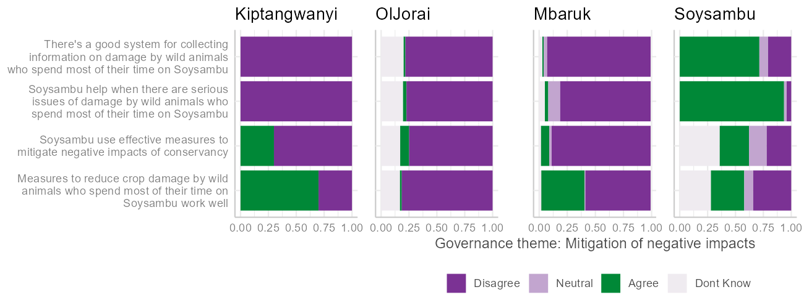
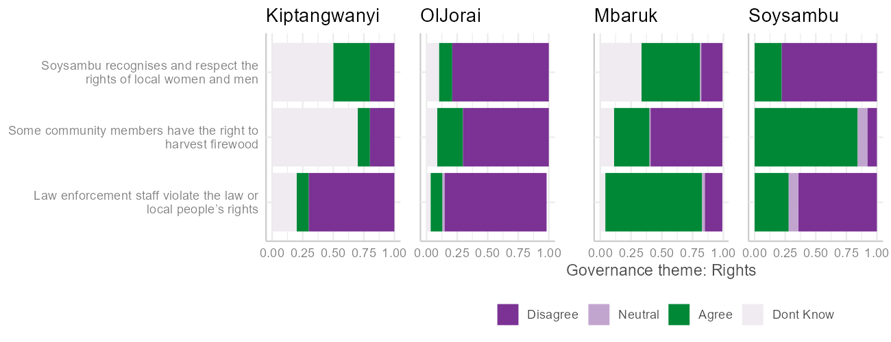
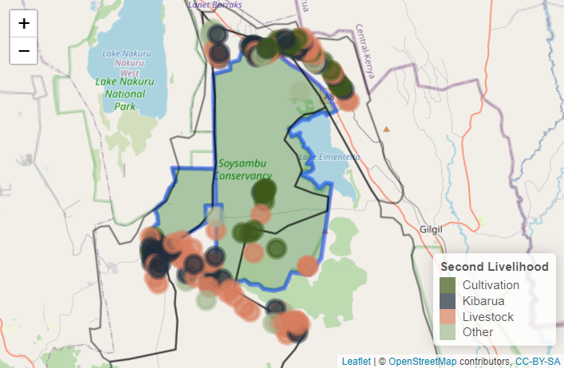
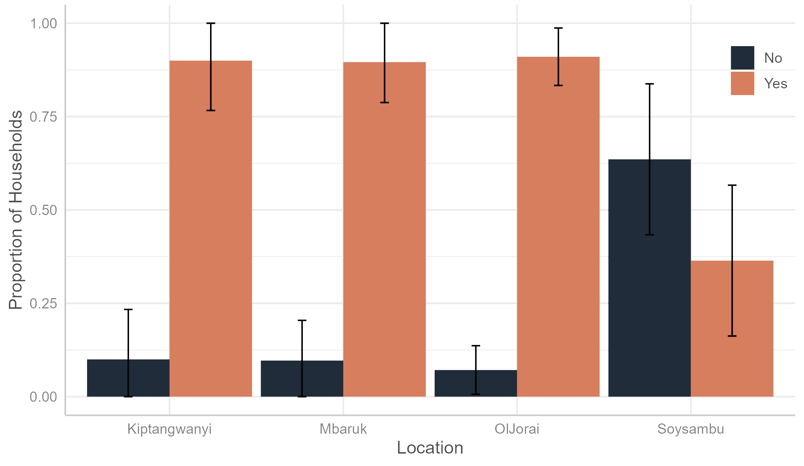

```{r setup, include=FALSE}
knitr::opts_chunk$set(echo = FALSE,
                      warning = FALSE,
                      message = FALSE)
```

```{r}
library(sea)
library(tidyverse)
library(xfun)
library(lubridate)
library(openxlsx)
library(scales)
library(googlesheets4)
library(stats)
library(stats4)
library(survey)
library(srvyr, warn.conflicts = FALSE)
library(cowplot)
library(egg)
library(tibble)
library(fontawesome)
library(sea)

```


```{r}
hhs_cleaned <- readRDS("hhs_cleaned.rds")
#Sustain EA colour pallette

# Set survey design
dclus2 <- hhs_cleaned %>%
  as_survey_design(c(dnum, snum), fpc = c(fpc1, fpc2))
```

\newpage

### Disclaimer

The views and opinions expressed in this report reflect those of the
authors. Whilst every care has been taken in the writing of this report,
the authors accept no responsibility for any resultant errors herein or
any damages or losses whatsoever caused or suffered by any individual or
organisation.

### Rights

The information in this report is copyrighted; therefore, copying or
transmitting any part of this report without permission from the authors
may be a violation. However, we encourage the dissemination and use of this
report with appropriate citations and acknowledgement.

### Suggested citation

Please cite this report as such:

Brehony, P., Tyrrell, P., Muiyuro, R., Kang'ethe, E. 2024. Social
Assessment of Protected Area for Soysambu Conservancy. Sustain East
Africa, Nairobi, Kenya.

### Acknowledgements

This Social Assessment of Protected Areas for Soysambu Conservancy is
the result of a collaborative effort between Sustain East Africa,
Soysambu Conservancy, and representatives from communities bordering the
Conservancy. Thank you to the all those who helped to pull this
together.

Particular thanks go to: Helen Jerotich, Community Education Officer
(Soysambu Conservancy); Chief Joseph Mwangi and Assistant Chief Felicah
Mugi of Mbaruk location; Chief Parit Sururu and Assistant Chief Henry
Balozi of Kongasis, Ol Jorai location; and Chief Simon Mathare and
Assistant Chief Benson Mungai of Kiptangwanyi location.

We would also like to acknowledgement the MCA of Eburru Mbaruk Ward,
Michael Gathanwa, and his ward administration for their insights and
input in highlighting areas where Soysambu Conservancy can continue to
support neighbouring communities.

We also thank the Nyumba Kumi village elders from the three locations
for their input, as well as the dedicated enumerators involved in
carrying out the household surveys: Benedicta Wanjiru, Emmanuel Kooli,
and Paul Waweru.

<!-- inverse gunmetal page -->

::: {.section-gunmetal-inverse}
# Summary

## Context

The Social Assessment for Protected and Conserved Areas (SAPA) is a
standardised, low-cost and relatively simple approach to assessing the
social impacts of protected or conserved areas. SAPA can help identify
the positive and negative social impacts of protected or conserved areas,
understand the underlying causes of problems related to governance and
identify actions that could improve the situation. The methodology can
also be used to establish a baseline for social impacts and their
overall contribution to human well-being against which changes can be
tracked over time. It is a multi-stakeholder assessment methodology for
use by site-level stakeholders.

## Key findings

### Positive social impacts

Based on the findings of the SAPA process, the main positive social
impacts that contributed to household well-being in communities
neighbouring or within Soysambu Conservancy were:

1.  Improving access to water

2.  Building or maintaining infrastructure

3.  Supporting education

4.  Supporting health projects

5.  Providing outreach services and training

Soysambu Conservancy provides water to the community by building water tanks, ensuring access to clean and safe
water for local residents. Furthermore, support for building or
maintaining infrastructure, including police posts, schools, and roads,
were reported to enhance the overall quality of life for community
members.
:::

<!-- gunmetal page -->

::: {.section-gunmetal}

Soysambu Conservancy's initiative to offer sponsorship opportunities for
students, enabling access to education and fostering academic
achievement, was seen as having a positive social impact. Additionally,
Soysambu's contributions to local schools, such as providing school
meals for students, school uniforms, desks, and sports equipment,
positively impact educational outcomes and student well-being. The
Conservancy also provides free guided educational trips to community
members, offering valuable learning experiences.

> We appreciate Soysambu for providing land to construct Lady Ann
> Secondary School.

Soysambu Conservancy's support for health projects, including the
provision of equipment to clinics and cancer screening for women,
contributed to improved healthcare access and outcomes within the
community. Additionally, Soysambu Conservancy also provided anti-rabies
vaccinations for dogs and donkeys, demonstrating a commitment to
community health.

Soysambu Conservancy also offered outreach services in the form of
training in improved livestock production, health, and waste management,
empowering residents with valuable knowledge and skills.

Soysambu actively participates in environmental conservation
initiatives, such as tree planting, contributing to the preservation of
natural resources and biodiversity. Furthermore, some households also
felt that providing access to firewood also demonstrated a commitment to
community support.

### Negative social impacts

Despite efforts to reduce the negative social impacts of Soysambu on
surrounding community members, some negative impacts were still
recorded. Most negative social impacts across the six case studies fall
under these main categories:

1.  Restricted access to services and utilities

2.  Unequal distribution of benefits

3.  Lack of appreciation of the community during emergencies

4.  Human-wildlife conflict

5.  Transmission of disease

Limited access to certain public utilities impacted by Soysambu, such
as good roads, creates barriers to mobility and community well-being.
Some residents claim that the challenges they face affect their daily
lives and overall quality of life.

There was also a perceived unfairness in the distribution of benefits
from Soysambu, including employment opportunities and community
involvement in development projects, perpetuating feelings of exclusion.
Some community members feel marginalized and overlooked in resource
allocation and decision-making processes during the development of
Soysambu's community projects, leading to social tensions and
disparities.

Furthermore, some respondents expressed that they felt unappreciated by
Soysambu Conservancy, particularly when they provided voluntary
assistance during emergencies, such as bush fires. This lack of
acknowledgement could result in strained relations between the community
and the conservancy.

Some respondents also mentioned that they felt disease transmission from
wildlife to livestock poses a significant concern to them. A number also
mentioned that conflict with wildlife originating from Soysambu resulted
in property damage and some injuries, with a lack of compensation (from
KWS). In particular, conflict with baboons, vervet monkeys, porcupines,
buffalo, and hyenas was mentioned.

> My son needs compensation, as he was injured by a buffalo while
> working in the conservancy.

\newpage

### Overall contribution to well-being

The survey results indicated that the majority of respondents perceived
Soysambu's overall contribution to well-being as neutral, taking into
account both positive and negative impacts. There were exceptions,
particularly in Ol Jorai and Mbaruk locations, where a few respondents
felt that Soysambu had increased their well-being.

`r big_numbers("75%", "of households residing in Soysambu felt the conservancy increased their well-being.")`

`r big_numbers("12%", "of respondents living in Ol Jorai felt Soysambu had reduced their well-being.")`

### Governance

SAPA encompasses four key principles of effective governance of
community-conserved areas: participation in decision-making,
transparency and accessibility to information, mitigation of negative
impacts, and an equitable benefit-sharing process.

#### Participation

In Mbaruk and Ol Jorai locations, the majority of people felt there is
little participation in Soysambu's decision-making that impacts the
community. However, in Soysambu itself, a large percentage of people
feel that there is some level of participation; in particular, they know
their community representative for meetings with Soysambu and
communicating with them. In Kiptangwanyi, there is a mix of opinions
with most people feeling that there is no participation, some agreeing
that there is participation, and quite a number do not know whether
there is any participation.

#### Transparency and access to information

There was overall dissatisfaction with transparency and access to
information about decisions by Soysambu that were perceived to affect
the communities, notably in Kiptangwanyi, Ol Jorai, and Mbaruk. Soysambu
residents show mixed views.

\newpage

#### Mitigation of negative impacts

Residents in Kiptangwanyi, Ol Jorai, and Mbaruk expressed scepticism
about how effective measures to mitigate negative impacts like wildlife
damage were, while opinions in Soysambu are more divided.

#### Benefit sharing process

There was widespread disagreement across Kiptangwanyi, Mbaruk, and
Ol Jorai regarding perceived fairness in benefit distribution from
Soysambu. A few Soysambu residents did feel like there was some benefit
sharing.

#### Rights

Views on respect for rights by Soysambu varied, with differing
perceptions across all locations about whether there was recognition
and respect for the rights of local women and men.

### Recommendations going forward

Based on the results of the surveys and the stakeholder workshops, there
are mixed perceptions about Soysambu Conservancy. On the one hand, there
were a number of positive impacts and some positive aspects to
governance. On the other hand, there was also widespread
dissatisfaction, particularly in the communities neighbouring Soysambu,
about the perceived negative impacts of the conservancy, the lack of
engagement in governance decisions impacting the community, and the fact
that many people felt that Soysambu was having no effect or a negative
effect on the well-being of their household.

Nevertheless, the stakeholder workshops demonstrated that there was good
will, and that both community representatives and Soysambu conservancy
are working to improve on these negative aspects and to engage
positively going forward. The survey respondents and workshop
participants provided a number of suggestions about the ways in which
Soysambu conservancy could take action.

These insights and requests aimed at enhancing social impacts within and
around Soysambu Conservancy, promoting sustainable practices, improving
community engagement, and ensuring equitable outcomes for all
stakeholders.

Although the specific key requests from the community are shown in Table
3 below in the "Recommendations" section, here we provide a summary of
those.

-   **Education**: There were requests to support schools and education
    generally. These included land allocation for new schools,
    the construction of primary schools, the installation of facilities like
    ablution blocks and libraries, and implementation of school feeding
    programs. Suggestions also encompassed scholarships and ensuring
    fairness in scholarship provisions.

-   **Agricultural outreach:** Tied to this, and requests about
    livestock and agriculture, there were also requests to educate farmers on
    improved methods. A number of communities rely on livestock as their
    primary or secondary livelihood. Therefore, there were also a number
    of livestock-focused requests, including access to grazing fields,
    the provision of fodder, and compensation for losses due to wildlife
    encounters. Stakeholders also emphasized the need for capacity
    building, such as courses on improved livestock management. We have
    provided a number of suggestions on this in the "Recommendations"
    section.

-   **Health:** There were also a number of requests for health and
    hospital facilities, namely to improve healthcare infrastructure,
    including hospitals, medical equipment, and upgraded dispensaries.
    Other requests included supporting new maternity wings, staff
    housing, and outpatient wings.

-   **Water:** There was a lot of concern expressed over access to and
    provision of water. Therefore, there were requests for infrastructure
    like dams, boreholes, and water towers. Specific locations
    highlighted for improvement included Kiungururia and Echareria.

-   **Improved Security:** Although communities living in Soysambu
    conservancy expressed a strong sense of security, most communities
    outside did not, and therefore, there were requests for additional
    security measures, including the construction of police posts and
    administrative offices for chiefs. There were also some requests for
    electric fences to improve security.

-   **Environmental Conservation:** There were also requests to support
    the community to plant trees in a number of areas (e.g., Chamuka
    springs), to install sanitation points, and overall, to continue
    raising awareness about environmental conservation.
    
-   **Land:** Furthermore, there were requests for land, either to
    purchase from Soysambu, or to be provided land to cultivate, or to
    learn about vegetables farming.

-   **Community engagement:** Finally, in seeking to improve
    transparency, communication between Soysambu and neighbouring
    communities, and involvement of communities, there were suggestions
    to establish regular meetings, to elect representatives specifically
    for relations with Soysambu, and to work together to foster a
    positive relationship in the future.
:::

<!-- inverse rust page -->

::: {.section-rust-inverse}
# Introduction

## Soysambu Conservancy

Soysambu Conservancy is located within the Rift Valley System. It covers
48,000 acres, encompassing the northern and western shores of Lake
Elmenteita. Soysambu Conservancy is renowned for its remarkable
biodiversity, including a population of 170 endangered Nubian giraffes
and over 450 bird species, notably hosting 28% of the world's Lesser
flamingo population. Indeed Lake Elmenteita is one of Kenya's Key
Biodiversity Areas and RAMSAR sites (a wetland that is of international
importance under the Ramsar Convention). Its rich wildlife habitat is
home to buffalo, leopard, hippo, hyena, jackal, eland, zebra, impala,
Thompson's, and Grant's Gazelle, waterbuck, reedbuck, klipspringer,
warthog, steinbok, colobus monkey, vervet monkey, and baboons.

Soysambu Conservancy was established as a not-for-profit Company in 2007
and works to conserve the Soysambu Estate as a traditional wildlife
area, which supports the integrity of the greater Rift Valley ecosystem,
while promoting sustainable coexistence of wildlife with livestock and,
at the same time, being relevant to and part of modern-day Kenya.

Soysambu Conservancy wanted to understand more about the social impact
of the conservancy on communities living within and surrounding the
conservancy. Furthermore, they wanted to use the opportunity of
assessing the social impacts of the Conservancy to listen to what
communities within and surrounding the conservancy had to say about the
positive and negative impacts of the Conservancy. This community
feedback will also lay the foundation for the next steps in Soysambu's
community outreach and development programmes, ensuring community
participation in project creation and buy-in.

This could also serve as an opportunity to establish a baseline for
Soysambu Conservancy's contribution to the well-being of communities
over time.

:::

<!-- rust page -->

::: {.section-rust}

## Social Assessment of Protected Areas (SAPA) approach

The Social Assessment for Protected and Conserved Areas (SAPA), launched
in 2014, responded to a need for a standardised, low-cost, and relatively
simple approach to assessing the social impacts of protected or conserved
areas [@franks_social_2018].


SAPA is a multi-stakeholder assessment methodology for use by site-level
stakeholders. The methodology is based on a standardised process that
can be replicated across protected or conserved areas while remaining
flexible enough for tailoring to local needs and contexts.

SAPA uses a set of standard assessment questions directly related to
social impacts and governance quality. It also includes a process of
developing site-specific questions that respond to the specific needs of
actors.

SAPA can help identify positive and negative social impacts of protected
or conserved areas, understand the underlying causes of problems related
to governance, and identify actions that could improve the situation. The
inclusion of a governance and equity assessment in the second edition of
SAPA strengthens the results and action planning processes. Governance
is distinct from management and pays attention to who defines objectives
and how. It also looks at the allocation of responsibility and
accountability for delivering on these objectives.

The methodology can also be used to establish a baseline for social
impacts and their overall contribution to human well-being, against which
changes can be tracked over time. Therefore, the SAPA approach was
chosen because it meets the requirements of the Soysambu conservancy, as
they seek to understand social impacts over time, and to listen to feedback
from communities living within and surrounding the conservancy.

## Objectives of the Social Assessment

Soysambu Conservancy aims to ensure that they provide value to Kenya,
its people, and the wider international community through sustainable
conservation and enjoyment as a national treasure and heritage.

The conservancy is currently expanding its engagement with communities
living within and surrounding the conservancy. Conducting a SAPA will
therefore help them better understand the views, needs, and
opportunities of the surrounding communities.

The primary objective of this assessment was therefore to integrate
conservation initiatives with community development and foster a
positive relationship between Soysambu and their neighbouring
communities, principally by increasing positive impacts and reducing
negative impacts on communities.
:::

<!-- inverse gunmetal page -->

<article class="section-gunmetal-inverse">

# Approach and methods

<div class="wrap-columns">

::: {.column-50}
## SAPA overview, process, and outputs

The SAPA Assessment uses a mixed-methods approach that combines
qualitative and quantitative data to gather information, assess
results, and generate ideas for action in response to the findings.

Throughout the SAPA process, there is an emphasis on linking the steps
to stakeholder engagement, either through discussions, feedback, or
actions to improve the situation. This ensures that stakeholders,
including communities through their representatives, are effectively
engaged throughout the assessment.

This multi-stakeholder approach increases the accuracy and credibility
of the findings, enhances transparency and ownership of the assessment
process, and builds support for action and accountability for
implementation. For those interested, much greater detail can be found
in the SAPA manual by @franks_social_2018.
:::

::: {.column-50}
## Preparation

### Feasibility and planning

Following discussion with Soysambu Conservancy management, it was agreed
that Soysambu met the feasibility requirements for a SAPA process.
Soysambu began operating in 2007. It was a protected or conserved Area
that was established and operated with management and governance
systems for at least two years. Furthermore, Soysambu Conservancy
satisfies the second feasibility criterion, as its managers and other key
stakeholders can convene for face-to-face meetings at least once during
the assessment process. Additionally, there is a clearly defined zone
covering Soysambu and its neighbouring communities. Finally, the managers
of Soysambu were willing to implement specific action plans aimed at
improving social impacts and governance within the conservancy.
:::

</article>

<!-- gunmetal page -->

<article class="section-gunmetal">

<div class="wrap-columns">

::: {.column-50}
In order to plan the SAPA process, together with the Soysambu
management, the Sustain East Africa team put together a work plan with
dates for key steps in the SAPA process, and was responsible for
organising the step, and, where relevant, inviting stakeholders, such as
community representatives, to participate.

### Community mapping

The aim of community mapping is to ensure that all stakeholders within
or neighbouring the conservancy are considered during the SAPA process.

Soysambu Conservancy provided a detailed map delineating its boundaries
and essential physical features such as roads, rivers, and Lake
Elmenteita. This map also included the locations and boundaries of
communities within and surrounding the conservancy.

Following a meeting and exploratory visit with Soysambu management and
representatives from neighbouring communities in September 2023, it was
decided that this SAPA would focus on key neighbouring villages within
the Ol Jorai, Kiptangwanyi, and Mbaruk locations, as well as those living
within Soysambu.

Furthermore, at this stage of the process, some of the questions that
would be specifically tailored to the Soysambu context were formulated.
:::

::: {.column-50}
While many of these raised issues that were already aligned with
standard assessment questions, some were articulated as additional
queries in the household questionnaire.

### Review existing information

At this stage, Soysambu Conservancy provided reports and meeting minutes
from previous community engagements and projects. These were carefully
reviewed to gain a comprehensive understanding of pertinent background
details from which a site profile could be formed. In turn, this allowed 
us to ensure that the most appropriate positive and negative social impacts 
and measures of well-being were covered in the assessments, that a sufficient 
number of households would be sampled, and that the assessment would be 
suitable to the cultural context.

### Stakeholder engagement

Finally, each location was visited, and the assessment was discussed
with the administrative chief of that location. This in turn led to
introductions to the heads of the village. At this stage, the survey team
was able to understand the local context, ensure that community
representatives were willing to participate in group discussions, and
secure permission to carry out the household surveys.
:::

</article>

<article class="section-gunmetal">

::: {.wrap-columns}
::: {.column-50}
## Scoping

The scoping phase of SAPA is dedicated to defining the assessment's
boundaries concerning space, time, and issues, prior to delving into
detailed information gathering.

In terms of space, the villages and locations that had been visited and
consulted were already set.

In terms of time, the SAPA primarily addresses social impacts that have
occurred in the past, rather than those anticipated in the future. For
this assessment, a recall period of five years was selected.

SAPA covers various social impact and governance issues. The standard
aspects of assessment include:

-   The impact of Soysambu and its development activities on people's
    well-being.
-   Identification of significant negative and positive impacts
    resulting from Soysambu and associated conservation and development
    initiatives.
-   Evaluation of the recognition and respect of local women's and men's
    rights by Soysambu.
-   Assessment of timely access to pertinent information by local women
    and men.
-   Examination of the effectiveness of measures to mitigate negative
    impacts on local women and men.
-   Evaluation of the equitable distribution of benefits related to
    Soysambu within and between local communities.
:::

::: {.column-50}
However, even these aspects of the assessment might overlook important
issues. To address this, as part of the scoping step, a community
meeting and stakeholder workshop are conducted. Furthermore, the
household survey and the second community meeting are also designed to
identify other potential gaps that may exist.

### First community meeting and stakeholder workshop

In November 2023, the Sustain team conducted a half-day workshop with
community stakeholders, including 19 participants representing location
chiefs, village representatives, and enumerators recruited from the
communities.

The workshop aimed to familiarize participants with the SAPA methodology
and upcoming household survey questions. It also gave representatives a
chance to raise any outstanding issues that were not being asked about.

This workshop plays a vital role in ensuring the SAPA's relevance to
local needs, the active participation of the key stakeholders, and fostering
ownership of the process among key stakeholders.
:::
:::

## Information gathering

The next step in the process was to gather information through a
household survey. This was then followed once more by a discussion and
feedback in a stakeholder workshop and community meeting. This balanced
approach combines quantitative data from surveys with qualitative
insights from community meetings and stakeholder workshops.

### Planning the household survey

The household survey was the key step to collecting quantitative data
from across the key locations in a statistically representative manner.
Based on timelines, budgets, and the number of villages to cover, we
agreed to interview 180 households, randomly selected from the target
area's villages.

Therefore, out of 44 villages identified as important, across the 3
selected locations, 18 villages were randomly chosen for the survey.
Within each of these 18 villages, a minimum of 10 households were to be
randomly selected.

The sampling plan was devised based on information from the most recent
national census, information from administrative chiefs, accessibility
of locations, estimated survey duration, and enumerator requirements.

```{r}
add_lot_link(caption = 'Table of sample size by location')

data <- data.frame(
  "Location" = c("Mbaruk", "Ol Jorai", "Soysambu", "Kiptangwani"),
  "Respondents" = c(81, 70, 20, 10),
  "Percentage" = c("45%", "39%", "11%", "5%")
)

data <- data %>%
  rename("Location" = "Location",
         "No. of Respondents" = "Respondents",
         "% of total" = "Percentage")
data %>%
  sea::sea_table(
    dark_color = sea_colors("gunmetal"),
    pale_color = sea_colors("grey"),
    third_color = "white"
  ) %>%
  flextable::autofit()
library(kableExtra)
#data %>%
#  kable() %>%
#  kable_styling()

# for reference colours: black, white, grey, pale_green, dark_green, rust_orange, gunmetal, dark_purple
```

### Developing the household questionnaire

The SAPA facilitation team crafted a series of questions to be piloted,
then tested them with the enumerators, before being deployed in the
household survey.

The survey incorporated Soysambu-specific social impacts and governance
issues, informed by concerns raised during reconnaissance
visits and reports from the Soysambu Conservancy team. Furthermore,
custom governance questions and statements were developed based on key governance
principles for conserved areas, addressing rights, participation,
transparency, impact mitigation, and benefit sharing.

</article>

<article class="section-gunmetal">

::: {.wrap-columns}
::: {.column-50}
The survey was initially drafted in English, and then translated into
Swahili. A back-translation process to English ensured accuracy and that
the intended meaning was correct. Adjustments based on feedback from the
pilot survey, training process, and Soysambu Conservancy management were
incorporated, and the final questionnaire was uploaded to the Open Data
Kit (ODK) and Kobo Toolbox for enumerator use during the survey.

### Enumerator training

In order to ensure that data collection is of the highest standards, the
SAPA process relies on proficiently trained enumerators, capable of
conducting efficient and accurate surveys.

Therefore, 3 enumerators were recruited from within the survey
locations, based on their proficiency in English and Swahili, their good
standing in the community, and the fact that they had at least completed
high school.

In November 2023, the SAPA facilitation team conducted two-day
training sessions which included a detailed run-through of all the
questions, the information the survey was to capture, and why this was
important. The enumerators were trained in the use of ODK and Kobo
Toolbox. The training also included a review of survey and research
ethics, and appropriate behaviour before and after the survey.
:::

::: {.column-50}
The enumerators conducted practice interviews, focused on comprehension
and questionnaire adjustments.

Following successful completion of the training, the enumerators were
equipped with smartphones, battery banks, notebooks, and backpacks. They
were clearly instructed on the sampling approach, with each enumerator
allocated six villages and instructed to randomly sample 10 households
from each village.

As a final step in the training, the enumerators conducted pilot
interviews with acquaintances. The data from these were reviewed and
analysed and the enumerators were given feedback on their performance.

### Conduct household survey

As discussed above, the sample size includes 18 randomly selected
villages, where a total of 10 households were surveyed. In total, 181
households were sampled over three weeks from November 20th to December
6th, 2023.

Sampling locations included the following 8 villages from Mbaruk: Kiwanja Ndege Mkulima, Leleshwa, Pema, Mbaruk, Muranga, Kiambogo, Echareria, and Mololine. 

7 villages from Ol Jorai: Kapkures, Ngatta, Kelelwa, Oldubey, Kapedo, Central Utut, and Kampi Turkana. 

From Kiptangwani, only Jogoo village was selected.

The Soysambu location was made up of 4 settlements at Jolai 1 & 2, Sleeping Warrior Gate, Jolai Gate, and Soysambu Area.

Each survey began with an explanation of the purpose of the survey, how
data would be used, confidentiality measures, the participant's rights,
and sought their consent before proceeding.
:::
:::

Following each survey, the respondent was given a small token of
appreciation in the form of sugar.

As the survey was being conducted, the facilitation team made random
calls to 11% of all respondents to verify that the survey had taken
place, to ask for any comments or feedback, and to ensure that the
information provided was correct.

No negative feedback or concerns regarding the data collection process
were received.

```{r, fig.cap='Map of Soysambu with sample sizes from each location', fig.align='center', out.width = '70%'}

```

</article>

<article class="section-gunmetal">

::: {.wrap-columns}
::: {.column-50}
### Analyse household survey

The first step in data analysis was to ensure that there was anonymity.
Therefore, in adherence to the Data Protection Act, 2019, identities and
numbers collected from respondents was removed. This ensured that all data 
collected from respondents was handled anonymously. Additionally, no individually 
identifiable information pertaining to race, health status, ethnic social origin, 
conscience, belief, genetic data, biometric data, property details, marital 
status, family details, sex, or sexual orientation was shared.

The next steps were to use design based inference in *R*, with the
*survey* and *srvyr* packages to calculate population proportions,
standard errors, and 95% confidence intervals based on the sample data
collected.

The results from these are presented as tables, graphs, maps, and
percentages in the following section.

## Assessing

### Second community meeting and stakeholder workshop

The final stages of the SAPA process involve conducting a second
stakeholder workshop, where key findings from the household survey are
shared with representatives of key stakeholders. Any questions raised
during the workshop are addressed, and actionable ideas are presented.
:::

::: {.column-50}
This workshop serves firstly as a review and validation that the data
collected are likely to reflect the realities on the ground, and
secondly as a further information-gathering opportunity. The insights
gathered as part of this discussion can help assist in mitigating
negative social impacts, promoting equitable distribution of positive
impacts, and enhancing governance within the protected area.

At the second workshop in Soysambu, the focus was on discussing
additional ideas for ways in which Soysambu could provide positive
social benefits to the community, that were not sufficiently captured in
the survey responses.

These ideas, detailed below, encompassed community activities,
initiatives by Soysambu Conservancy management, and greater
collaboration with local, regional, or national government entities.

## Taking action

### Communicate results

Following the conclusion of Soysambu Conservancy's SAPA, it is crucial
that the findings are effectively communicated to all relevant
stakeholders. This includes not only the conservancy management team but
also local communities, government authorities, NGOs, and other
interested parties. This has been partly achieved through the second
workshop discussed above.
:::
:::

</article>

\newpage

<article class="section-gunmetal">

::: {.wrap-columns}
::: {.column-50}
However, beyond this, clear and transparent communication of the
assessment results will help foster understanding, build trust, and
encourage collective action towards addressing identified issues.

In communicating the results, it is essential to use accessible language
and diverse communication channels to reach different stakeholders
effectively. This may include community meetings, workshops,
newsletters, social media platforms, and formal reports. As was the case
for the second workshop discussed above, engaging in further dialogue
sessions where stakeholders can ask questions and provide feedback on
the assessment findings will improve understanding and ownership of the
process.

### Plan actions and monitor progress

Looking ahead, it is important to put an action plan in place to address 
the identified issues. This should outline specific
strategies, activities, timelines, responsibilities, and resources
required to implement interventions.
:::

::: {.column-50}
As was brought up in the second stakeholder workshop, community
representatives called for greater collaboration with local, regional,
or national government entities. Therefore, it will be important to
ensure that the conservancy management, local communities, government
agencies, and potentially other relevant NGOs are involved in the
action planning process. This will ensure some ownership, prioritising,
and commitment to the proposed interventions.

Once an action plan is in place, it will be essential to establish
mechanisms for monitoring and evaluating progress. By continuously
monitoring progress, Soysambu Conservancy can adapt its strategies and
interventions to meet evolving social needs and ensure the sustainable
management of the protected area.
:::
:::

</article>

<!-- inverse rust page -->

::: {.section-rust-inverse}
# Findings

## Characteristics of the respondents

### Household head's gender, age, and average number of children

The SAPA household survey resulted in a sample of 181 households, with
113 men and 68 women participating. As Figure 2 below shows, across
all surveyed locations, the number of male respondents exceeded the
number of female respondents, with the greatest gender disparity in respondents found
in the communities living within Ol Jorai (see Figure 2 below). Mbaruk, on
the other hand, had a more balanced gender balance compared to other
locations, with 54% male and 46% female participants.

Other household characteristics, including the mean age of the household
head, and the average number of children per household, also varied
across the surveyed locations, as shown in Table 2 below. Ol Jorai
stood out with the highest mean number of children per household, while
Mbaruk had the lowest. Mbaruk also had the highest mean age of the
household head, contrasting with Kiptangwanyi, which had the lowest.
Soysambu and Kiptangwanyi showed similar mean ages of the household
head, but Soysambu had a slightly higher mean number of children.

:::

<!-- rust page -->

<div class="section-rust">

```{r, fig.cap='Gender of respondents.', fig.align='center', out.width = '70%'}
    by_location <- dclus2 %>% 
      group_by(locat, gender) %>% 
      summarise(
        proportion = survey_mean(vartype = "ci", na.rm = TRUE),
        total = survey_total(vartype = "ci", na.rm = TRUE),
        n = unweighted(n())
      ) 

    ggplot(by_location, aes(x = locat, y = n, group = gender, fill = gender)) +
      geom_bar(stat = "identity", position = position_dodge(preserve = "single"), width = 0.95) +
      guides(fill = guide_legend(title = NULL)) +
      labs(x = "Location", y = "Number of Households") +
      sea::scale_fill_sea_discrete() +
      sea::theme_sea() + 
      theme(legend.position = c(0.95, 0.95))
    
```
    

```{r}
    add_lot_link(caption = 'Characteristics of households')

    mean_numb_child_location <- dclus2 %>%
      group_by(locat) %>%
      summarize(mean_numb_child = survey_mean(numb_child))

    mean_age_by_location <- dclus2 %>% 
      filter(!is.na(age)) %>% 
       group_by(locat) %>% 
      summarise(mean_age = survey_mean(age)) 

    combined_table <- left_join(mean_numb_child_location, mean_age_by_location, by = "locat") %>%                   select(-contains("_se")) %>%
                      rename(Location = locat) %>%
                      rename("Mean age of household head" = mean_age) %>% 
      rename("Mean no. of children" = mean_numb_child) %>%
                      mutate_if(is.numeric, round, digits = 1) 

    combined_table %>%
      sea::sea_table(
        dark_color = sea_colors("rust_orange"),
        pale_color = sea_colors("grey"),
        third_color = "white"
      ) %>%
      flextable::autofit()

    #combined_table %>%
    #  kable() %>%
    #  kable_styling()

```

### Principal livelihoods of the households

Residents surrounding Soysambu Conservancy engage in various
economic activities, each with distinct needs. To the south,
adjacent to Soysambu, are pastoralist communities. Along the
Pipeline-Elmenteita road, there exists a satellite urban settlement
area where minimal agriculture is practiced. The northern region
comprises a mix of satellite urban communities and pastoralists,
while the area along the Nakuru road towards Gilgil is predominantly
occupied by smallholder farmers.

However, as we can see in Figure 3 below, for almost all households,
cultivation was the principal activity that contributed to the
(paid manual labour) were stated in some locations. Finally, in some
of the more urbanised areas, people shared that their own business,
or a permanent salary (shown as other in Figure 3 below) was the
principal livelihood.
Figure 21, in the appendix, shows that the second most important
livelihood shows greater variability across locations.

```{r fig, fig.cap='Map of principal livelihood activities in surveyed households.', fig.align='center', out.width = '90%'}
    
```

### How long household heads have been in the area

Part of the survey was to understand the proportion of native-born
residents versus migrants in the surveyed locations, by asking the respondents, *"Was the household head
born in this community?"*

The survey results show

 -   **All respondents in the Kiptangwanyi location were not born in the community** (note that the sample size in Kiptangwanyi was small, see Table 1).
 
 -   In Mbaruk (90%) and Soysambu (84%), **a large percentage of respondents were also not born in the community.**
 
 -   This was different in **Ol Jorai where the majority of respondents were born in the area** (83%), with a minority
     who immigrated into the area.

```{r, fig.cap='Was the household head born in this community?', fig.align='center', out.width = '80%'}
    by_location <- dclus2 %>% 
      group_by(locat, hh_head_born) %>% 
      summarise(proportion = survey_mean(vartype = "ci", na.rm=TRUE),
                total = survey_total(vartype = "ci", na.rm=TRUE),
                n= unweighted(n())) 

    ggplot(by_location, aes(x=locat, y=proportion, group = hh_head_born, fill = hh_head_born)) +
      geom_bar(stat = "identity", position = position_dodge(preserve = "single"), width = 0.95) +
      geom_errorbar(data=by_location, aes(ymax = ifelse(proportion_upp > 1, 1, proportion_upp), ymin = ifelse(proportion_low < 0, 0, proportion_low)), 
                    position = position_dodge(preserve = "single", width = 0.95), width = 0.1) +
      guides(fill=guide_legend(title=NULL)) +
      sea::scale_fill_sea_discrete() +
      labs(x="Location", y = "Proportion of Households") +
      scale_y_continuous(limits=c(0, 1)) +
      theme_sea() + 
      theme(legend.position=c(0.80,0.950))
```

## Wealth of household

Based on a number of variables that were recorded during the survey,
a wealth index was constructed. This included whether the household
owned assets such as a car, motorbike, television, radio, generator,
smart phone, water tank, pit latrine, and whether they used M-pesa,
the construction material of their house, how often they skipped
meals, how many livestock they had, and how large an area they
cultivated (see Appendix Figure 34). Based on a principal component analysis, households were
categorised into 5 quintiles, and a map of these is shown in Figure
5 below, followed by two key variables in understanding household-level 
wealth, namely how often the household were forced to skip a
meal, and the construction material of the walls of their house.

```{r, fig.cap='Map showing the distribution of wealth quintiles.', fig.align='center', out.width = '90%'}
    
```

\newpage

## Positive social impacts

Overall, interviewed households generally felt Soysambu had few
 positive impacts across a number of themes, **with only 8-14%
proportions of households across themes suggesting that Soysambu had a high positive
impact.**

### Education
-   **Soysambu Conservancy's initiative to offer sponsorship
    opportunities for students**, enabling access to education
    and fostering academic achievement, **was seen as a positive
    social impact by some households (19.3%).** 
-   Additionally, **Soysambu's contributions to local schools**,
    such as providing school meals for students, school
    uniforms, desks, and sports equipment, **positively impact educational outcomes and student well-being (20.4%)**. 
-   The Conservancy also provides **free guided educational
    trips to community members**, offering valuable learning
    experiences and fostering appreciation for conservation
    efforts, recognised **by some households (19.4%).**    
    
<aside>

<center>

<h3><strong> Lady Ann Delamere Secondary School</strong></h3>

</center>

Lady Ann Delamere Secondary School is a mixed day school in Gilgil sub-county, with 165 students. The school was named after Lady Ann Delamere because it stands on 25 acres of land that was generously donated by the Lord Delamere family.

The Soysambu/Delamere estates continue to play an important role in the school's development, and representatives are active participants in the school's board. Aside from donating land for the school, they also gifted the school with two cows, which the school can use for milk production. To help secure the school grounds, they planted a live fence of kei-apple. They also supported the construction of the school’s administration block and classrooms by providing the necessary building materials. 

Environmental education is another area where the estate has made a significant impact. They organize conservation talks and tree-planting activities. They also organize complimentary field trips to Soysambu Conservancy for all students. Finally, they recognize the specific needs of female students, and provide them with gender specific health talks and donated feminine napkins.

</aside>
    
\newpage        
### Health

-   Soysambu Conservancy's support for health projects,
    **including the provision of equipment to clinics and cancer
    screening for women**, and contributed to improved
    healthcare access and outcomes within the community
    **(21.1%).**

<aside>

<center>

<h3><strong> Elmenteita Dispensary</strong></h3>

</center>

Elmenteita Dispensary, located in Gilgil sub-county and bordering the Soysambu Conservancy, serves over 6,000 people from neighbouring villages. The dispensary was established with support from the Elmenteita Dispensary Self-Help Group (EDSHG) in 2006, it has since received significant backing from the Soysambu Conservancy and the Constituency Development Fund (C.D.F).

Soysambu Conservancy has made a number of contributions to the dispensary, including repairing and equipping the maternity wing, as well as ensuring water supply and electricity. The conservancy provided essential medical equipment, covered utility expenses, and financially supported regular nurse visits in the outpatients wing. Additionally, they supplied apparatus for a medical lab, although the lab remains non-operational due to a lack of technicians.

Beyond medical services, the conservancy has enhanced the facility's environment through tree and flower planting, creating a more welcoming atmosphere for the community.


</aside> 

-   Additionally, Soysambu Conservancy **also provided
    anti-rabies vaccinations** for dogs and donkeys,
    demonstrating a commitment to community health, with several
    households noting the impact **(17.9%).**

<aside>

<center>

<h3><strong> Rabies Vaccination</strong></h3>

</center>

Rabies is a fatal zoonotic disease transmitted through animal bites, but it is entirely preventable with effective vaccinations. Recognizing this, Soysambu Conservancy, in partnership with the Ministry of Livestock Gilgil office, conducted a vaccination campaign on May 6th and 7th, 2024, targeting dogs, cats, and donkeys in Mbaruk, Elmenteita, and Kiungururia villages. The aim was to vaccinate 400 animals to reduce the risk of rabies transmission to humans.

During the two-day campaign, veterinarians and community representatives not only vaccinated the animals but also raised awareness about rabies among the villagers. The campaign, funded by Soysambu Conservancy, successfully vaccinated 131 dogs, 20 cats, and 39 donkeys in Kiungururia; 85 dogs, 12 cats, and 3 donkeys in Elmenteita; and 72 dogs, 7 cats, and 21 donkeys in Mbaruk.

The initiative was well-received by the communities, who appreciated the effort to keep rabies at bay. The campaign's success has set the stage for future vaccination efforts to cover other neighbouring communities, ensuring wider protection against rabies.

</aside>         
### Water
-   Soysambu Conservancy **provides water to the community**
    by building water tanks, ensuring access to clean and safe 
    water for local residents, and this
    was noted by some households **(21.2%).**
    
### Infrastructure and utilities
-   Soysambu Conservancy's support in **building or maintaining
    infrastructure** including police posts, schools, and roads,
    was reported to enhance the overall quality of life for
    community members. **This was the most noted benefit across
    all households (25.1%).**
    
### Outreach services

-   Soysambu conservancy also offered outreach services in the
    form of training in improved livestock production, health,
    and waste management, empowering residents with valuable
    knowledge and skills **(19.1%).** 

### Environmental conservation
-   Soysambu actively participates in **environmental
    conservation initiatives**, such as tree planting,
    contributing to the preservation of natural resources and
    biodiversity **(21.3%)**.
-   Moreover, **(21.9%)** of households noted they felt support when they were provided with **free firewood while bush-clearing**.
        
```{r, fig.cap='Overall positive impacts across all communities.', fig.align='center', out.width = '100%'}
all_by_location <- data.frame()
variables <- c(
  "provide_water",
  "infrastr",
  "health_projects",
  "donations",
  "vaccin",
  "educate_comm",
  "sponsor",
  "educatn_trips",
      "envt_conservatn",
      "offer_firewd"
    )
    for (variable in variables) {
      by_location <- dclus2 %>% 
        group_by_at(vars({{variable}})) %>% 
        summarise(
          proportion = survey_mean(vartype = "ci", na.rm = TRUE),
          total = survey_total(vartype = "ci", na.rm = TRUE),
          n = unweighted(n())
        ) %>% 
        mutate(responses := fct_relevel({{variable}}, "High", "Medium", "Low", "Zero")) %>%
        # Pivot to long format
        pivot_longer(
          cols = starts_with("responses"),
          names_to = "variable",
          values_to = "value"
        )
      
      all_by_location <- bind_rows(all_by_location, by_location)
    }

    all_by_location <- all_by_location %>%
      mutate(variable = coalesce(provide_water,
                                 infrastr,
                                 health_projects,
                                 donations,
                                 vaccin,
                                 educate_comm,
                                 sponsor,
                                 educatn_trips,
                                 envt_conservatn,
                                 offer_firewd)) %>% 
      select(!c("provide_water",
                  "infrastr",
                  "health_projects",
                  "donations",
                  "vaccin",
                  "educate_comm",
                  "sponsor",
                  "educatn_trips",
                  "envt_conservatn",
                  "offer_firewd")) %>% 
      filter(!variable == "I do not want to answer") %>% 
      mutate(variable = fct_relevel(variable, "High", "Medium", "Low", "Zero")) %>% 
      mutate(value = case_when(
        value == "provide_water" ~ "Provide water to community",
        value == "infrastr" ~ "Build or maintain infrastructure (e.g. police post, school, roads)",
        value == "health_projects" ~ "Support health projects",
        value == "donations" ~ "Donate to schools (e.g. meals, desks, balls)",
        value == "vaccin" ~ "Provide anti-rabies vaccinations",
        value == "educate_comm" ~ "Education (e.g. livestock production, health talks, waste management)",
        value == "sponsor" ~ "Sponsorship opportunities for students",
        value == "educatn_trips" ~ "Guided educational trips to Soysambu",
        value == "envt_conservatn" ~ "Assist in environmental conservation e.g. tree planting",
        value == "offer_firewd" ~ "Offer firewood to bush-clearing workers"
      ))

    # Create a bar plot
    ggplot(all_by_location, aes(x = reorder(value, proportion), y = proportion, fill = variable)) +
      geom_col(position = "stack", stat = "identity") +
      coord_flip() +
      scale_fill_brewer(palette = "PRGn") +
      guides(fill = guide_legend(title = NULL)) +
      labs(title = "Positive impacts", x = "", y = "Proportion of Households who feel impact is:") +
      theme_sea() + 
      theme(legend.position = "bottom") +
      scale_x_discrete(
        breaks = all_by_location$value,
        labels = str_wrap(all_by_location$value, width = 40)  # Adjust width as needed
      )
```

\newpage 

## Positive impacts by location

The findings of the household survey reveal diverse perspectives
across the four locations. When the survey respondents were **asked about how important projects previously implemented by Soysambu were to their households.**
 
 - **The majority of respondents from Kiptangwanyi location suggested Soysambu had a low (mean: 43%) or zero (mean: 52%) impact, indicating some impact of Soysambu, but little major impact across all categories**. A significant portion expressed low importance, while only a few acknowledged medium to high importance, particularly concerning water provision and infrastructure development.
     
 -  **In Mbaruk location, respondents indicated that the previously mentioned projects had zero impact on their households (mean: 96.9%), with very few attributing medium to high importance to any of them.**
     
 - **In the Ol Jorai location, the influence of Soysambu Conservancy on the community appears notably positive (mean: 64%).** A majority of respondents affirmed the high importance of all the projects to their households, with a significant number rating them as of medium importance (mean: 24%). Fewer respondents indicated zero importance (mean: 0.4%), while a minimal number expressed low importance.
 
 <aside>

<center>

<h3><strong> Flash Floods in Ol Jorai</strong></h3>

</center>

In Ol Jorai village, flash floods triggered by heavy downpours in the Eburru hills caused extensive devastation, resulting in the loss of seven lives and numerous livestock, while 69 houses were destroyed. Two days after the disaster, affected families began receiving relief aid, including food and non-food items. Soysambu Conservancy contributed to these efforts by donating Ksh 10,000 to each of families who lost loved ones. Additionally, smaller amounts were given to families whose houses were partially damaged. 

</aside> 
 
 
 - **In Soysambu, the findings revealed mixed perceptions among residents of the significance of various projects.** While a considerable number regarded most projects as of high importance, some perceived certain initiatives e.g. sponsorship opportunities for students and community education programs, as having zero impact to their households. However, health projects, infrastructure, schools, and water were nearly all highly impactful. Consequently, the number of respondents expressing medium importance to the projects was minimal.
      

```{r, fig.cap='Positive impacts broken down into separate locations.', fig.align='center', out.width = '80%',  out.height= '80%'}
    variables <- c(
      "provide_water",
      "infrastr",
      "health_projects",
      "donations",
      "vaccin",
      "educate_comm",
      "sponsor",
      "educatn_trips",
      "envt_conservatn",
      "offer_firewd"
    )
    # List of locations
    locations <- c("Kiptangwanyi", "OlJorai", "Mbaruk", "Soysambu")

    # Create an empty list to store results for each location
    all_by_location_list <- list()

    for (location in locations) {
      # Create empty frame to store the results for the current location
      all_by_location <- data.frame()
      
      for (variable in variables) {
        by_location <- dclus2 %>% 
          filter(locat == location) %>%  # Filter data for the specific location
          group_by_at(vars({{variable}})) %>% 
          summarise(
            proportion = survey_mean(vartype = "ci", na.rm = TRUE),
            total = survey_total(vartype = "ci", na.rm = TRUE),
            n = unweighted(n())
          ) %>% 
          mutate(responses := fct_relevel({{variable}}, "High", "Medium", "Low", "Zero")) %>%
          # Pivot to long format
          pivot_longer(
            cols = starts_with("responses"),
            names_to = "variable",
            values_to = "value"
          )
        
        all_by_location <- bind_rows(all_by_location, by_location)
      }
      
      all_by_location <- all_by_location %>%
        mutate(variable = coalesce(provide_water,
                                   infrastr,
                                   health_projects,
                                   donations,
                                   vaccin,
                                   educate_comm,
                                   sponsor,
                                   educatn_trips,
                                   envt_conservatn,
                                   offer_firewd)) %>% 
        select(!c("provide_water",
                  "infrastr",
                  "health_projects",
                  "donations",
                  "vaccin",
                  "educate_comm",
                  "sponsor",
                  "educatn_trips",
                  "envt_conservatn",
                  "offer_firewd")) %>% 
        filter(!variable == "I do not want to answer") %>% 
        mutate(variable = fct_relevel(variable, "High", "Medium", "Low", "Zero")) %>% 
        mutate(value = case_when(
          value == "provide_water" ~ "Provide water to community",
          value == "infrastr" ~ "Build or maintain infrastructure (e.g. police post, school, roads)",
          value == "health_projects" ~ "Support health projects",
          value == "donations" ~ "Donate to schools (e.g. meals, desks, balls)",
          value == "vaccin" ~ "Provide anti-rabies vaccinations",
          value == "educate_comm" ~ "Education (e.g. livestock production, health talks, waste management)",
          value == "sponsor" ~ "Sponsorship opportunities for students",
          value == "educatn_trips" ~ "Guided educational trips to Soysambu",
          value == "envt_conservatn" ~ "Assist in environmental conservation e.g. tree planting",
          value == "offer_firewd" ~ "Offer firewood to bush-clearing workers"
        ))
      
      all_by_location_list[[location]] <- all_by_location
    }

    # Function to create ggplot for each location
    create_ggplot <- function(df) {
      ggplot(df, aes(x = reorder(value, proportion), y = proportion, fill = variable)) +
        geom_col(position = "stack") +
        scale_fill_brewer(palette = "PRGn") +
        guides(fill = guide_legend(title = NULL)) +
        labs(x = "", y = "Proportion of Households who feel impact is:") +
        sea::theme_sea() + 
        theme(legend.position = "bottom") +
        scale_x_discrete(
          breaks = df$value,
          labels = str_wrap(df$value, width = 90)  # Adjust width as needed
        )
    }
    # Create the ggplots for each location with horizontal bars
    p_kip <- create_ggplot(all_by_location_list$Kiptangwanyi) +
      coord_flip()
    p_kip <- p_kip + labs(title="Kiptangwanyi")

    p_ol <- create_ggplot(all_by_location_list$OlJorai) +
      coord_flip()
    p_ol <- p_ol + labs(title="OlJorai")

    p_mba <- create_ggplot(all_by_location_list$Mbaruk) +
      coord_flip()
    p_mba <- p_mba + labs(title="Mbaruk")

    p_soy <- create_ggplot(all_by_location_list$Soysambu) +
      coord_flip()
    p_soy <- p_soy + labs(title="Soysambu")

 p_kip + theme(legend.position="bottom", 
                     axis.title.y = element_blank(),
                     axis.title.x = element_blank())
p_ol + theme(legend.position="bottom",
                           axis.ticks.y = element_blank(),
                           axis.title.y = element_blank(),
                           axis.title.x = element_blank())

p_mba + theme(legend.position="bottom",         axis.title.y = element_blank(),                      axis.title.x = element_blank())

              p_soy + theme(legend.position="bottom",
                            axis.ticks.y = element_blank())
             

```

\newpage

### Feelings of security

 This was not across the board, but there were clear results that
 communities living on **Soysambu Conservancy felt much more secure than those living outside (100%)**. Feeling secure is a crucial contributor to well-being:
 
- **40% of respondents in Mbaruk felt insecure or very insecure.**

- **90% of respondents in Ol Jorai felt secure or very secure**

- **70% of respondents in Kiptangwanyi felt secure or very secure**
 
```{r, fig.cap='How secure do you feel from the risk of theft of your property?', fig.align='center', out.width = '70%'}
    by_location <- dclus2 %>% 
      group_by(locat, secure_feelings) %>% 
      summarise(
        proportion = survey_mean(vartype = "ci", na.rm = TRUE),
        total = survey_total(vartype = "ci", na.rm = TRUE),
        n = unweighted(n())
      ) %>% 
      filter(!secure_feelings == "I do not want to answer") %>%
      mutate(secure_feelings = fct_relevel(secure_feelings, "Very secure", "Secure", "Insecure", "Very Insecure"))

    ggplot(by_location, aes(x = locat, y = proportion, group = secure_feelings, fill = secure_feelings)) +
      geom_bar(stat = "identity", position = position_dodge(preserve = "single"), width = 0.95) +
      geom_errorbar(data=by_location, aes(ymax = ifelse(proportion_upp > 1, 1, proportion_upp), ymin = ifelse(proportion_low < 0, 0, proportion_low)), 
                    position = position_dodge(preserve = "single", width = 0.95), width = 0.1) +
      guides(fill = guide_legend(title = NULL)) +
      labs(x = "Location", y = "Proportion of Households") +
      scale_y_continuous(limits=c(0, 1)) +
      theme_sea() + 
      scale_fill_sea_discrete(colors = c("pale_green", "gunmetal", "dark_purple", "rust_orange")) +
      theme(legend.position = c(0.9, 0.85))
    
```

\newpage

## Negative social impacts

Although Soysambu Conservancy has made recent efforts to
build positive relationships with communities within and neighbouring the
conservancy, there are still a number of impacts that are having
negative impacts on household well-being.

### Benefits

- Respondents also said that Soysambu-related benefits are unfairly
shared, for example, there was a large concern regarding **limited employment opportunities** and a lack of prioritisation in employment within Soysambu **(89.5%)**. This was the largest negative impact cited by communities.
- The second most cited impact was that community members are not involved in development projects **(87.4%)**, including project design and implementation. 
- There is also a perceived **lack of appreciation from Soysambu Conservancy** when they receive assistance from the community, such as when the community assists in putting out fires during dry seasons **(74%)**.

### Human-wildlife conflict

- Human-wildlife conflict also dominates in the area with perceptions (81%) that **wildlife originating from Soysambu is exacerbating tensions and creating challenges for residents**. Examples include the damage to crops from monkey, loss off livestock, and other property; and some injury of people from buffalo; this resentment is largely linked to a lack of compensation for damage and injury by wildlife from Kenya Wildlife Service (KWS) (*see below for more details*).

### Disease
-   The findings from discussions with community representatives and the
household surveys indicate that **transmission of disease from wildlife and livestock in Soysambu** to local livestock poses a significant concern for community members, with **43% of households indicating it had an impact.**

### Restriction on access to utilities
- **Restricted access to certain public utilities**, such as roads, creates barriers to mobility and
community well-being. This was an occasionally cited issue by community members **(35%)**.

### Access to natural resources
- Limited access to grazing areas (44%) and restrictions on tree cutting (60%)
within Soysambu Conservancy are more minor impacts cited by some community members. 


```{r, fig.cap='Overall negative impacts across all communities.', fig.align='center', out.width = '120%'}
variables <- c(
  "transmn_diseases",
  "conflict_wild",
  "compensation_wild",
  "access_restrictn",
  "priority_employ",
  "involved_projects",
  "soys_appreciate",
  "access_graze",
  "tree_cutting"
)

# Create empty frame to store the results 
all_by_location <- data.frame()

for (variable in variables) {
  by_location <- dclus2 %>% 
    group_by_at(vars({{variable}})) %>% 
    summarise(
      proportion = survey_mean(vartype = "ci", na.rm = TRUE),
      total = survey_total(vartype = "ci", na.rm = TRUE),
      n = unweighted(n())
    ) %>% 
    mutate(responses := fct_relevel({{variable}}, "High", "Medium", "Low", "Zero")) %>%
    # Pivot to long format
    pivot_longer(
      cols = starts_with("responses"),
      names_to = "variable",
      values_to = "value"
    )

  all_by_location <- bind_rows(all_by_location, by_location)
}

all_by_location <- all_by_location %>%
  mutate(variable = coalesce(transmn_diseases, conflict_wild, compensation_wild, access_restrictn, priority_employ,
                             involved_projects, soys_appreciate, access_graze, tree_cutting)) %>% 
  select(!c("transmn_diseases",
            "conflict_wild",
            "compensation_wild",
            "access_restrictn",
            "priority_employ",
            "involved_projects",
            "soys_appreciate",
            "access_graze",
            "tree_cutting")) %>% 
  filter(!variable == "I do not want to answer") %>% 
  mutate(variable = fct_relevel(variable, "High", "Medium", "Low", "Zero")) %>% 
  mutate(value = case_when(
    value == "tree_cutting" ~ "No cutting of trees allowed in Soysambu",
    value == "access_graze" ~ "Little access to grazing allowed in Soysambu",
    value == "soys_appreciate" ~ "Lack of appreciation when Soysambu receive help from community",
    value == "involved_projects" ~ "Community are not involved in development projects",
    value == "priority_employ" ~ "Community not prioritised in employment in Soysambu",
    value == "access_restrictn" ~ "Restriction on access to public utilities (e.g. roads)",
    value == "compensation_wild" ~ "No KWS compensation for damages by wildlife",
    value == "conflict_wild" ~ "Conflict with wildlife from Soysambu",
    value == "transmn_diseases" ~ "Transmission of disease from wildlife and livestock in Soysambu"
    ))
  
# Create a bar plot
ggplot(all_by_location, aes(x = reorder(value, proportion), y = proportion, fill = variable)) +
  geom_col(position = "stack", stat = "identity") +
  coord_flip() +
  scale_fill_brewer(palette = "PRGn") +
  guides(fill = guide_legend(title = NULL)) +
  labs(title = "Negative impacts", x = "", y = "Proportion of Households who feel impact is:") +
  theme_sea() + 
  theme(legend.position = "bottom") +
  scale_x_discrete(
    breaks = all_by_location$value,
    labels = str_wrap(all_by_location$value, width = 30)  # Adjust width as needed
  )

```

## Negative impacts by location
Considerable differences in perceived impact exist between locations. 

- **In Ol Jorai**,  findings suggest that respondents considered nearly all of the highlighted negative impacts as of **high importance (mean: 88%)**, implying a detrimental effect on their household well-being. Fewer respondents felt that the impacts were of medium importance, while a number of them feel that some impacts were of zero importance, for example, conflict with wildlife, little grazing access to Soysambu and community not being prioritised in employment by Soysambu.

- Opinions among respondents in **Kiptangwanyi** location were varied and **slightly lower (mean: 70%)** when it came to negative impacts. A significant majority of respondents highlighted that all negative impacts were of high importance and thus were having an impact on their household well-being, except for the restriction of access to public utilities, where most respondents expressed a perception of zero importance. 

- **In Mbaruk**, negative aspects of Soysambu were reported slightly less often **(mean: 60%)**. A lack of community involvement in development projects and the community not being prioritised in employment in Soysambu were rated highest in terms of negative impacts. However, there was little negative impact reported around access to roads and access for cutting of trees. 

- **In Soysambu**, negative aspects of the conservancy were mixed, with almost no households feeling an impact of restrictions on roads or tree cutting.  However, there was considerable negative impact reported from conflict with wildlife from Soysambu, and lack of KWS compensation. They also felt they are not involved in development projects or employment opportunities. 

```{r, fig.cap='Negative impacts broken down into separate locations.', fig.align='center', out.width = '120%'}

# List of negative variables
variables <- c(
  "transmn_diseases",
  "conflict_wild",
  "compensation_wild",
  "access_restrictn",
  "priority_employ",
  "involved_projects",
  "soys_appreciate",
  "access_graze",
  "tree_cutting"
)

# List of locations
locations <- c("Kiptangwanyi", "OlJorai", "Mbaruk", "Soysambu")

# Create an empty list to store results for each location
all_by_location_list <- list()

for (location in locations) {
  # Create empty frame to store the results for the current location
  all_by_location <- data.frame()
  
  for (variable in variables) {
    by_location <- dclus2 %>% 
      filter(locat == location) %>%  # Filter data for the specific location
      group_by_at(vars({{variable}})) %>% 
      summarise(
        proportion = survey_mean(vartype = "ci", na.rm = TRUE),
        total = survey_total(vartype = "ci", na.rm = TRUE),
        n = unweighted(n())
      ) %>% 
      mutate(responses := fct_relevel({{variable}}, "High", "Medium", "Low", "Zero")) %>%
      # Pivot to long format
      pivot_longer(
        cols = starts_with("responses"),
        names_to = "variable",
        values_to = "value"
      )
    
    all_by_location <- bind_rows(all_by_location, by_location)
  }
  
  all_by_location <- all_by_location %>%
    mutate(variable = coalesce(transmn_diseases, conflict_wild, compensation_wild, access_restrictn, priority_employ,
                               involved_projects, soys_appreciate, access_graze, tree_cutting)) %>%  
    select(!c("transmn_diseases",
              "conflict_wild",
              "compensation_wild",
              "access_restrictn",
              "priority_employ",
              "involved_projects",
              "soys_appreciate",
              "access_graze",
              "tree_cutting")) %>% 
    filter(!variable == "I do not want to answer") %>% 
    mutate(variable = fct_relevel(variable, "High", "Medium", "Low", "Zero")) %>% 
    mutate(value = case_when(
      value == "tree_cutting" ~ "No cutting of trees allowed in Soysambu",
      value == "access_graze" ~ "Little access to grazing allowed in Soysambu",
      value == "soys_appreciate" ~ "Lack of appreciation when Soysambu receive help from community",
      value == "involved_projects" ~ "Community are not involved in development projects",
      value == "priority_employ" ~ "Community not prioritised in employment in Soysambu",
      value == "access_restrictn" ~ "Restriction on acccess to public utilities (e.g.roads)",
      value == "compensation_wild" ~ "No KWS compensation for damages by wildlife",
      value == "conflict_wild" ~ "Conflict with wildlife from Soysambu",
      value == "transmn_diseases" ~ "Transmission of disease from wildlife and livestock in Soysambu"
    ))
  
  all_by_location_list[[location]] <- all_by_location
}

# Function to create ggplot for each location
create_ggplot <- function(df) {
  ggplot(df, aes(x = reorder(value, proportion), y = proportion, fill = variable)) +
    geom_col(position = "stack") +
    scale_fill_brewer(palette = "PRGn") +
    guides(fill = guide_legend(title = NULL)) +
    labs(x = "", y = "Proportion of Households who feel impact is:") +
    theme_sea() + 
    theme(legend.position = "bottom") +
    scale_x_discrete(
      breaks = df$value,
      labels = str_wrap(df$value, width = 40)  # Adjust width as needed
    )
}
# Create the ggplots for each location with horizontal bars
p_kip <- create_ggplot(all_by_location_list$Kiptangwanyi) +
  coord_flip()
p_kip <- p_kip + labs(title="Kiptangwanyi")

p_ol <- create_ggplot(all_by_location_list$OlJorai) +
  coord_flip()
p_ol <- p_ol + labs(title="Ol Jorai")

p_mba <- create_ggplot(all_by_location_list$Mbaruk) +
  coord_flip()
p_mba <- p_mba + labs(title="Mbaruk")

p_soy <- create_ggplot(all_by_location_list$Soysambu) +
  coord_flip()
p_soy <- p_soy + labs(title="Soysambu")

 p_kip + theme(legend.position="bottom", 
                     axis.title.y = element_blank(),
                     axis.title.x = element_blank())
p_ol + theme(legend.position="bottom",
                           axis.ticks.y = element_blank(),
                           axis.title.y = element_blank(),
                           axis.title.x = element_blank())

p_mba + theme(legend.position="bottom",         axis.title.y = element_blank(),                      axis.title.x = element_blank())

              p_soy + theme(legend.position="bottom",
                            axis.ticks.y = element_blank())
             
```

## Conflict with  wildlife

Conflict with wildlife was investigated separately to the above questions. It was reiterated that the majority of Soysambu is now fenced, and hence large herbivores are confined inside Soysambu. More mobile species can still cross the fence. Many conflict cases  are not caused by wildlife resident in Soysambu, although people often attribute this to be the case.

### Conflict

Based on the results of the household survey, the majority of
conflict with wildlife comes from baboons and vervet monkeys, as
well as a few others, including porcupines and buffalo. For
households who have livestock, hyaenas (not defined which species)
were the most frequently cited. Furthermore, across all areas,
thankfully less than 1% (0.9%) of households reported that a member
of their household was injured or killed by wildlife in the last
year.

\newpage

#### Households reporting that livestock `r fontawesome::fa("cow")` were damaged by wild animals in the last year.

`r wrap_columns_elements(c(big_numbers("10%", "Kiptangwanyi"), big_numbers("25%", "Mbaruk"), big_numbers("50%", "Ol Jorai"), big_numbers("0%", "Soysambu")))`

#### Households reporting that crops `r fontawesome::fa("seedling")` were damaged by wild animals in the last year.

`r wrap_columns_elements(c(big_numbers("80%", "Kiptangwanyi"), big_numbers("24%", "Mbaruk"), big_numbers("17%", "Ol Jorai"), big_numbers("4%", "Soysambu")))`

## Overall contribution to well-being

In terms of well-being, the survey looked at this from a number of
perspectives. Firstly, the respondents were asked about their own
overall self-assessed well-being. This was achieved by asking the
household head, *"How's life?"* and explaining that 1 means
everything is very bad and 10 means everything is very good.

- On average, **life was reported as being very bad** in most locations **(mean: 72.4%).**

- **Soysambu** had the highest number of people reporting **poor well-being (very bad: 98%)**.
- **Ol Jorai** had the most people reporting a **good or very good life (42%).**

```{r, fig.cap='Responses when asked: How is your life at the moment?', fig.align='center', out.width = '80%'}
    by_location <- dclus2 %>% 
      mutate(note_life_cat = cut(note_life, c(1, 3, 5, 8, 10), include.lowest = TRUE, labels = c("Very Bad", "Bad", "Good", "Very Good")
      )) %>% 
      group_by(locat, note_life_cat) %>% 
      summarise(
        proportion = survey_mean(vartype = "ci", na.rm = TRUE),
        total = survey_total(vartype = "ci", na.rm = TRUE),
        n = unweighted(n())
      ) %>% 
      drop_na(note_life_cat)

    ggplot(by_location, aes(x = locat, y = proportion, group = note_life_cat, fill = note_life_cat)) +
      geom_bar(stat = "identity", position = position_dodge(preserve = "single"), width = 0.95) +
      geom_errorbar(data=by_location, aes(ymax = ifelse(proportion_upp > 1, 1, proportion_upp), ymin = ifelse(proportion_low < 0, 0, proportion_low)), 
                    position = position_dodge(preserve = "single", width = 0.95), width = 0.1) +
      guides(fill = guide_legend(title = NULL)) +
      labs(x = "Location", y = "Proportion of Households") +
      scale_y_continuous(limits=c(0, 1)) +
      theme_sea() + 
      scale_fill_sea_discrete(colors = c("rust_orange", "dark_purple", "gunmetal", "pale_green")) +
      theme(legend.position = c(0.9, 0.85))
```

```{r, fig.cap='How has the general well-being of your household changed over the last 5 years?', fig.align='center', out.width = '80%'}
    by_location <- dclus2 %>% 
      group_by(locat, contribute_wellbeing) %>% 
      summarise(
        proportion = survey_mean(vartype = "ci", na.rm = TRUE),
        total = survey_total(vartype = "ci", na.rm = TRUE),
        n = unweighted(n())
      ) %>% 
      filter(!contribute_wellbeing == "I do not want to answer") 

    ggplot(by_location, aes(x = locat, y = proportion, group =contribute_wellbeing, fill = contribute_wellbeing)) +
      geom_bar(stat = "identity", position = position_dodge(preserve = "single"), width = 0.95) +
      geom_errorbar(data=by_location, aes(ymax = ifelse(proportion_upp > 1, 1, proportion_upp), ymin = ifelse(proportion_low < 0, 0, proportion_low)), 
                    position = position_dodge(preserve = "single", width = 0.95), width = 0.1) +
      guides(fill = guide_legend(title = NULL)) +
      labs(x = "Location", y = "Proportion of Households") +
      scale_y_continuous(limits=c(0, 1)) +
      theme_sea() + 
      scale_fill_sea_discrete(colors = c("pale_green", "dark_purple", "rust_orange")) +
      theme(legend.position = c(0.73, 0.9))
```

\newpage

- However, despite the lowest reporting well-being, **Soysambu residents reported they had the greatest increase in well-being in the last 5 years (54%).**

- Most other areas reported little change to well-being. 

- Then, once the respondent was asked about the positive and negative impacts of Soysambu Conservancy, they were asked if they could take into account all of these impacts discussed, and summarise the overall impact of Soysambu on the well-being of their household. **This confirms that Soysambu Conservancy has improved their own residents well-being in the last 5 years.**  

```{r, fig.cap='The impact of Soysambu Conservancy on the well-being of their household', fig.align='center', out.width = '80%'}
    by_location <- dclus2 %>% 
      group_by(locat, overall_impact) %>% 
      summarise(
        proportion = survey_mean(vartype = "ci", na.rm = TRUE),
        total = survey_total(vartype = "ci", na.rm = TRUE),
        n = unweighted(n())
      ) %>% 
      filter(!overall_impact == "I do not want to answer") 
     # mutate(overall_impact = fct_relevel(overall_impact, "Increased our well-being", "Neutral", "Reduced our well-being"))


    ggplot(by_location, aes(x = locat, y = proportion, group = overall_impact, fill = overall_impact)) +
      geom_bar(stat = "identity", position = position_dodge(preserve = "single"), width = 0.95) +
      geom_errorbar(data=by_location, aes(ymax = ifelse(proportion_upp > 1, 1, proportion_upp), ymin = ifelse(proportion_low < 0, 0, proportion_low)), 
                    position = position_dodge(preserve = "single", width = 0.95), width = 0.1) +
      guides(fill = guide_legend(title = NULL)) +
      sea::scale_fill_sea_discrete() +
      labs(x = "Location", y = "Proportion of Households") +
      scale_y_continuous(limits=c(0, 1)) +
      theme_sea() + 
      scale_fill_sea_discrete(colors = c("pale_green", "dark_purple", "rust_orange")) +
      theme(legend.position = c(0.72, 0.93))
```

Finally, in order to understand how the impact of Soysambu
Conservancy on household well-being is changing over time, the
respondents were asked, "How has the contribution of Soysambu 
to your household’s well-being changed over the past 5 years?".

```{r, fig.cap='How has the contribution of Soysambu to your households well-being changed over the past 5 years?', fig.align='center', out.width = '80%'}
    by_location <- dclus2 %>% 
      group_by(locat, contribute_wellbeing) %>% 
      summarise(
        proportion = survey_mean(vartype = "ci", na.rm = TRUE),
        total = survey_total(vartype = "ci", na.rm = TRUE),
        n = unweighted(n())
      ) %>% 
      filter(!contribute_wellbeing == "I do not want to answer")  
      #mutate(contribute_wellbeing = fct_relevel(contribute_wellbeing, "Increased our well-being", "Neutral", "Reduced our well-being"))


    ggplot(by_location, aes(x = locat, y = proportion, group = contribute_wellbeing, fill = contribute_wellbeing)) +
      geom_bar(stat = "identity", position = position_dodge(preserve = "single"), width = 0.95) +
      geom_errorbar(data=by_location, aes(ymax = ifelse(proportion_upp > 1, 1, proportion_upp), ymin = ifelse(proportion_low < 0, 0, proportion_low)), 
                    position = position_dodge(preserve = "single", width = 0.95), width = 0.1) +
      guides(fill = guide_legend(title = NULL)) +
      sea::scale_fill_sea_discrete() +
      labs(x = "Location", y = "Proportion of Households") +
      scale_y_continuous(limits=c(0, 1)) +
      theme_sea() + 
      scale_fill_sea_discrete(colors = c("pale_green", "dark_purple", "rust_orange")) +
      theme(legend.position = c(0.85, 0.85))
```

The survey results indicated that the majority of respondents
perceived Soysambu's overall contribution to well-being as neutral,
taking into account both positive and negative impacts. There were
exceptions, particularly in Kiptangwanyi and Soysambu locations, where a
few respondents felt that Soysambu had increased their well-being.


`r big_numbers("75%", "of those residing in Soysambu felt the conservancy increased their well-being.")`
`r big_numbers("12%", "of respondents living in Ol Jorai agreed that Soysambu had reduced their overall well-being.")`

\newpage

## Governance

In the context of the Social Assessment of Protected Areas (SAPA),
governance plays a pivotal role, encompassing various aspects such
as power dynamics, relational structures, and mechanisms for
accountability. Unlike management, governance within SAPA is
concerned with decision-making processes, resource allocation, and
ensuring the inclusion of all relevant stakeholders in the
conservation framework. In this case, it refers to how Soysambu interacts with its surrounding community members. 
So-called "good governance" within SAPA is characterized by:
Recognition and Respect for Rights; Full and Effective
Participation; Transparency and Access to Information; Mitigation of
Negative Impacts. As part of the SAPA process, we asked questions
about each of these.

### Participation in decision-making

Full and effective participation in decision-making ensures that all
relevant stakeholders are actively involved in the decision-making
processes which foster a sense of ownership and inclusivity.

- In the communities of Mbaruk and Ol Jorai, a significant portion of
residents express that they disagreed that they were involved in in
decision-making processes that affect their communities. 

- Conversely, within Soysambu itself, a notable proportion of individuals perceive
a degree of participation, particularly in terms of awareness about
their community representatives for engagements with Soysambu and
the channels available for communication with them.

- In Kiptangwanyi, opinions vary, with some residents indicating a lack of
participation, others acknowledging its existence, and a
considerable number choosing to answer *"Don't know"* when asked
about the extent of their involvement in decision-making processes.

```{r, fig.cap='Participation in decision-making', fig.align='center', out.width = '120%'}
    
```

#### Level of influence

One key positive result that did emerge from the survey was that
most household heads felt that they had medium or high levels of
influence on decision-making in their communities. 
The percentage of households that said they had medium or high
levels of influence in their communities:

`r wrap_columns_elements(c(big_numbers("100%", "Kiptangwanyi"), big_numbers("98%", "Mbaruk"), big_numbers("96%", "Ol Jorai"), big_numbers("100%", "Soysambu")))`

### Transparency and access to information

Facilitating transparency
through timely access to relevant information in suitable formats,
thereby promoting openness and trust among stakeholders. 
To assess this aspect, respondents were given three statements to react to (see Figure
below).

In Kiptangwanyi, Ol Jorai, and Mbaruk locations, results suggest that
a substantial proportion of respondents expressed dissatisfaction
with the transparency of information. They felt that there were no
meetings with Soysambu, and that they did not have timely access to
information about decisions affecting the community made by
Soysambu. The results were slightly different in the communities
living in Soysambu, where although a significant number of
respondents disagreed that there was sufficient transparency, a
greater proportion agreed with the statements.

```{r, fig.cap='Agree/Disagree on statements about transparency and access to information.', fig.align='center', out.width = '120%'}
    
```

### Mitigation of negative impacts

Mitigation of negative impacts involves implementing effective
measures to address any adverse effects on local communities,
safeguarding their well-being and interests. This aspect of good
governance was assessed through specific statements related to
Soysambu and its associated negative impacts, shown in the Figure
below.

The household survey results show diverse perspectives across
locations. In Kiptangwanyi, Ol Jorai and Mbaruk, most respondents
disagreed that an effective system for collecting information on
damage caused by wild animals existed, as well as a lack of help when
serious issues of damage by wild animals did occur. On the contrary,
in communities living in Soysambu, the majority agreed with the two
statements. This suggests that some strategies do exist, but they
are implemented in different ways across the different locations.

There was less consensus across Mbaruk, Kiptangwanyi, and Soysambu
regarding Soysambu's use of effective measures to mitigate the
negative impacts of the conservancy, with more respondents feeling
like there were measures to mitigate negative impacts and crop
damage. The exception here was Ol Jorai where the majority still
disagreed that there were any measures in place.

```{r, fig.cap='Agree/Disagree on statements about mitigation of negative impacts.', fig.align='center', out.width = '120%'}
    
```

### Equitable benefit-sharing process
Equitable benefit sharing in SAPA refers to ensuring that benefits derived from the conserved or protected area are equitably distributed among relevant stakeholders based on agreed-upon targeting options, thus promoting fairness and social justice. This can be slightly tricky in the case of private, conserved land.
Therefore, the statements given to respondents sought to gauge the
extent to which there was any perceived benefit sharing, and whether
the allocation of benefits was gender-balanced (see Figure
below).

Across Kiptangwanyi, Mbaruk, and Ol Jorai locations, almost all
respondents disagreed with all statements. A minority of respondents
in Soysambu agreed with the statements, which suggests that
communities living in Soysambu do receive some benefits that other
communities do not.

In addition, nearly all respondents believed that women had little influence compared to men in determining the allocation of any benefits from Soysambu. 

```{r, fig.cap='Agree/Disagree on statements about equitable benefit-sharing processes.', fig.align='center', out.width = '120%'}
    knitr::include_graphics('img/agree disagree governance theme benefit sharing.png')
```

### Rights
In SAPA, prioritizing recognition and respect for the rights of all
relevant stakeholders engaged in protected area management is
fundamental to good governance. Once more, it is tricky to study
this in the context of private conserved land.

In the survey, respondents were asked whether Soysambu recognizes
and respects the rights of local women and men. 

In response to the overall statement, in Ol Jorai and Soysambu, the majority disagreed
with this statement, with a few in Mbaruk and Kiptangwanyi expressing similar views.

Conversely, a few respondents in Kiptangwanyi and Mbaruk, as well as most in Ol Jorai and Soysambu,
agreed with the statement. When it came to the community's perceived right to harvest firewood, respondents in Soysambu felt that they had the right to harvest firewood.

There were mixed responses in all other locations regarding law enforcement staff potentially violating the law or
local people's rights. The majority of respondents from Kiptangwanyi, Ol Jorai, and Soysambu disagreed. This result is slightly different to claims that were made in the open ended questions (see the section in "From assessment to action" below).

Nevertheless, in Mbaruk, the perception was different, as most respondents agreed that there were some violations of their
rights.

```{r, fig.cap='Agree/Disagree on statements about rights.', fig.align='center', out.width = '120%'}
    
```


<!-- inverse purple page -->

<div class="section-purple-inverse">

# From assessment to action

To capture suggestions from stakeholders, during the survey, respondents
were asked a simple open-ended question: *"Are there any other ways, not
mentioned, that you think Soysambu could help your community?"*.
Furthermore, during the second stakeholder workshop, the 33 participants
were divided into groups that represented their communities and were
given an opportunity to brainstorm and add further suggestions based on results from the survey tool.

In the following section, we outline the main categories under which
these suggestions fall. Here, we outline actionable steps and strategies aimed at enhancing the
conservation efforts and social impact management within and around Soysambu
Conservancy. Drawing upon the identified challenges and opportunities,
these recommendations are drawn from the community members and seek to foster sustainable practices, improve
community engagement, and promote equitable outcomes for all
stakeholders involved.

## Support for schools and education

Soysambu Conservancy has provided land for the construction of Lady Ann
Secondary School. One household participant expressed gratitude to
Soysambu for this initiative. However, there is a recurring call for
greater support for schools and education, as highlighted in both the
open-ended survey questions and the stakeholder workshops.

<!-- purple page -->

::: {.section-purple}
Specifically, participants made several requests for investments from
Soysambu, including:

i)  Allocation of land between Baraka and Soysambu for the construction
    of a primary school and other public utilities, as well as the
    relocation of Kiboko Primary School to this land.

ii) Construction of a primary school in Royal Estate.

iii) Installation of ablution blocks in primary schools such as
     Kapkures, Kampi Turkana, Oldubei, Olesirwa, Kelelwa, and Olepolos.

iv) Establishment of an Early Childhood Development Education (ECDE) center in Jogoo
    village, addressing a recognized need from community engagement
    sessions.

v)  Development of a nursery school in Kiwanja Ndege and Ngatta areas,
    along with polytechnics and secondary schools.

vi) Implementation of school feeding programs in Ol Jorai Primary
    School.

vii) Creation of a library in the Mololine area to engage the youth.

viii) Provision of transportation for children commuting to Kiboko
      Primary.

Furthermore, workshop participants suggested that Soysambu could offer
scholarships to the brightest students from primary schools across all
areas. Some respondents expressed concerns about the fairness of
scholarship provisions, emphasizing the importance of ensuring a fair
and transparent process and creating a representative and elected committee from all locations to help screen candidates. A similar process has been established successfully in Ol Pejeta Conservancy. 

**Action: Develop a clear strategy for engaging with schools, including infrastructure development, educational content, support for teachers, and bursaries. Lessons can be learned from Lewa, Ol Pejeta, Enonkishu Conservancy, and Big Life Foundation.**

## Health and hospital facilities

Perhaps unsurprisingly, support for health initiatives within the
communities was another form of support that was regularly mentioned.
During the survey, respondents expressed a collective desire for
improved health facilities, including the construction of hospitals,
provision of medical equipment, and upgrades to existing dispensaries.

 - In the Mbaruk area, one in five respondents echoed the need for expanded
healthcare infrastructure, including a hospital and a better-equipped
dispensary in Echareria. The sentiment was further reinforced during the
stakeholder workshops, with participants emphasizing the importance of
constructing essential facilities such as a maternity wing, staff houses
for health workers, and an outpatient wing in various locations,
including Kiungururia.

- Similarly, in Ol Jorai, some respondents stressed the need for improved
health facilities in Kampi Turkana and Kapkures: *"We need a hospital in
Kapkures as women are losing children because a hospital is lacking"*.
The sentiment was echoed during the stakeholder workshops, where
requests for dispensaries at Kampi Turkana and Kapkures, along with
staff housing at the Ol Jorai health center, were highlighted.

- While there were no specific requests from respondents in Kiptangwanyi
during the survey, during the stakeholder workshops, participants
emphasized the importance of equipping the maternity wing at the
Elmenteita dispensary in Elmenteita village.

**Action: Develop a clear strategy for engaging with health clinics, dispensaries, and schools, including infrastructure development and support for health workers. CHASE Africa is one of the leading NGOs in the region, working with conservation practitioners to improve the outcomes of health care in conservation landscapes.**


## Water provision services

The need for reliable access to water was a recurring theme among the
communities surveyed. Respondents highlighted the necessity for water
infrastructure such as dams and boreholes to address water scarcity,
especially during dry seasons.

- In the Mbaruk area, a significant portion of respondents emphasized the
importance of water infrastructure, including the revival of existing
boreholes and the construction of new ones. Participants specifically
called for a water tower at Kiungururia and a borehole in Echareria
during the stakeholder workshops, indicating the critical need for
improved water access: *"Allow access to the water passing
through Kiambogo to [Soysambu]."*

- Similarly, in Kasambara, participants echoed the sentiment for enhanced
water infrastructure, with requests for boreholes at Wamagwathi's farm
and a pipe extension at Kianyeni village to address water scarcity in
the region. In particular, participants called for the existing
boreholes near African Forest to be revived.

- In Ol Jorai, a third of those surveyed underscored the necessity for dams
or water pans to mitigate water scarcity, particularly during dry
weather.

- Respondents from Kiptangwanyi also expressed a pressing need for
community water provision, with 50% of survey respondents advocating for
improved water access. Stakeholder workshops reiterated the importance
of constructing water points and providing water pipes in key areas to
address water challenges effectively.

- Overall, the stakeholder workshops served to emphasize the requests for
water distribution infrastructure (e.g., water points at Mwariki C, water
pipes in Jogoo village), a mega-dam at Soysambu to help harvest water
heading to Elmenteita around Maisha Poa area, a water pan in Kampi
Turkana, and a borehole in Ngatta.

**Action: Develop a clear strategy for water provision, accounting for the supply of water, the trade-offs for livestock and wildlife management, and the roles of WRUA. A consultant, such as Sean Avery, would provide concrete steps forward.**


## Livestock management

Livestock management also emerged as a significant concern among the
communities surveyed, particularly among those for whom livestock
are one of their most important livelihoods. The map below shows that
the second most important livelihood for most households is livestock,
especially in places like Ol Jorai.

```{r fig2, fig.cap='Map of the second most important livelihood in surveyed households.', fig.align='center', out.width = '90%'}

```

Therefore, unsurprisingly, requests and suggestions came primarily from
Ol Jorai, where most of those surveyed sought assistance in multiple
aspects of livestock management, including:

- Access to grazing fields during dry seasons.

- Provision of grass for livestock.

- Livestock management education programs.

- Compensation for losses due to wildlife encounters.

- Cessation of harassment by security personnel on
herders.

The stakeholder workshops further elucidated the community's requests,
with a majority emphasizing the need for capacity building on improved
livestock management, access to grazing areas, hay production (some
suggested at Nderit Primary School), livestock vaccination, and
infrastructure development such as cattle dips (e.g., at Kampi Shule).
Participants also highlighted the need for measures to mitigate
wildlife-livestock conflict, particularly from hyenas, with some
people suggesting the use of traps.

A number of respondents in the Mbaruk area also highlighted the need for
support in sustainable livestock management, grazing access
(they mentioned on "unused land"), education on livestock management,
and access to animal vaccination services and artificial insemination.
Additionally, participants in Kasambara emphasized the long-standing
request for the provision of dairy goats and dairy cattle, underscoring
the community's desire for diversified livestock options.

**Action: Engage with rangeland management trainers and implementers such as TruRange, Mara Training Centre, Ol Pejeta, and others to develop a livestock engagement plan and training the surrounding communities. **

## Environment and sanitation

The preservation of the environment and promotion of sanitation also
emerged as key priorities. Survey respondents and workshop
participants emphasized the importance of addressing environmental
issues and implementing sanitation measures to improve community
well-being.

- Respondents from Mbaruk and Ol Jorai in particular, suggested that
Soysambu could address environmental challenges by: installing
sanitation points near highways; providing tree seedlings (also
mentioned in Ol Jorai); and raising awareness about environmental
conservation.

- Additionally, workshop participants emphasized the importance of fencing
and tree planting at Chamuka Springs to safeguard natural resources and
promote environmental sustainability.

**Action: Select key activities from the list provided and begin implementation. **

## Security


Ensuring the safety and security of residents and their property is
important for community well-being. While many respondents from
communities within Soysambu expressed satisfaction with the prevailing
sense of security (see Figure above), it is evident that this is not
the case in other areas.

- In Mbaruk, 22% of survey respondents identified the need for additional
security measures, specifically requesting assistance from Soysambu in
constructing a police post in Murang'a Echereria, Mbaruk, and Mololine
villages. This sentiment was further emphasized during the stakeholder
workshops, with participants additionally advocating for the
establishment of a police post in Royal Estate.

- These calls were echoed by respondents from Kiptangwanyi, who also
highlighted the need for administrative offices for the chief and
assistant chiefs at the Kiptangwanyi chief's camp.

**Action: Work with local administration to prioritise security projects. **

## Land and fencing

Land usage and fencing emerged as significant concerns among
respondents.

- During the survey and stakeholder workshops, a number of
people expressed appreciation for Soysambu's past initiatives, such as
selling land to their fathers in Kiambogo.

- In Mbaruk, 16% of respondents expressed various preferences regarding
land usage within Soysambu. These included desires to purchase land from
Soysambu if it were to become available, allocate portions of land for
community purposes such as markets, graveyards, and waste disposal
sites, and provide land to squatters at affordable rates.

- In Soysambu, 35% of respondents suggested initiatives to optimize land
usage, which included requests for subsidized land allocations for
cultivation purposes, setting aside land for vegetable farming, and
advocating for the installation of electric fences around residential
areas to bolster security measures.

## Community representation

Based on the governance section, most people across all locations
disagreed that there was sufficient transparency and access to
information or equitable benefit-sharing . In fact, across all locations, most people felt they
were not well-informed, didn't have access to timely information about
decisions made by Soysambu that would affect them, nor that their
communities were sharing information with Soysambu. Unsurprisingly,
improved community representation emerged as a key recommendation, with
survey respondents and stakeholder workshop participants expressing a
desire for greater involvement and communication with Soysambu.

For instance, in Mbaruk, a number of respondents emphasized the
importance of clear communication from Soysambu regarding community
rules and regulations. Additionally, they advocated for the
establishment of quarterly general meetings to facilitate open dialogue
and transparency. One respondent requested the election of a community
representative to enhance community voice and representation.

Similarly, in Ol Jorai, respondents underscored the importance of
fostering positive relationships between Soysambu and local communities.
They emphasized the need for community inclusion in decision-making
processes and likewise they suggested holding regular meetings to
facilitate ongoing dialogue and collaboration between Soysambu and the
community.

**Action: Creation of a community committee, with fair representation of all communities and their membership, including youth and women, and participation in community project and program development could be an important next step.**

## Harassment and compensation

In Ol Jorai, some respondents highlighted instances where individuals
gathering firewood experienced perceived harassment. Additionally, there
were reports of individuals feeling harassed during law enforcement
activities. Concerns were also expressed regarding perceived delays or
lack of compensation from the Kenya Wildlife Service (KWS) for damage
caused by wildlife to crops and livestock. These issues were not
reported in other surveyed areas. After these issues were raised, Soysambu conducted a review, re-fresher training in law enforcement, and updated their internal policies.

**Action: Soysambu will investigate all reported incidents to ensure the well-being and safety of community members.**

## Further suggestions

Less frequently mentioned suggestions, or those posing potential
implementation challenges, include:

 - Prioritizing employment opportunities for community members within the conservancy, which could be advertised and selected through a community committee. 
 
 - Facilitating community participation in game drives to observe wild animals within the Soysambu and better understand the conservation work Soysambu Conservancy is conducting.

\newpage

## Full list of requests from communities

Here we have included all the suggestions that were made by survey
respondents, or in the stakeholder workshops, in a table format.

```{r}
add_lot_link(caption = 'Community suggestions for other ways Soysambu could help the community.')

df <- data.frame(
  Category = c(
    "Support for Schools and Education", "Support for Schools and Education", "Support for Schools and Education",
    "Support for Schools and Education", "Support for Schools and Education", "Support for Schools and Education",
    "Support for Schools and Education", "Support for Schools and Education", "Support for Schools and Education",
    "Support for Health and hospital facilities", "Support for Health and hospital facilities",
    "Support for Health and hospital facilities", "Support for Health and hospital facilities"
  ),
  Suggestion = c(
    "Allocation of land between Baraka and Soysambu for the construction of a primary school and other public utilities, as well as the relocation of Kiboko Primary School to this land.",
    "Construction of a primary school in Royal Estate.", "Installation of ablution blocks in primary schools such as Kapkures, Kampi Turkana, Oldubei, Olesirwa, Kelelwa, and Olepolos.",
    "Establishment of an Early Childhood Development Education (ECDE) center in Jogoo village, addressing a recognized need from community engagement sessions.",
    "Development of a nursery school in Kiwanja Ndege and Ngatta areas, along with polytechnics and secondary schools.", "Implementation of school feeding programs in Ol Jorai Primary School.",
    "Creation of a library in the Mololine area to engage the youth.", "Provision of transportation for children commuting to Kiboko Primary.",
    "Offering scholarships to the brightest students from primary schools across all areas.", "Construction of hospitals and dispensaries, provision of medical equipment, and upgrades to existing healthcare facilities.",
    "Establishment of a maternity wing, staff houses for health workers, and outpatient wings.",
    "Improvement of health facilities in various locations such as Kampi Turkana and Kapkures.", "Equipping the maternity wing at the Elmenteita dispensary."
  )
)

sea::sea_table(df,
    dark_color = sea_colors("dark_purple"),
    pale_color = sea_colors("grey"),
    third_color = "white") %>%
  flextable::autofit() %>%
    flextable::merge_v(j = c("Category"))
#df %>%
#  kable() %>%
#  kable_styling()
```
\newpage

```{r}


df <- data.frame(
  Category = c(
    "Water Provision Services", "Water Provision Services", "Water Provision Services",
    "Water Provision Services", "Livestock Management", "Livestock Management", "Livestock Management",
    "Environment and Sanitation", "Environment and Sanitation",
    "Environment and Sanitation", "Security", "Security", "Land and Fencing", "Land and Fencing", "Community Representation",
    "Community Representation", "Harassment and Compensation", "Further Suggestions"
  ),
  Suggestion = c(
    "Installation of water infrastructure including boreholes and water towers.", "Construction of dams, boreholes, and water towers.", "Revival of existing boreholes and extension of water infrastructure.",
    "Mitigation of water scarcity through the construction of water pans and pipes.", "Access to grazing fields during dry seasons and provision of grass for livestock.",
    "Education programs on improved livestock management and capacity building.", "Compensation for losses due to wildlife encounters and cessation of harassment by security personnel on herders.",
    "Installation of sanitation points near highways and provision of tree seedlings.",
    "Fencing and tree planting at Chamuka Springs.", "Raising awareness about environmental preservation.", "Construction of police posts in various locations.",
    "Establishment of administrative offices for local authorities.", "Purchase and allocation of land for community use.", "Provision of land for cultivation and installation of electric fences.",
    "Clear communication of rules and regulations, and establishment of quarterly general meetings.", "Fostering positive relationships and inclusion of the community in decision-making processes.",
    "Investigation of reported harassment incidents and compensation for wildlife-related damages.", "Prioritizing employment opportunities for community members within the conservancy and facilitating community participation in game drives."
  )
)

sea::sea_table(df,
    dark_color = sea_colors("dark_purple"),
    pale_color = sea_colors("grey"),
    third_color = "white") %>%
  flextable::autofit() %>%
    flextable::merge_v(j = c("Category"))
#df %>%
#  kable() %>%
#  kable_styling()
```

\newpage

# Agricultural extension services

In the requests and suggestions from those surveyed and workshop
participants, there were a number of calls for education programs to
improve livelihoods. For most households, the principal livelihoods are
still agriculture based (with <i> kibarua</i> or livestock for some). Soysambu
has already carried out some form of agricultural extension activity
through the farmer's seminar on livestock production. This could be an
area that is expanded on to support those in the community who are
engaged in smallholder activities.

An extension programme could be designed to promote new methods and
solutions to inform smallholders on how to increase production (and
income) and become more food secure.

A needs-based assessment would be required for the target community and
tracking impact would be a crucial consideration. Changing farming
practices and behaviours is a particularly challenging objective in the
short term as behaviours tend to change over longer periods of time and
often proof of success of new practices needs to be demonstrated for
changes in traditional farming practice to be adopted. As such, this
would be a longer-term programme allowing for shifts in both the
knowledge and attitudes of the target community with regards to the
practices being promoted and actually being implemented. Funding of
certain inputs should also be considered for the success of this
programme and for the farmers to be able to adopt some of the practices
being promoted.

An agricultural extension programme could be rolled out in a number of
ways, from inviting interested members of the community to watch videos
promoting new and improved farming methods -- through to creating
demonstration farms to impart knowledge in a more practical manner and
allowing for participants to see changes over time.

The tables below set out some examples of how climate smart agriculture
could be promoted to the smallholder community. These suggestions aim to
increase farmer's knowledge on farming practices that can improve
productivity in crop or livestock agriculture, and how farmers can adapt
their practices to accommodate an ever-changing climate.

\newpage

```{r}
add_lot_link(caption = 'Agricultural extension - Soil Management')

df <- data.frame(
  Theme = c("Soil health", "Conservation agriculture", "Soil management"),
  Content = c("Information sharing on what a soil test is and why it is important to do one e.g., can tell the health of the soil, pH levels, which crops can be grown in your soil and which fertilizer to use. \n\n  How to carry out a soil test. Should do a soil test every 3-5 years.",
              "A way of farming to keep nutrients and moisture in the soil. Helps control pests and diseases. Involves minimum tillage, mulching, crop rotation",
              "Emphasizes the importance of fertilizer to return nutrients to the soil.   \n\n Different types of fertilizer and nutrients at various stages of growth.   \n\n Manure - enhances soil fertility and improves soil health over time – reducing the need for fertilizer."),
  "Disbursement of information" = c("Practical demonstration - how to carry out a crop test.  \n\n Potential to fund soil tests for participants. Cost circa 1000 KSH per test.",
                                  "Practical demonstration of all three activities.",
                                  "Practical demonstration of fertilizer and manure application. \n\n Possible provision of inputs for one season for participants.")) %>% 
  rename("Disbursement of information" = Disbursement.of.information)
sea::sea_table(df,
    dark_color = sea_colors("dark_purple"),
    pale_color = sea_colors("grey"),
    third_color = "white") %>% 
  flextable::autofit()
#df %>%
#  kable() %>%
#  kable_styling() 
```

\newpage

```{r}
add_lot_link(caption = 'Agricultural extension - Maize.')

df <- data.frame(
  "Theme" = c("Planting", "Management", "Pests and diseases", "Storage"),
  "Content" = c("Informing participants that maize does not grow well in acidic soils. A soil test can determine suggestions for remedying acidic soil, such as adding lime.\n\n Selecting the best maize variety for the area and using certified seeds (disease-free and guaranteed to germinate).\n\n Consider planting drought-resistant crops like maize and sorghum.\n\n Preparation of land for planting including minimum tillage, marking planting lines, digging planting holes and applying manure and fertilizer.\n\n Plant beans between maize rows to boost soil health.",
                "Importance of weeding, fertiliser and when to apply, soil testing (to gauge best fertilizer).",
                "Plant certified seeds, keep farm weed free and rotate crops each season.\n\n Scout for pests and diseases regularly and treat them as you see them.\n\n How to deal with plants once diseased.",
                "The importance of harvesting and storing appropriately e.g., dry maize thoroughly for 2-3 weeks on a tarpaulin in the sun.\n\n If storing in a sisal sack – treat maize first with pesticide (can not be eaten for 6 months after treating)."),
  "Disbursement of information" = c("Practical demonstration of planting techniques and an educational session on importance of certified seeds and contingency crops.", "Practical demonstration.", "Educational sessions e.g. videos.", "Practical demonstration and education on alternative storage methods e.g., hermetic bags.\n\n Possible funding of hermetic bags for participants.")
)%>% 
  rename("Disbursement of information" = Disbursement.of.information)
sea::sea_table(df,
    dark_color = sea_colors("dark_purple"),
    pale_color = sea_colors("grey"),
    third_color = "white") %>% 
  flextable::autofit()
#df %>%
#  kable() %>%
#  kable_styling()
```

\newpage

```{r}
add_lot_link(caption = 'Agricultural extension - Livestock')

df <- data.frame(
  "Theme" = c("Cows – housing", "Cows – feeding", "Cows (dairy) - fodder", "Cows (dairy) – hay", "Cows (dairy) – silage"),
  "Content" = c("Importance of good housing and what a cow shed should consist of e.g., sleeping area, walking area, feeding area, milking place and calf pen.\n\n Use concrete flooring.\n\n Clean daily and use disinfectant.",
                 "Ensure good yields with provision of fodder crops, protein supplements (dairy meal, legume plants), along with vitamins and minerals.\n\n What the average healthy cow needs to produce optimally.",
                 "What grasses can be planted directly into the field and creating a nursery for other fodder grasses.",
                 "Good for adapting to the changing climate.\n\n How to grow and harvest it.",
                 "Planning for the dry season. How to make it and how long it can be stored for."),
  "Disbursement of information" = c("Practical demonstration.",
                                     "Education session e.g., talks from experts or videos.",
                                     "Practical demonstration.",
                                     "Practical demonstration on how and when to cut grass, dry it, and store it.",
                                     "Practical demonstration on how to make and store silage.")
)%>% 
  rename("Disbursement of information" = Disbursement.of.information)

sea::sea_table(df,
    dark_color = sea_colors("dark_purple"),
    pale_color = sea_colors("grey"),
    third_color = "white") %>% 
  flextable::autofit()
#df %>%
#  kable() %>%
#  kable_styling()
```

\newpage

```{r}
add_lot_link(caption = 'Water Management')

df <- data.frame(
  "Theme" = c("Rainwater harvesting", "Water management"),
  "Content" = c("How to build a rainwater harvesting system by fixing gutters on roofs and connecting to a tank. \n \n Building a water pan that collects and stores surface runoff water for crops.", "Installing a drip irrigation system to save time and money. \n \n How solar power can also be used e.g., with solar panels and solar pumps."),
  "Disbursement of information" = c("Demonstration on how to create gutters on roofs.  \n \n Demonstration of creating a water pan. \n \n Possible funding of materials e.g., water storage tanks, gutters.", "Demonstration of a drip irrigation system. \n \n Possible funding of tanks and irrigation materials.")) %>% 
  rename("Disbursement of information" = Disbursement.of.information)

sea::sea_table(df,
    dark_color = sea_colors("dark_purple"),
    pale_color = sea_colors("grey"),
    third_color = "white") %>% 
  flextable::autofit()
#df %>%
#  kable() %>%
#  kable_styling()
```

\newpage

```{r}
add_lot_link(caption = 'Financial literacy')

df <- data.frame(
  "Theme" = c("Budgeting", "Loans", "Savings", "Insurance"),
  "Content" = c("What is it? Why it’s important.",
                 "Why take a loan e.g., for farm inputs.  Type of loan e.g., bank/SACCO/Chama.\n\n Paying it back, interest and collateral.",
                 "Why save e.g., gets you through poor yields, buying inputs etc. Work out how much you can afford to save, where to put your money e.g., a bank.",
                 "Why is it important? Changing weather and unexpected losses. How insurance works etc."),
  "Disbursement of information" = c("Educational session – talk given by an expert or video.",
                                     "Educational session – talk given by an expert or video.",
                                     "Educational session – talk given by an expert or video.",
                                     "Educational session – talk given by an expert or video.")
) %>% 
  rename("Disbursement of information" = Disbursement.of.information)

sea::sea_table(df,
    dark_color = sea_colors("dark_purple"),
    pale_color = sea_colors("grey"),
    third_color = "white") %>% 
  flextable::autofit()
#df %>%
#  kable() %>%
#  kable_styling()
```

```{r, fig.align='center', out.width = '60%'}
knitr::include_graphics('img/flamingos.png')
```

\newpage
:::

<!-- putting bibliography before appendix -->

::: {#refs}
## Bibliography
:::

<!-- grey section - for appendix only -->

::: {.appendix-section-grey}
# Appendix

## Appendix 1 - Sampling of households

```{r}
#add_lot_link(caption = 'Sampling of households from locations and villages')

# Create a data frame with the provided data
data <- data.frame(
  Location = c("Gilgil", "Gilgil", "Gilgil", "Kiptangwanyi", "Kiptangwanyi", "Kiptangwanyi", "Kiptangwanyi", "Kiptangwanyi", "Kiptangwanyi", "Kiptangwanyi", "Mbaruk", "Mbaruk", "Mbaruk", "Mbaruk", "Mbaruk", "Mbaruk", "Mbaruk", "Mbaruk", "Mbaruk", "Mbaruk", "Mbaruk", "Mbaruk", "Ol Jorai", "Ol Jorai", "Ol Jorai", "Ol Jorai", "Ol Jorai", "Ol Jorai", "Ol Jorai", "Ol Jorai", "Ol Jorai", "Ol Jorai", "Ol Jorai", "Ol Jorai", "Ol Jorai", "Ol Jorai", "Ol Jorai", "Ol Jorai", "Ol Jorai", "Soysambu", "Soysambu", "Soysambu", "Soysambu", "Soysambu"),
  Village = c("Kikopey", "Karura", "Kasarani", "Jogoo", "Mwariki C", "Elmenteita", "Bombo", "Dam", "Old   game", "Miti   Mingi", "Muranga", "Mbaruk Marura", "Pema", "Kiwanja Ndege Mkulima", "Kiambogo", "Kahuho", "Mololine", "Kasambara", "Kiwanja Ndege", "Leleshwa", "Echareria", "Mbaruk", "Oldubey", "Kelelwa", "Central Utut", "Kapkures", "Elmenteita Munyaka", "Lokichogio", "Kapedo", "Central hall", "Kongasis", "Block   D", "Gema", "Kampi   shule", "Kongasis   A", "Kongasis   B", "Kongasis   Centre", "Ngatta", "Kampi   Turkana", "Head office", "Soysambu area", "Melia Nyeupe/borehole/nginegii", "Jolai 1, 2, sleeping warrior, jolai gate", "Congreve area"),
  `HHS` = c("", "", "", "600", "", "200", "250", "150", "", "", "90", "100", "200", "5000", "70", "200", "80", "100", "200", "80", "300", "500", "260", "282", "178", "274", "600", "400", "189", "700", "", "500", "400", "400", "800", "1300", "1200", "250", "117", "92", "183", "28", "50", "11"),
  Selected = c("", "", "", "yes", "", "", "", "", "", "", "yes", "", "yes", "yes", "yes", "", "yes", "", "", "yes", "yes", "yes", "yes", "yes", "yes", "yes", "", "", "yes", "", "", "", "", "", "", "", "", "yes", "yes", "", "yes", "", "yes", "")
)


data <- data %>%
  rename("Location" = "Location",
         "Village" = "Village", 
         "Estimated No. of HHs" = "HHS",
         "Selected" = "Selected")

sea::sea_table(data,
    dark_color = sea_colors("grey"),
    pale_color = sea_colors("white"),
    ) 
#df %>%
#  kable() %>%
#  kable_styling()
```

\newpage

## Appendix 2 - Additional data

```{r, fig.cap='Map of the second most important household livelihood.', fig.align='center', out.width = '90%'}

```

```{r, fig.cap='Livestock as tropical livestock units per household.', fig.align='center', out.width = '60%'}
by_location <- dclus2 %>% 
  mutate(total_tlu_cat = cut(total_tlu, c(0, 0.01, 1, 5, 10, Inf), include.lowest = TRUE,
                                  labels = c("None", "Less than 1", "1 - 5", "5 - 10", "More than 10"))) %>% 
  group_by(locat, total_tlu_cat) %>% 
  summarise(
    proportion = survey_mean(vartype = "ci", na.rm = TRUE),
    total = survey_total(vartype = "ci", na.rm = TRUE),
    n = unweighted(n())
  ) %>% 
  filter(! total_tlu_cat == "NA") %>% 
  filter(! total_tlu_cat == "None")

ggplot(by_location, aes(x = locat, y = proportion, group = total_tlu_cat, fill = total_tlu_cat)) +
  geom_bar(stat = "identity", position = position_dodge(preserve = "single"), width = 0.95) +
  geom_errorbar(data=by_location, aes(ymax = ifelse(proportion_upp > 1, 1, proportion_upp), ymin = ifelse(proportion_low < 0, 0, proportion_low)), 
                position = position_dodge(preserve = "single", width = 0.95), width = 0.1) +
    sea::scale_fill_sea_discrete() +
  guides(fill = guide_legend(title = NULL)) +
  labs(x = "Location", y = "Proportion of Households") +
  scale_y_continuous(limits=c(0, 1)) +
  theme_sea() + 
  scale_fill_sea_discrete(colors = c("rust_orange", "dark_purple", "gunmetal", "dark_green")) +
  theme(legend.position = c(0.9, 0.85))
```

```{r, fig.cap='Did the household cultivate crops in the last year?', fig.align='center', out.width = '60%'}

```

```{r, fig.cap='Number of acres cultivated by the household in their location in the last year.', fig.align='center', out.width = '60%'}
by_location <- dclus2 %>% 
  mutate(crop_acre_cat = cut(crop_acre, c(0, 0.01, 1, 5, 10, Inf), include.lowest = TRUE,
                       labels = c("None", "Less than 1 acre", "1 - 5 acres", "5 - 10 acres", "more than 10 acres"))) %>% 
  group_by(locat, crop_acre_cat) %>% 
  summarise(
    proportion = survey_mean(vartype = "ci", na.rm = TRUE),
    total = survey_total(vartype = "ci", na.rm = TRUE),
    n = unweighted(n())
  )
ggplot(by_location, aes(x = locat, y = proportion, group = crop_acre_cat, fill = crop_acre_cat)) +
  geom_bar(stat = "identity", position = position_dodge(preserve = "single"), width = 0.95) +
  geom_errorbar(data=by_location, aes(ymax = ifelse(proportion_upp > 1, 1, proportion_upp), ymin = ifelse(proportion_low < 0, 0, proportion_low)), 
                position = position_dodge(preserve = "single", width = 0.95), width = 0.1) +
  guides(fill = guide_legend(title = NULL)) +
  labs(x = "Location", y = "Proportion of Households") +
  scale_y_continuous(limits=c(0, 1)) +
  theme_sea() + 
  scale_fill_sea_discrete(colors = c("rust_orange", "dark_purple", "gunmetal","pale_green","dark_green")) +
  theme(legend.position = c(0.88, 0.85))
```

```{r, fig.cap='Livestock damaged by wildlife in the last year.', fig.align='center', out.width = '60%'}
by_location <- dclus2 %>% 
  group_by(locat, wild_conf_yn) %>% 
  summarise(
    proportion = survey_mean(vartype = "ci", na.rm = TRUE),
    total = survey_total(vartype = "ci", na.rm = TRUE),
    n = unweighted(n())
  ) %>% 
  drop_na(wild_conf_yn)

ggplot(by_location, aes(x = locat, y = proportion, group = wild_conf_yn, fill = wild_conf_yn)) +
  geom_bar(stat = "identity", position = position_dodge(preserve = "single"), width = 0.95) +
  geom_errorbar(data=by_location, aes(ymax = ifelse(proportion_upp > 1, 1, proportion_upp), ymin = ifelse(proportion_low < 0, 0, proportion_low)), 
                position = position_dodge(preserve = "single", width = 0.95), width = 0.1) +
  guides(fill = guide_legend(title = NULL)) +
  labs(x = "Location", y = "Proportion of Households") +
  scale_y_continuous(limits=c(0, 1)) +
  theme_sea() + 
  scale_fill_sea_discrete(colors = c("gunmetal", "rust_orange")) +
  theme(legend.position = c(0.9, 0.85))
```

```{r, fig.cap='Cultivated  crops damaged by wildlife in the last year.', fig.align='center', out.width = '60%'}
by_location <- dclus2 %>% 
  group_by(locat, crops_damg_yn) %>% 
  summarise(
    proportion = survey_mean(vartype = "ci", na.rm = TRUE),
    total = survey_total(vartype = "ci", na.rm = TRUE),
    n = unweighted(n())
  ) %>% 
  drop_na(crops_damg_yn)

ggplot(by_location, aes(x = locat, y = proportion, group = crops_damg_yn, fill = crops_damg_yn)) +
    geom_bar(stat = "identity", position = position_dodge(preserve = "single"), width = 0.95) +
    geom_errorbar(data=by_location, aes(ymax = ifelse(proportion_upp > 1, 1, proportion_upp), ymin = ifelse(proportion_low < 0, 0, proportion_low)), 
                  position = position_dodge(preserve = "single", width = 0.95), width = 0.1) +
    guides(fill = guide_legend(title = NULL)) +
    labs(x = "Location", y = "Proportion of Households") +
    scale_y_continuous(limits=c(0, 1)) +
    theme_sea() + 
    scale_fill_sea_discrete(colors = c("gunmetal", "rust_orange")) +
    theme(legend.position = c(0.88, 0.85))
```

```{r, fig.cap='Level of education completed by respondents.', fig.align='center', out.width = '60%'}
by_location <- dclus2 %>% 
  group_by(locat, edu) %>% 
  summarise(
    proportion = survey_mean(vartype = "ci", na.rm = TRUE),
    total = survey_total(vartype = "ci", na.rm = TRUE),
    n = unweighted(n())
  ) 

ggplot(by_location, aes(x = locat, y = proportion, group = edu, fill = edu)) +
 geom_bar(stat = "identity", position = position_dodge(preserve = "single"), width = 0.95) +
    geom_errorbar(data=by_location, aes(ymax = ifelse(proportion_upp > 1, 1, proportion_upp), ymin = ifelse(proportion_low < 0, 0, proportion_low)), 
                  position = position_dodge(preserve = "single", width = 0.95), width = 0.1) +
    guides(fill = guide_legend(title = NULL)) +
    labs(x = "Location", y = "Proportion of Households") +
        scale_y_continuous(limits=c(0, 1)) +
theme_sea() + 
  scale_fill_sea_discrete(colors = c("rust_orange", "dark_purple", "gunmetal","pale_green","dark_green")) +
  theme(legend.position = c(0.78, 0.85))
```


```{r, fig.cap='Box plots to show the proportion of ownership for a subset of assets, by location. Red crosses represent the mean value and blue crosses represent the median. ', fig.align='center', out.width = '100%'}
hhs_pca_eda <- hhs_cleaned %>% 
  select(dnum, snum, fpc1, fpc2, stype, inter_phon, norm_phon, radio, torch,  tv, elec, gen, 
         solar_elec, piki, vehicle, table, sofa, pit_lat, tank, mpesa,skip_meal, wall,fuel,
         total_tlu, crop_acre, "_index", locat) %>% 
  mutate(inter_phon = ifelse(inter_phon == "Yes", 1, 0),
         norm_phon = ifelse(norm_phon == "Yes", 1, 0),
         radio = ifelse(radio == "Yes", 1, 0),
         torch = ifelse(torch == "Yes", 1, 0),
         tv = ifelse(tv == "Yes", 1, 0),
         elec = ifelse(elec == "Yes", 1, 0),
         gen = ifelse(gen == "Yes", 1, 0),
         solar_elec = ifelse(solar_elec == "Yes", 1, 0),
         piki = ifelse(piki == "Yes", 1, 0),
         vehicle = ifelse(vehicle == "Yes", 1, 0),
         table = ifelse(table == "Yes", 1, 0),
         sofa = ifelse(sofa == "Yes", 1, 0),
         pit_lat = ifelse(pit_lat == "Yes", 1, 0),
         tank = ifelse(tank == "Yes", 1, 0),
         mpesa = ifelse(mpesa == "Yes", 1, 0),
         gas_fuel = ifelse(fuel == "Gas", 1, 0),
         skip_meal = ifelse(skip_meal == "Never", 1, 0),
         brick_cement_wall = ifelse(wall == "Bricks (or mud bricks) with Cement (Durable)", 1, 0),
         crop_acre= ifelse(crop_acre > 1, 1, 0),
         total_tlu = coalesce(total_tlu, 0),
         total_tlu= ifelse(total_tlu > 1, 1, 0),
         any_elec = ifelse(elec == 1 | solar_elec == 1, 1, 0)) %>% 
  select(-c(elec, solar_elec, wall, fuel)) %>%
  rename("Water tank" = tank, "Radio" = radio, "Livestock no." = total_tlu, "Crop acreage" = crop_acre, "Torch" = torch, "Smart phone" = inter_phon, "Motorbike" = piki, "TV" = tv, "Electricity" = any_elec)

hhs_pca_eda_subset_all <- hhs_pca_eda %>% 
  select(!c(dnum, snum, fpc1, fpc2, stype, "_index", sofa, gas_fuel, gen, pit_lat, mpesa, table, vehicle, brick_cement_wall, norm_phon, skip_meal)) %>%
  na.omit()

hhs_pca_eda_subset_all$locat <- factor(hhs_pca_eda_subset_all$locat)

create_plot <- function(data, locat_value) {
  filtered_data <- data %>% filter(locat == locat_value) %>% na.omit()
  clean_data <- na.omit(stack(filtered_data))
  
  ggplot(clean_data, aes(x = reorder(ind, values, FUN = mean), y = values)) + 
    geom_boxplot(fill = "#90918E") +
    theme(axis.text.x = element_text(angle = 90, hjust = 1)) +
    stat_summary(fun = mean, geom = "point", size = 5, color = "red", shape = 3) +
    stat_summary(fun = median, geom = "point", size = 5, color = "blue", shape = 3) +
    guides(fill = guide_legend(title = NULL)) + 
    labs(x = "", y = "Proportion", title = paste(locat_value)) +
    scale_y_continuous(limits = c(min(clean_data$values, na.rm = TRUE), max(clean_data$values, na.rm = TRUE))) + 
    theme_sea() +  
    theme(legend.position = "none", axis.text.x = element_text(angle = 90, vjust = 0.5, hjust=1))
}

locat_values <- unique(hhs_pca_eda_subset_all$locat)

plots <- lapply(locat_values, function(loc) create_plot(hhs_pca_eda_subset_all, loc))

combined_plot <- cowplot::plot_grid(plotlist = plots, ncol = 2)
print(combined_plot)
```
:::
